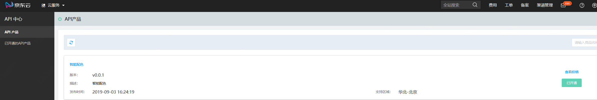
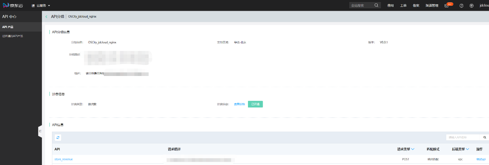
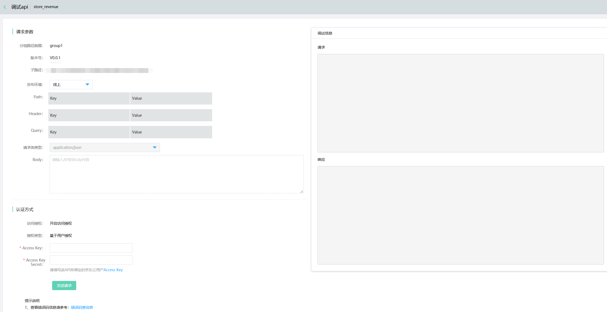
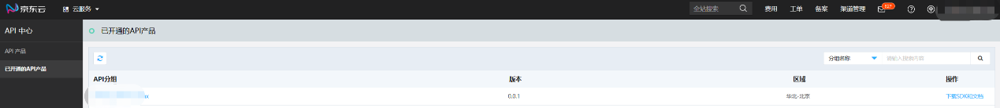
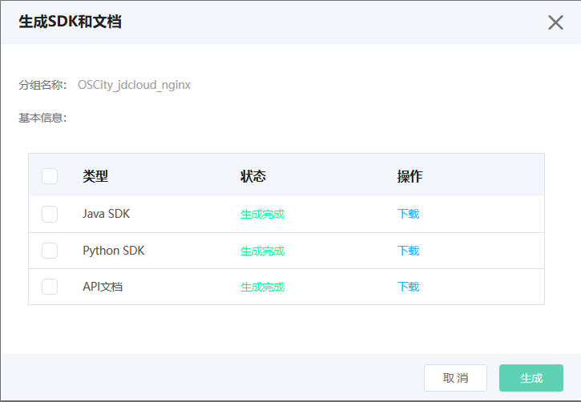

# 操作指南

### API中心为您提供以下丰富的功能：

#### （1）查看API产品
进入京东云控制台的API中心，可以在API产品列表页面查看目前有哪些API产品处于可售状态，如果想查看该产品，可点击API分组名称。
   

由此进入该分组的详情页，详情页展示了分组的详细信息（包括名称、区域、版本、路径和描述）、计费信息和API相关信息。当您开通该API分组后，即可点击调试API按钮，进行在线调试。

   

#### （2）在线调试
在线调试时，输入您已创建的Access Key和Access Key Secret即可授权成功。
  

#### （3）查看已开通的API产品
进入已开通的API产品列表页面，您可以看到当前账号下已经开通的API分组，点击分组名称可以查看该分组的详情。还可以点击“下载SDK和文档”对SDK及文档进行生成和下载。
  
  
  

 
下载后即可使用SDK对此API分组进行访问。
