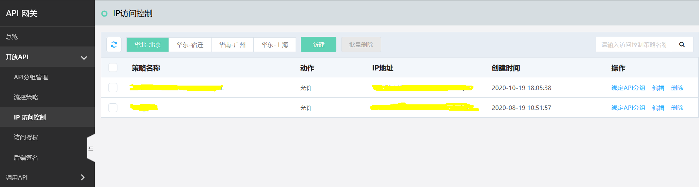
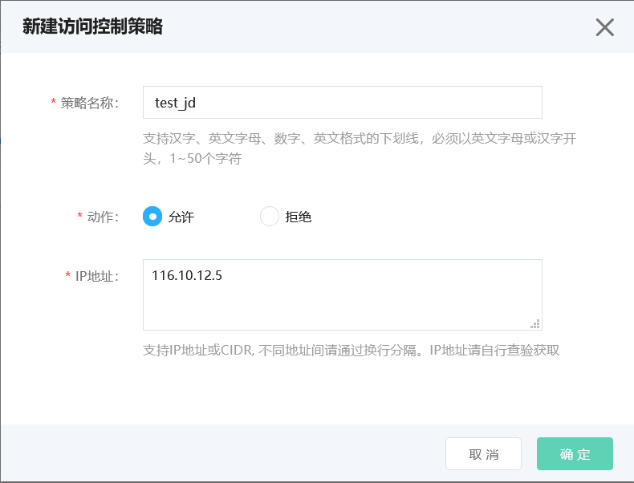
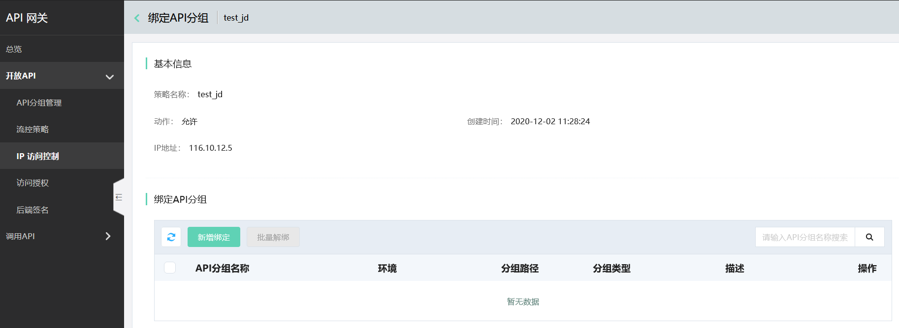
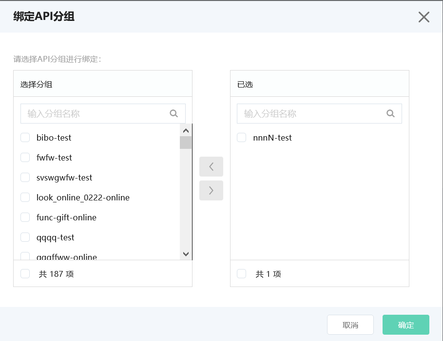
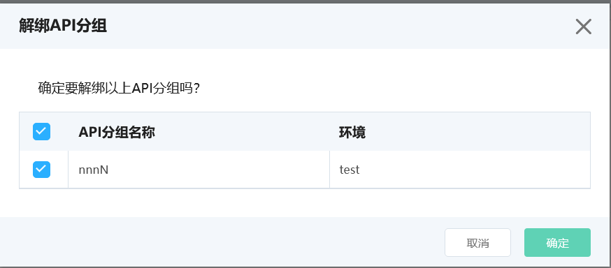
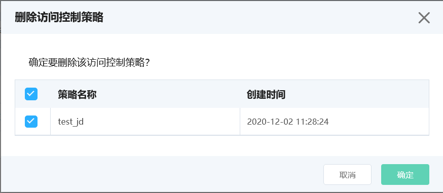

# IP访问控制

API网关为您提供IP访问控制功能。您可以通过此功能对特定的IP和IP段进行访问限制，从而保障您后端服务的安全。

*  IP访问控制策略通过绑定 API分组生效，从而对用户访问API分组时的IP和IP段进行限制。

*  一个IP访问控制策略可以与多个API分组绑定，但每一个 API分组 只能绑定一个IP访问控制策略。因此若API分组 已经与某个策略绑定，当您绑定新策略时，该操作将替换之前的策略，实时生效。

*  当您创建IP访问控制策略时，需要选择 生效区域，当前支持华北-北京、华东-宿迁、华南-广州和华东-上海。

## 操作步骤

1.点击左侧 **IP访问控制**，进入访问控制策略列表页，可进行策略的查看、配置和绑定。

2.新增IP访问控制策略。您可以选择对目标IP和IP段进行*允许* 或*拒绝* 的动作设置。

若选择允许，则目标IP和IP段以外的其他IP和IP段均无法通过API网关访问到您的后端服务。若选择拒绝，则除目标IP和IP段以外的其他IP和IP段均可以通过API网关访问到您的后端服务。

新建成功后可以查看策略详情。

3.将IP访问控制策略与API分组绑定。绑定成功后当用户调用该API分组时，对应的IP访问控制策略就会生效。

如果想更换策略绑定的分组，也可以进行解绑操作，解除当前策略与API分组的绑定关系。

4.当某个IP访问控制策略失效时，您可以删除该策略。

