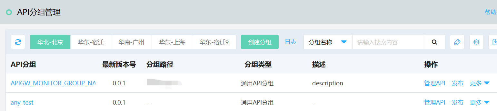
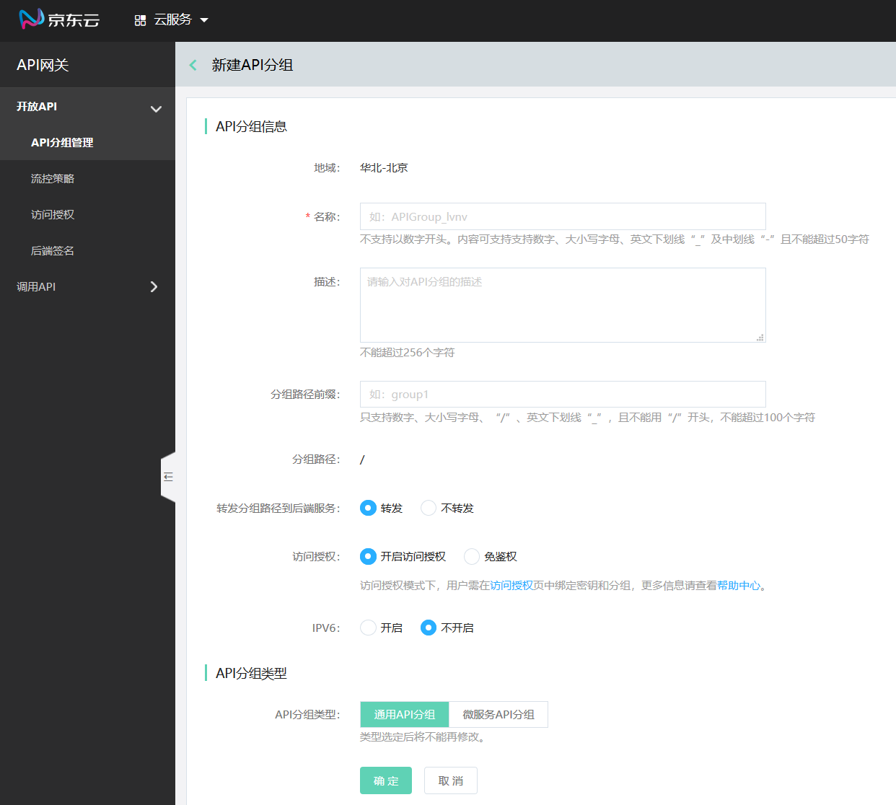

# 创建API分组

API 分组是 API 的基础管理单元。SDK是基于该API分组生成的。您需先创建 API 分组，再在分组下创建 API。

* 分组具有 Region 属性，API 选定分组前需确定 Region，且一旦生成不可更改。

* 基于API分组，用户需发布服务，还可配置基于分组的流控策略、访问授权、后端签名、IP访问控制、自定义域名等。

## 操作步骤
### STEP1:点击左侧菜单 **API分组管理** ，进入分组列表页
登录 [API网关 控制台](https://apigateway-console.jdcloud.com/apiGroupList)。

 
 
 
 ### STEP2:创建API分组
 在“API分组管理”页面，点击 **创建分组** ，进入“新建API分组”页面。
 注意：当前只有华北-北京和华东-上海地区支持IPV6。

    
 ### STEP3:保存信息，创建分组   
填写分组信息后，点击保存，即新建分组。

当首次新建时，系统会自动将其保存为版本号为0.0.1的版本。后续可在版本管理中进行多版本维护。

