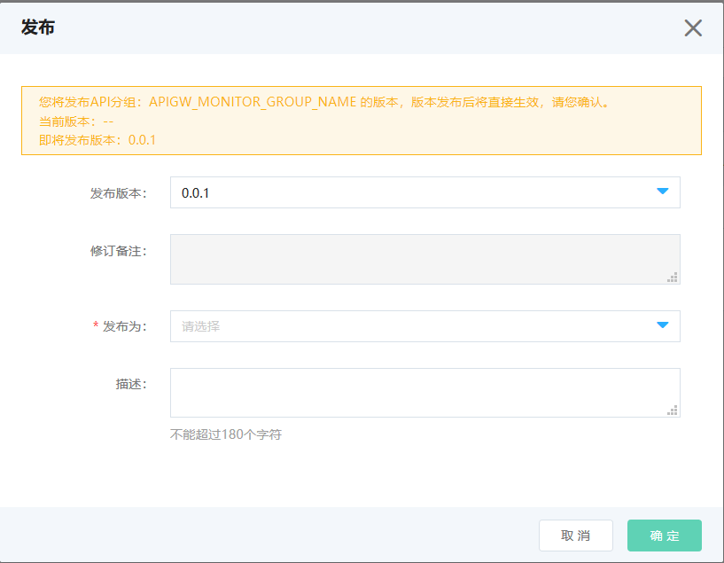
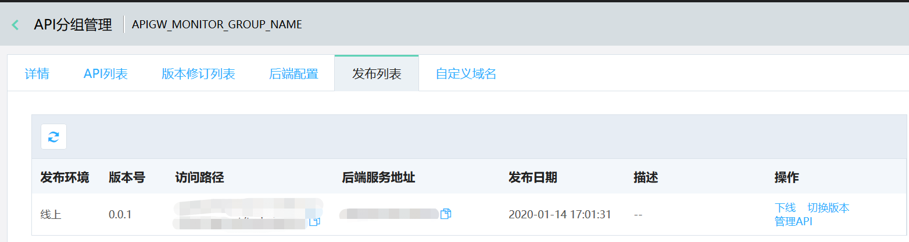
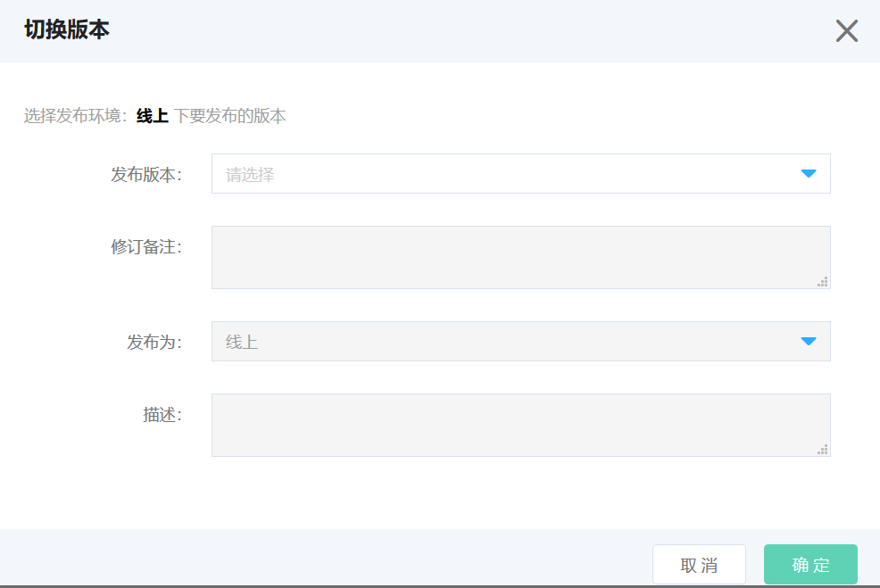
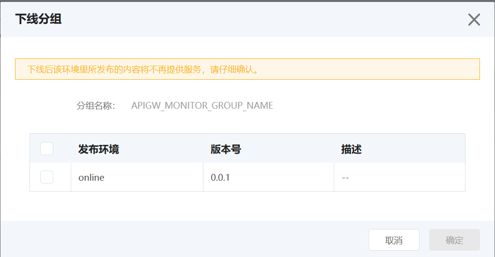

# 发布API分组

API分组信息创建完成后，需要通过发布才能使用。目前京东云提供了3套发布环境：测试、预发、线上。在发布完成后，API调用者可通过自定义域名或二级域名，访问调用API。

注意：

* 需要先对API分组进行后端配置，再进行发布。

## 操作步骤：

### STEP1:选择要进行发布的分组

首先，进入 **API分组管理**页，并找到要发布的分组

### STEP2:点击 **发布**按钮：

说明：

1）选择要发布的版本。API网关支持分组的版本管理功能，因此在发布时，注意选择您需要发布的版本。后续还可在环境管理中切换或者下线不同的版本。
   
2）选择要发布的环境。API网关提供了三种环境：测试、预发、线上。

### STEP3:在发布列表中，管理各个环境下发布的版本：
发布完成后，可在部署管理页中，看到各个环境的部署情况。

API 网关支持对测试/预发/线上的 API 分组做版本管理，您可以发布 API分组、下线 API 分组还可以切换版本，切换版本是实时生效。

### STEP4:下线
如需下线，可直接点击下线操作。实时生效。

