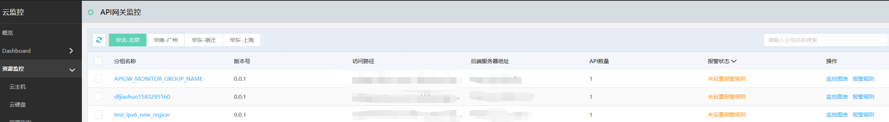
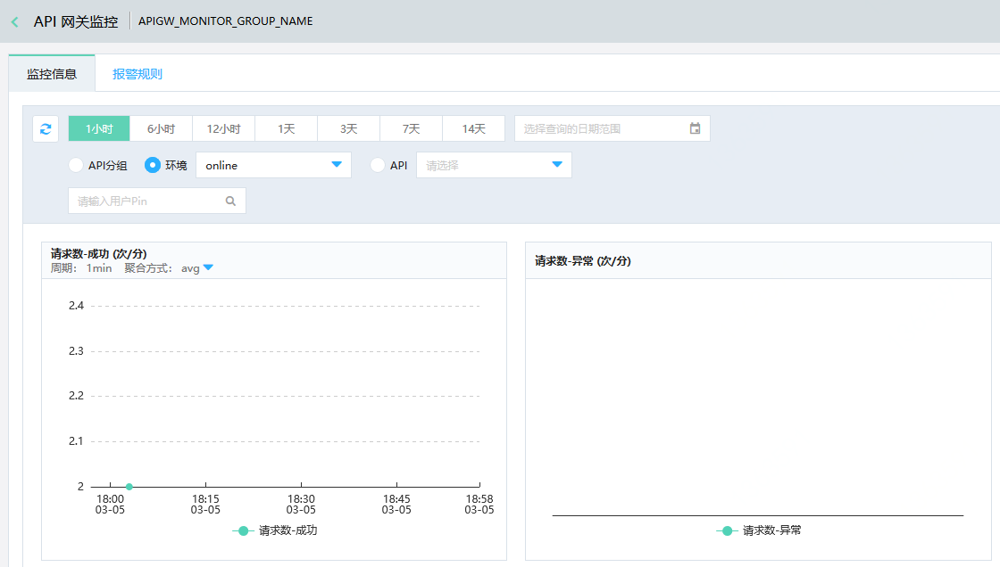
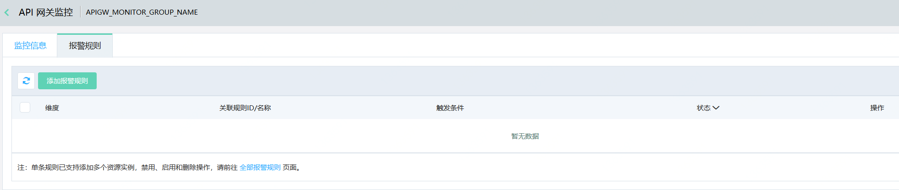

# 访问监控

目前您可以在京东云监控中，查看API网关在线上部署环境中API的实时监控信息，并可以对API分组设置报警规则。

#### 入口

管理 > 云监控 > 资源监控 > 网关监控

##  操作步骤：
###  第1步：进入监控页

 

###  第2步：查看API分组的监控详情

 

###  第3步：设置报警规则报警规则

在第1步中，选择要设置报警规则的API分组，然后点击新增报警规则

 
 
 
 
 
更多详细设置请参考：

- [设置报警规则](https://docs.jdcloud.com/cn/monitoring/createrule)

