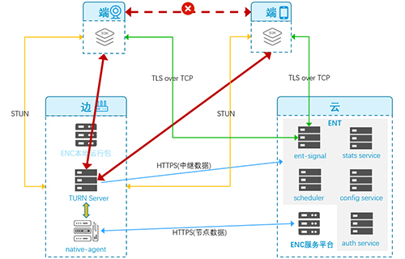

**基础架构图：**

**关键组件：**

- SDK服务（端）：用户在设备端集成产品的SDK进行数据传输

- native agent（边）：边缘管理组件，向ENC服务上报节点的状态、用量、本机负载等情况。支持可执行程序的调度、管理、监控等，和云端通过https进行连接，接收云端升级、变量设置等操作

- TURN Server（边）：边缘节点的计算单元，其下发、管理、监控，由ENC进行调度、升级、检测，完成数据流的中继

- Scheduler服务（云）：全局调度，把终端请求调度到最佳的边缘节点。
