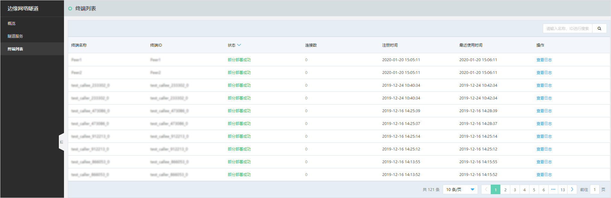
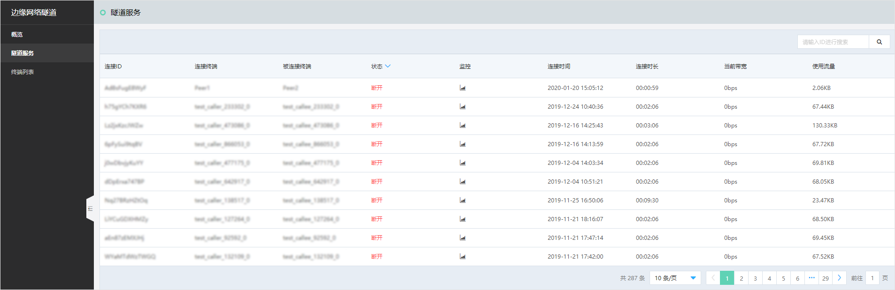

### 产品开通
1. 首先申请公测：用户在官网产品页填写使用‘边缘网络隧道’产品的申请信息（含业务场景描述）等，由人工评估审核完成后进行开通。
2. 进行开通产品服务：用户登录控制台，阅读并同意《边缘网络隧道服务条款》之后，点击‘立即开通’按钮，完成产品开通工作。

### 使用流程

#### 步骤一：下载SDK
根据技术选型，选择对应的SDK(C、Go)进行下载（SDK请在‘*[下载专区](./Download-Center.md)*’进行下载）;

#### 步骤二：终端注册
调用SDK-API对终端进行注册，可查阅'*[SDK文档](SDK-Reference/Overview.md)*'中对API的说明;
在产品控制台，可以看到注册成功的终端设备，并查看终端的状态信息、对应的隧道连接数、产生的日志等终端相关基本信息，如下图所示：

#### 步骤三：建立连接
终端注册成功之后，就可以同其他终端进行连接。当通道建立成功后即可发送消息、获取消息；
在产品控制台，可以查看隧道产生的流量、连接时长等信息，如下图所示。同时，通过云监控，对隧道的网络流量、网络速率、网络延迟、丢包率进行了监控。

