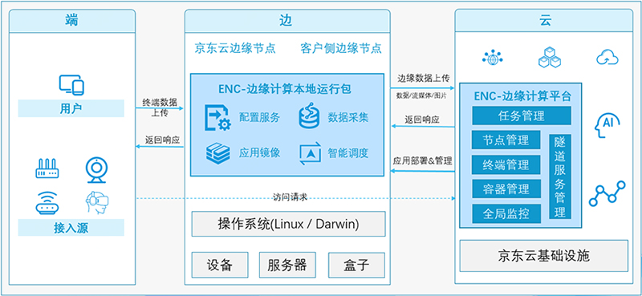

**基础架构图：**

**关键组件：** 
JEES作为一个边缘计算平台，除了提供底层服务管理能力外，还提供一些基础功能模块，分为云端管理平台（云）、本地运行包（边）两部分，具体如下：
- 模块epnc-core是边缘节点与云中心的唯一入口，主要负责接收边缘节点信息上报和对应计算任务的下发；

- 模块epnc-stats负责收集边缘节点和计算任务的用量信息，并将其存储到时序数据库和云监控中；

- 模块epnc-scheduler负责将用户提交的编排任务调度到合适的边缘节点；

- 模块epnc-config负责存储用户提交的编排任务信息；

- 本地运行包主程序epnc-edge 负责接受云端指令、服务实例的管理，如启动、退出、守护等，在边缘侧管理用户的计算任务。目前支持两种运行模式：Native 进程模式和 Docker 容器模式。
