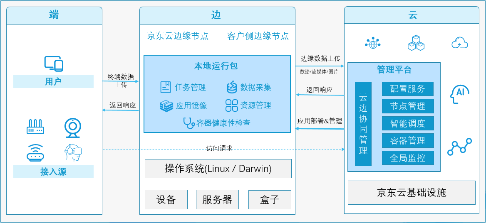

**基础架构图：**

**关键组件：** 
  JEES作为一个边缘计算平台，除了提供底层服务管理能力外，还提供一些基础功能模块，分为云端管理平台（云）、本地运行包（边）两部分，具体如下：
- 云边协同管理（epnc-core）：是边缘节点与云中心的唯一入口，主要负责接收边缘节点信息上报和对应计算任务的下发；

- 智能调度（epnc-scheduler）：负责将用户提交的编排任务调度到合适的边缘节点；

- 配置服务（epnc-config）：负责存储用户提交的编排任务信息；

- 全局监控（epnc-stats）：负责收集边缘节点和计算任务的用量信息，并将其存储到时序数据库和云监控中；

- 本地运行包主程序（epnc-edge）：负责接受云端指令、服务实例的管理，如启动、退出、守护等，在边缘侧管理用户的计算任务。目前支持两种运行模式：Native 进程模式和 Docker 容器模式；

- 容器健康性检查：负责容器创建之后，查看容器是否正常运行。如果容器运行出错，就要根据设置的重启策略进行处理；

- 数据采集：监控所在节点的资源使用情况，并定时向云端报告。采集整个集群所有节点的资源情况，对于任务的调度和正常运行至关重要。
