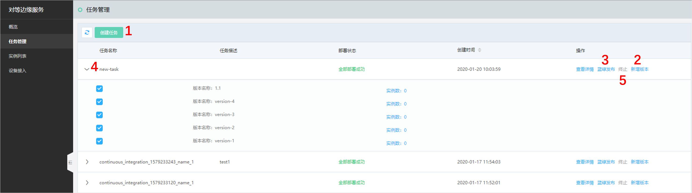
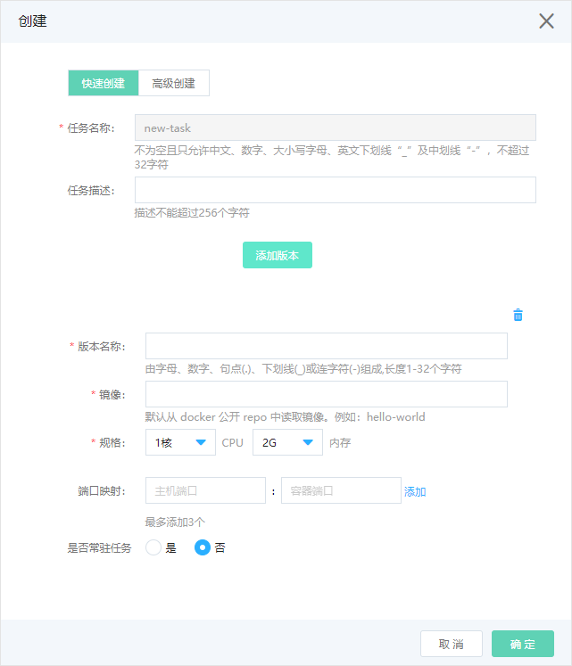
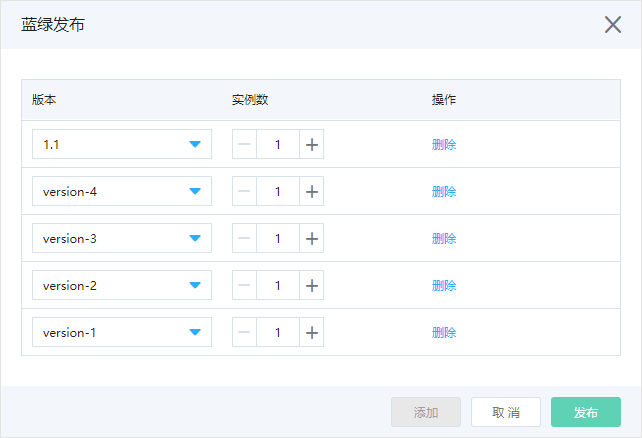
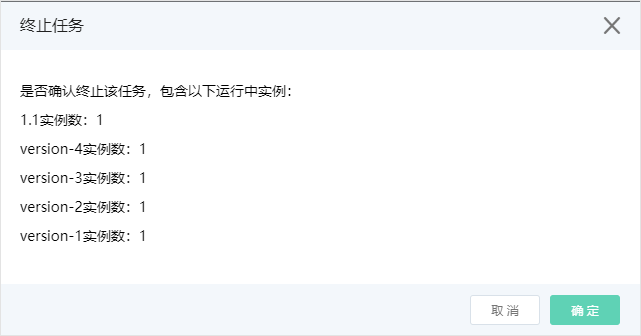
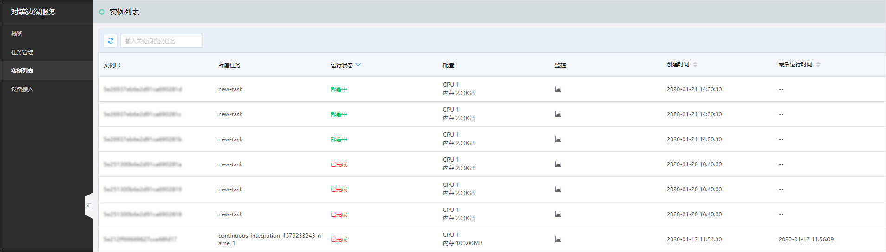

### 步骤一：产品开通 
1. 首先申请公测，用户在[官网产品页](https://www.jdcloud.com/cn/products/jd-cloud-equal-edge-service)填写使用‘对等边缘服务’产品的申请信息（含业务场景描述）等，由人工评估审核完成后进行开通； 
2. 进行开通产品服务，用户登录[控制台](https://epnc-console.jdcloud.com/consumer)，阅读并同意《对等边缘服务条款》之后，点击‘立即开通’按钮，完成产品开通工作。

### 步骤二：生成任务 
在任务的列表页，如下图：

点击***位置1***，进行创建任务：填写任务的基本信息，同时可以进行新增版本的操作，也可在列表页任务的操作项点击‘新增版本’来完成，可参考下面的操作： 
 

点击***位置2***，进行新增版本： 
 
镜像选择：目前支持从第三方镜像库docker.io拉取镜像（从docker公开repo中读取镜像）； 
规格：选择自身业务所需要的资源（CPU、内存），该属性为产品收费项（产品目前为公测期，可免费试用）； 
端口映射：输入容器中业务本身所需要的端口号； 
是否常驻任务：如果选择‘是’，则任务不管因何原因结束，都会自动拉起，保证业务的持续可用性。 
*注意，新增版本之后，我们只是记录了完成该版本所需要的资源信息，并没有发布版本，需要点击列表页中的‘蓝绿发布’对任务进行发布部署*

点击***位置3***，进行蓝绿发布：在这里选择对任务下版本的实例发布数量，点击‘发布’按钮进行任务的下发部署： 
 

点击***位置4***，进行任务的版本信息查看：在添加完成版本之后，可以在任务列表页针对每一个任务进行展开，查看其添加的版本信息。 

点击***位置5***，进行终止任务：对已选择的版本进行实例销毁，停止该版本的实例运行： 

### 步骤三：查看实例 
 
这里展示所有的实例信息。可以通过任务进行筛选，获取该任务下的实例运行情况。

### 步骤四：设备接入 
用户可通过点击‘设备接入’按钮下载安装包，修改配置文件且注册成功后，可管理自身的闲置计算能力，并根据贡献的算力值获取相应酬劳（待上线）。
