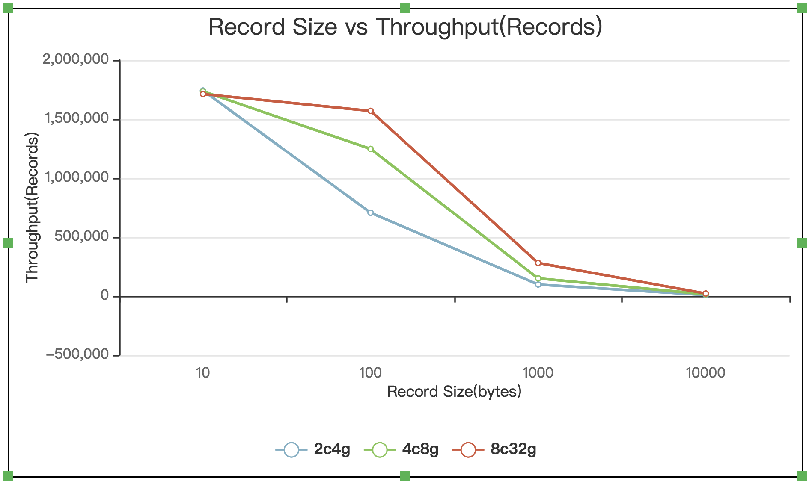
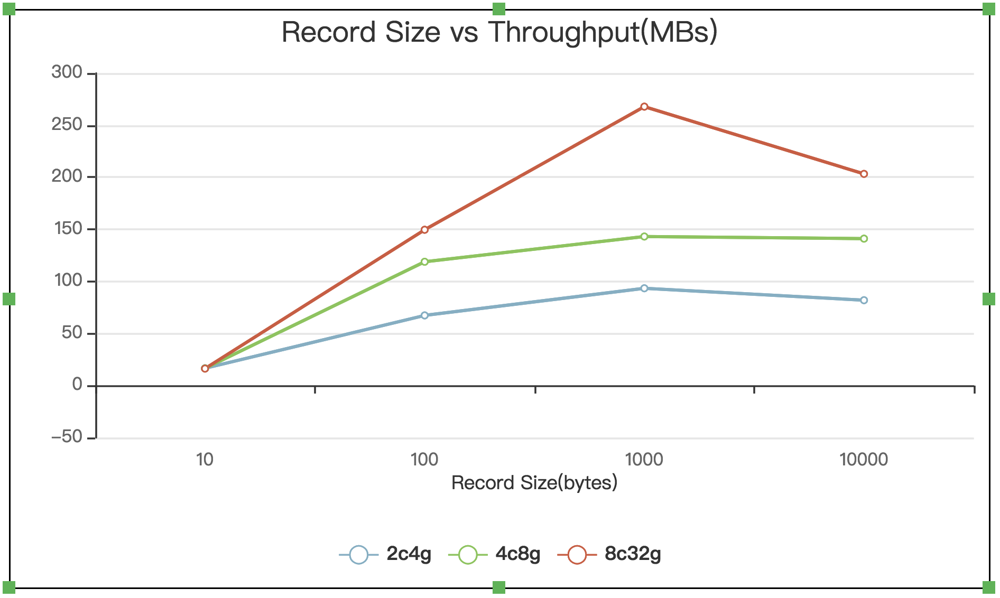

# 京东智联云消息队列 Kafka版 性能测试

## 测试工具

Kafka系统提供了测试工具kafka-producer-perf-test.sh和kafka-consumer-perf-test.sh，通过该工具可以对生产者性能和消费者性能进行测试，获取一组最佳的参数值，进而提升生产者的发送效率和消费者的读取效率。

## 测试规格
- kafka版本：1.0.1
- 节点个数：3

## 测试结果

### 消息生产

| 规格       | producer thread | partition | replication | sync | message-size(byte) | messages     | Records/sec | MB/sec     | avg latency(ms) | max latency(ms) |
| :--------- | :-------------- | :-------- | :---------- | :--- | :----------------- | :----------- | :---------- | :--------- | :-------------- | :-------------- |
| 2c4g 180g  | 1               | 6         | 3           |      | 10                 | 5000000      | 1741674     | 16.61      | 3.93            | 101             |
|            |                 |           |             |      | **100**            | **5000000**  | **706743**  | **67.40**  | **269.34**      | **2086**        |
|            |                 |           |             |      | 1000               | 5000000      | 97998       | 93.46      | 329.97          | 8168            |
|            |                 |           |             |      | 10000              | 500000       | 8596        | 81.99      | 236.83          | 1594            |
| 4c8g 400g  | 1               | 6         | 3           |      | 10                 | 50000000     | 1735086     | 16.55      | 3.08            | 102             |
|            |                 |           |             |      | **100**            | **50000000** | **1314924** | **125.40** | **44.64**       | **1581**        |
|            |                 |           |             |      | 1000               | 5000000      | 150105      | 143.15     | 214.12          | 1722            |
|            |                 |           |             |      | 10000              | 200000       | 14797       | 141.12     | 134.88          | 877             |
| 8c32g 400g | 1               | 6         | 3           |      | 10                 | 50000000     | 1712328     | 16.33      | 0.83            | 100             |
|            |                 |           |             |      | **100**            | **50000000** | **1569119** | **149.64** | **1.06**        | **134**         |
|            |                 |           |             |      | 1000               | 5000000      | 280883      | 267.87     | 114.28          | 379             |
|            |                 |           |             |      | 10000              | 200000       | 21315       | 203.28     | 91.57           | 296             |
| 16c64g 80g | 1               | 6         | 3           |      | 10                 | 50000000     | 1624431     | 15.49      | 0.59            | 137             |
|            |                 |           |             |      | 100                | 50000000     | 1566072     | 149.35     | 0.82            | 114             |
|            |                 |           |             |      | 1000               | 5000000      | 274017      | 261        | 117.24          | 371             |

### 消息消费

| 规格       | Consumer | partition | replication | messages | Records/sec | MB/sec |
| :--------- | :------- | :-------- | :---------- | :------- | :---------- | :----- |
| 2c4g 180g  | 1        | 6         | 3           | 50000000 | 1230466     | 117.34 |
| 4c8g 400g  | 1        | 6         | 3           | 50000000 | 1674200     | 136    |
| 8c32g 400g | 1        | 6         | 3           | 50000000 | 1725020     | 145    |
| 16c64g 80g | 1        | 6         | 3           | 50000000 | 1735336     | 165.49 |

## 压测趋势图
- 消息大小与生产TPS的关系

- 消息大小与生产吞吐的关系

