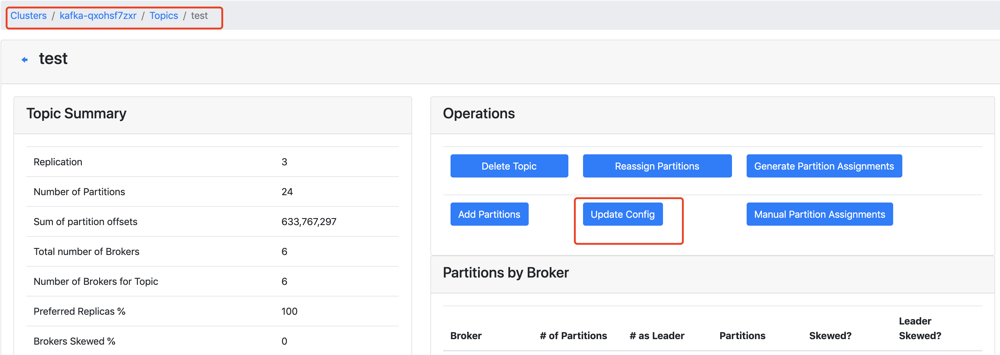
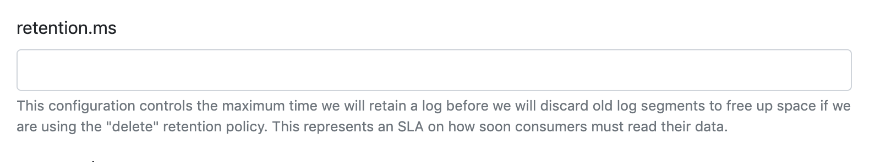
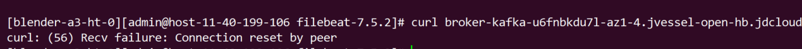

# 常见问题

## 实例问题

1. **消息队列 kafka 版基于哪个开源版本提供？**

   当前消息队列kafka版基于Apaceh Kafka V2.4.1、V1.0.2 和 V0.10.2 版本， 推荐生产消费端选取对应版本的SDK。

2. **是否可以访问部署消息队列 kafka 版的服务器？**

   不可以， 消息队列kafka版作为全托管服务，用户无需维护所有基础设施，包括操作系统更新和其他日常维护。

3. **如何降低 Kafka 实例的磁盘使用量？**

    - 如果是调整整个集群的情况下，可以调整集群默认日志保存时间，联系值班人员进行调整。

    - 如果是调整某个topic的日志保存时间，可以通过kafka-manager进行调整。

      

      

## 网络问题

1. 客户端连接不上kafka 服务端？

   这种问题通常是客户端网络配置问题，如用户设置了特殊的acl 规则等。建议在客户端主机上telnet xxxxxx(broker 域名）9092 检查网络是否正常。

   如下显示是正确的：

   

2. 消息队列 kafka 版支持外网访问吗？

   为提升数据访问的安全性，消息队列kafka版目前仅支持用户VPC内访问。

## Topic问题

1. **消息队列 Kafka 版不支持自动创建Topic？**

   消息队列 Kafka 版默认关闭自动创建topic功能，以防止用户客户端错误创建大量topic影响集群稳定性，建议用户在kafkamanager或利用sdk先创建topic,再收发消息。非必要建议不要申请打开自动创建topic。曾有用户申请打开自动创建topic,用户程序原因创建了几千topic（生产和消费为不同的业务方，生产方删除的topic,被消费方又自动创建出来了），严重影响到集群的正常工作。
   
2. **如何选取Topic的副本数？**

   Kafka实例副本数应不少于3个，创建Topic时选择3副本或以上（不超过实例副本数）存储数据，保障数据可靠性。

3. **为什么Topic不能减分区？**

   Topic减分区会造成数据丢失。这是Apache Kafka自身设计所限制的。

## 消费者组问题

1. **kafka为什么使用消费者组？**

   - 一个分区只可以被消费组中的一个消费者所消费。
   - 一个消费组中的一个消费者可以消费多个分区。
   - 一个消费组中的不同消费者消费的分区一定不会重复。

2. **如何在控制台删除无用的消费者组？**

    控制台暂未提供删除消费组功能，请通过命令行工具删除：

    ```
    kafka-consumer-groups.sh --bootstrap-server  slave1:9092,slave2:9092,slave3:9092 --group xxx --delete
    ```

3. **partition 和 consumer数目的关系是什么？**

   - 如果consumer比partition多，是浪费，因为kafka的设计是在一个partition上是不允许并发的，所以consumer数不要大于partition数 。
   - 如果consumer比partition少，一个consumer会对应于多个partitions，这里主要合理分配consumer数和partition数，否则会导致partition里面的数据被取的不均匀 。最好partiton数目是consumer数目的整数倍，所以partition数目很重要，比如取24，就很容易设定consumer数目 。
   - 如果consumer从多个partition读到数据，不保证数据间的顺序性，kafka只保证在一个partition上数据是有序的，但多个partition，根据你读的顺序会有不同。
   - 增减consumer，broker，partition会导致rebalance，所以rebalance后consumer对应的partition会发生变化

