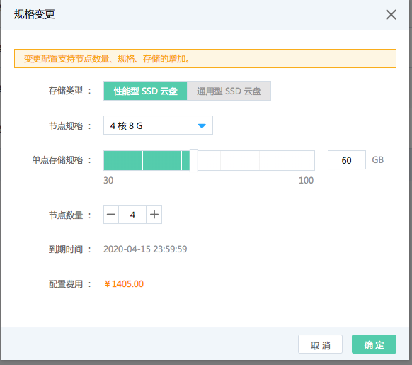

## 规格变更

在消息队列Kafka版实例列表页，选择要扩容的实例，单击“操作-更多-规格变更”进行实例节点数量、规格、存储的变更设置。</br>

```
实例配置变更须知
1.	变更配置支持节点数量、规格、存储的增加。
2.	变更配置后京东云可能会重启您的实例，服务不会中断，可能存在短暂的请求失败，客户端的重试机制可以解决。
3.	低版本的客户端可能无重连机制，实例重启可能导致断开连接后不可用。
4.	变更配置后可能会导致分区（Partition）消息乱序，请谨慎操作。

```


