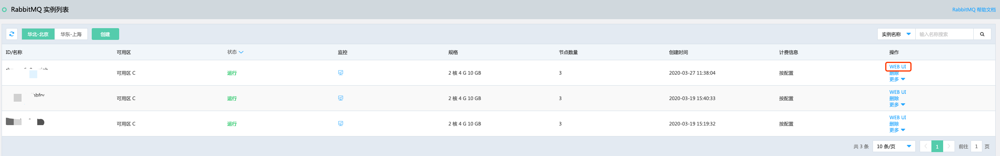
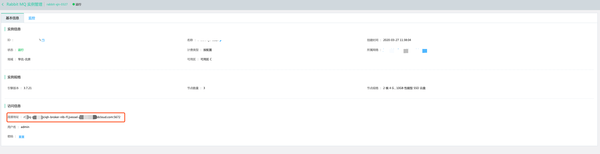

## 连接实例
消息队列 RabbitMQ 版支持通过集群管理工具WebUI和京东智联云云主机部署客户端方式连接实例。</br>

### 通过集群管理工具WebUI连接实例
1.	登录消息队列 RabbitMQ 版控制台，创建消息队列 RabbitMQ 版实例 。</br>
2.	点击操作列的“Web UI”进入可视化界面，输入创建实例设置的用户名密码，访问并且管理消息队列 RabbitMQ 版实例。</br>




### 通过京东智联云云主机部署客户端访问

1.	登录消息队列 RabbitMQ 版控制台，创建消息队列 RabbitMQ 版实例 。</br>
2.	登录[云主机控制台](https://cns-console.jdcloud.com/host/compute/list)，创建和消息队列 Kafka 版具有相同私有网络和子网的云主机，并[获取公网IP](https://docs.jdcloud.com/cn/virtual-machines/associate-elastic-ip)。</br>
3.	在本地通过SSH登录云主机，用curl命令访问测试网络是否连通。指令格式说明如下：</br>

```
ssh 用户名@公网IP
curl -XGET 内网域名/_cat
```

其中连接地址从实例详情中获取，如下图所示：



之后可根据需要选择下载不同版本的语言客户端sdk，部署程序，进行客户端消息收发。

消息队列 RabbitMQ 版完全兼容开源 RabbitMQ，支持所有开源client和插件，详细使用方式请下载官方客户端并参考[官方指南](https://www.rabbitmq.com/devtools.html)。

