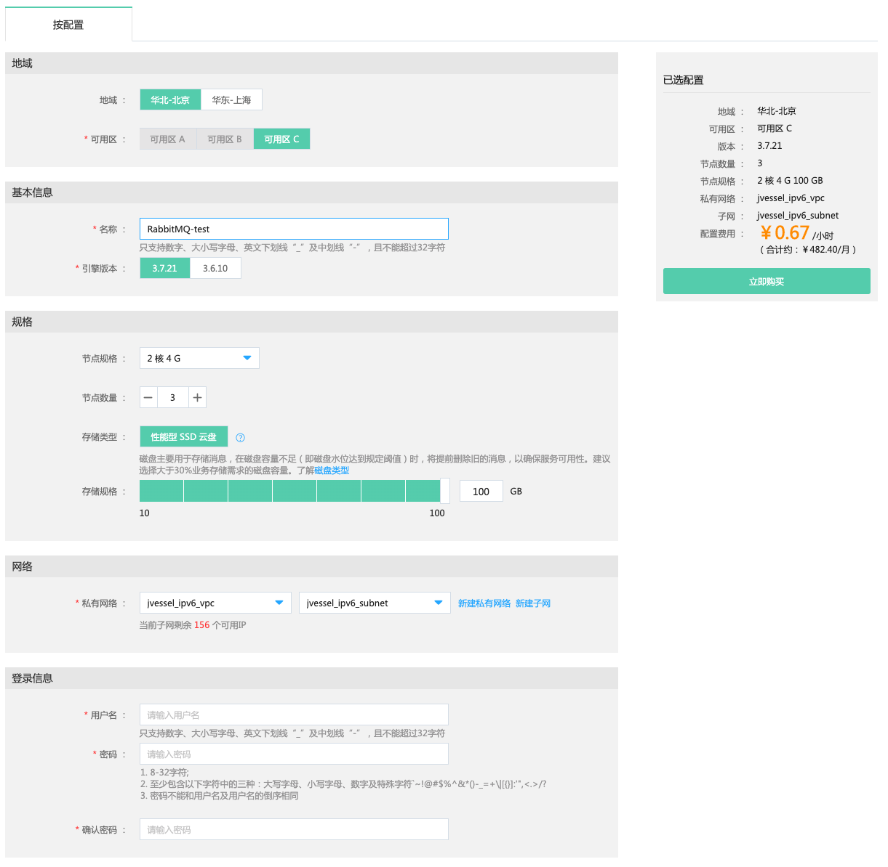

## 创建实例

您可以登录京东智联云消息队列 RabbitMQ 版控制台新建实例，关于实例的计费说明请参见“[价格总览](../Pricing/Price-Overview.md)”、“[计费规则](../Pricing/Billing-Rules.md)”。

### 前提条件
- 已注册京东智联云账号，并完成实名认证。如果还没有账号请 [注册](https://accounts.jdcloud.com/p/regPage?source=jdcloud&ReturnUrl=https%3a%2f%2fuc.jdcloud.com%2fpassport%2fcomplete%3freturnUrl%3dhttps%3a%2f%2fwww.jdcloud.com)，或 [实名认证](https://uc.jdcloud.com/account/certify)。
- 如计费类型选择按配置计费，请确认您的账户余额（包括代金券）能满足您的使用。

### 操作步骤
1. 登录消息队列 RabbitMQ 版控制台。 
2. 在实例列表页面单击“创建”，进入“创建”页面，选择付费方式、地域、基本信息、规格、网络、登录信息、高级配置等信息。 

* “地域”：目前工作区域只支持且默认选择“华北-北京”、“华东-上海”。 
* “可用区”：可用区是使用独立电源和网络资源的物理区域。通过内部网络互联，再以物理方式进行隔离，提高了应用程序的可用性。  
* “名称”：必填项，自定义的实例名称，名称不可为空，只支持数字、大小写字母、英文下划线“_”及中划线“-”，以字母开头且不能超过32字符。 
* “引擎版本”：当前版本支持V3.7.21、V3.6.10。 
* “节点规格”：可以根据具体业务情况选择不同实例规格。 
* “节点数量”：一个节点为一个Broker。  
* “存储类型”：支持性能型SSD云硬盘、通用型SSD云硬盘、容量性HDD云硬盘，建议选择性能型SSD云硬盘。 
* “存储规格”：可以根据具体业务情况选择不同存储规格，单点存储规格范围20-16000GB，步长为10GB，可输入整数。 
* “私有网络”： 京东智联云上自定义的逻辑隔离的网络空间，更多说明请参见[私有网络功能]( https://docs.jdcloud.com/cn/virtual-private-cloud/vpc-features)。 
* “子网”： 子网是所属VPC IP地址范围内的 IP 地址块，更多说明请参见[子网功能]( https://docs.jdcloud.com/cn/virtual-private-cloud/subnet-features)。 
* “用户名”：只支持数字、大小写字母、英文下划线“_”及中划线“-”，且不能超过32字符。
* “密码”：应至少包含以下字符中的三种：大写字母、小写字母、数字及特殊字符`~!@#$%^&*()-_=+\|[{}]:'",<.>/?，并且8-32字符，不能和用户名及用户名的倒序相同。
* “购买时长”： 购买实例的使用时间，开通自动续费后到期可自动购买。 

3. 规格确认完成后，单击“立即购买”跳转至付费页面。 
4. 跳转支付确认页面成功付款后返回实例列表页面。您创建的实例将展现在实例列表中。且实例状态为“创建中”，耐心等待几分钟，创建成功后实例状态会变为“运行”。如果实例创建失败，请根据界面提示，重新创建实例。 

