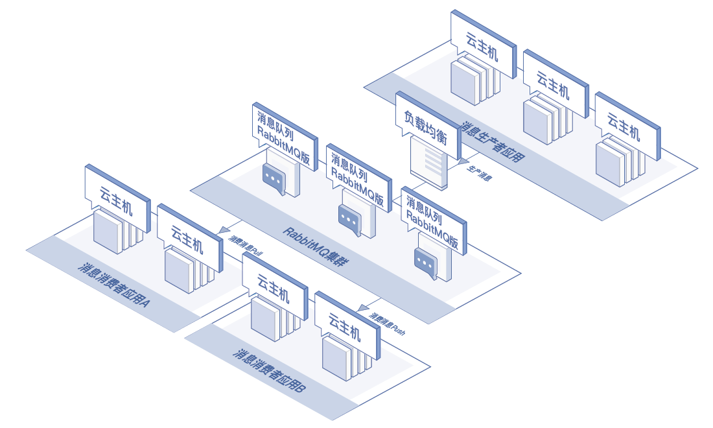
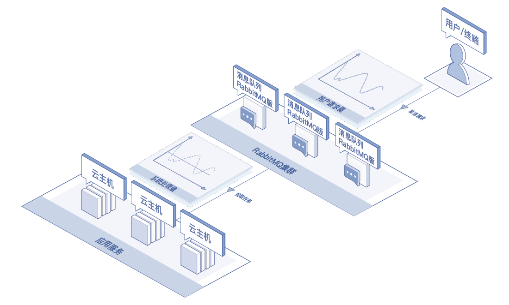

## 应用场景

### 异步解耦
消息队列 RabbitMQ 版可以作为企业级消息系统，异步解耦应用系统，适用于例如金融交易账单，电商订单分发等场景。

### 流量控制
用户浏览网页、评论等行为产生的网站活动数据，都可以通过消息队列Kafka版实时收集，然后以发布-订阅的模式实时记录到对应的Topic里，消费者通过订阅这些Topic来做实时的监控或者加载到Hadoop等离线仓库进行离线统计分析等。

