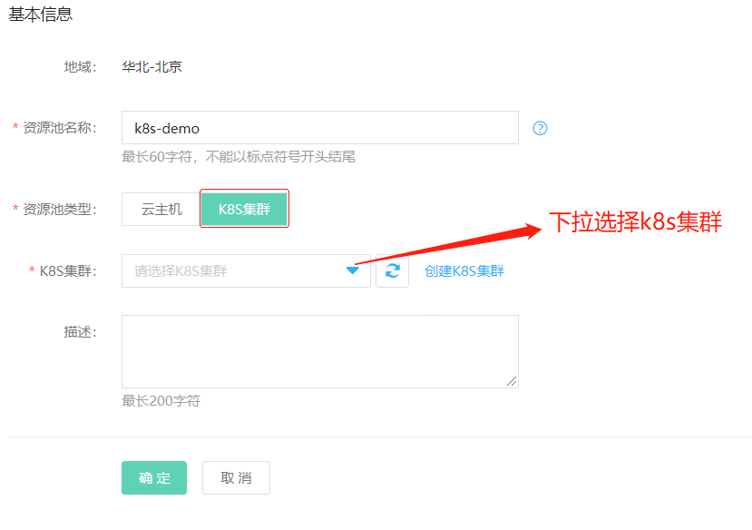
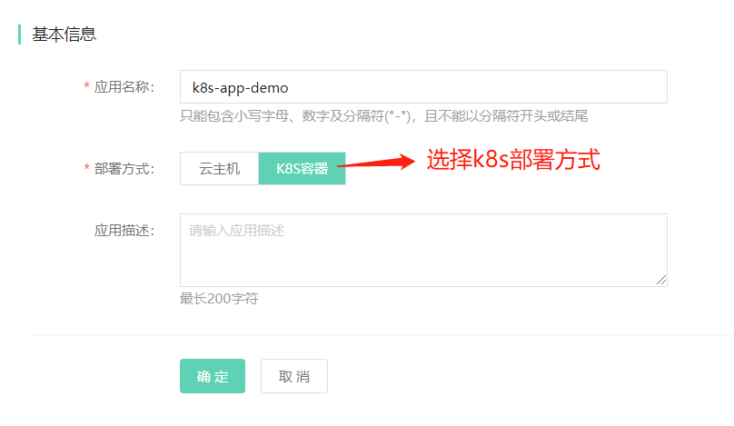
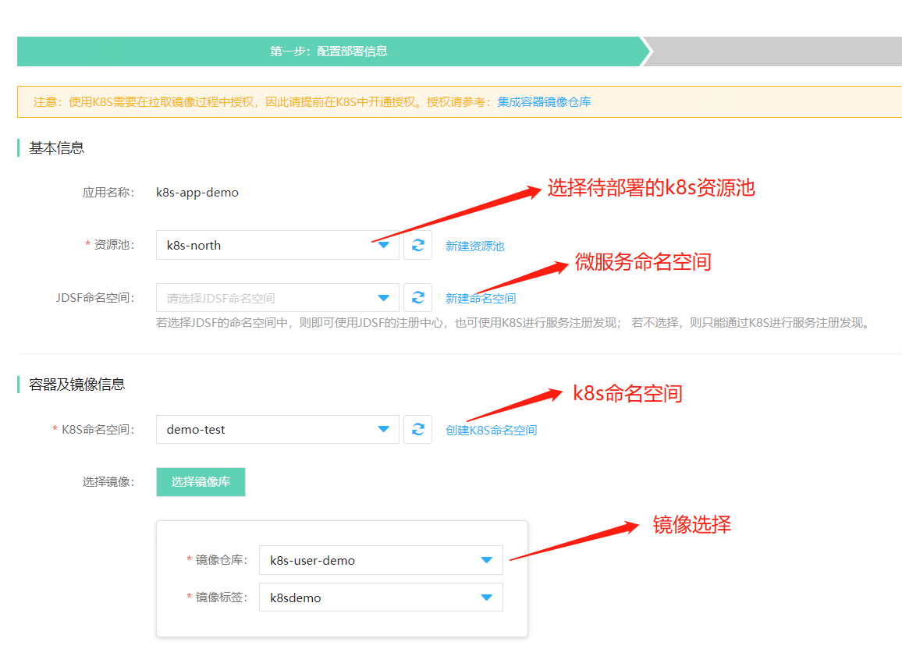
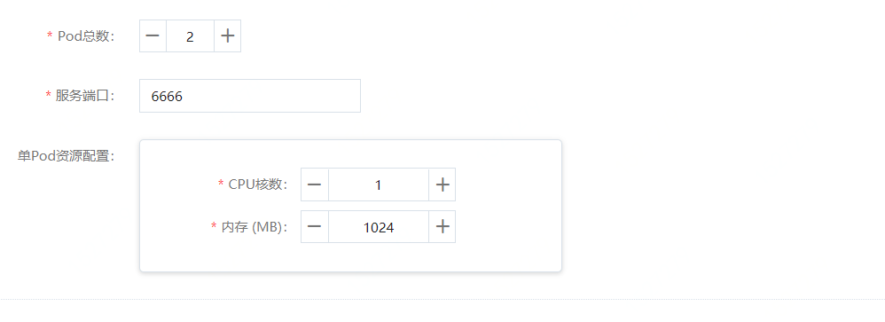
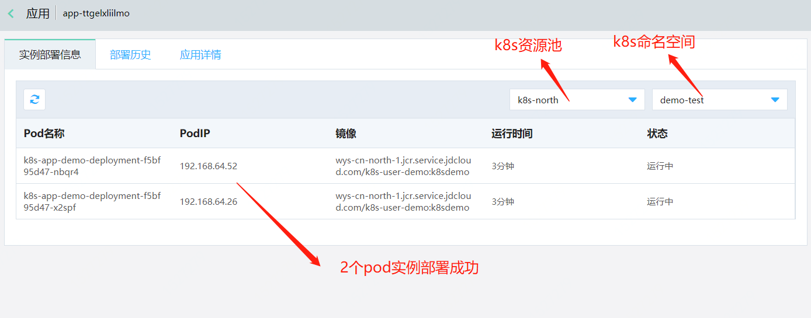
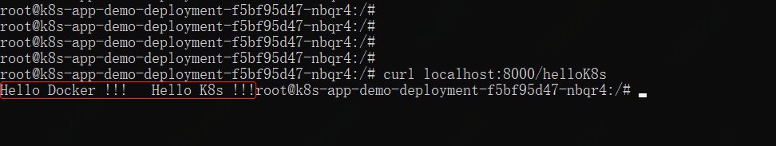

# Kubernetes 应用部署快速入门

## 环境准备

1、已在“云服务”，“Kubernetes集群”项中创建 Kubernetes 集群。

2、镜像下载

| 内容 |  类型 | 大小 | 地址 |
|---|---|---|---|
| 示例程序包镜像 | 镜像 | 493.11MB  | https://jdsf-demo.s3.cn-north-1.jdcloud-oss.com/k8s.tar  |
| 示例程序包 | Dockerfile与jar包 | 14.62MB  | https://jdsf-demo.s3.cn-north-1.jdcloud-oss.com/k8sDemo.zip  |


## 部署应用

#### STEP1:创建Kubernetes资源池

在“资源池管理”中，点击“新建资源池”，选择Kubernetes集群后保存，需注意Kubernetes集群vpc配置。



#### STEP2:创建Kubernetes应用

“应用管理”中，点击“新建应用”，选择 Kubernetes 集群部署方式后保存。



#### STEP3:发起部署

1.“应用管理”中，对刚创建的Kubernetes应用，点击“发起部署”，弹出部署页面。

2.部署页面：配置部署信息后点击“发起部署”。

资源选择：


 
配置设置：


 
另外Kubernetes部署有：启动命令、环境变量、存储、应用生命周期管理等配置（非必填）


#### STEP4:部署结果

1.“应用管理”中，点击Kubernetes应用，选择“实例部署信息”页面，并配置过滤条件。



2.容器内请求服务：

容器内输入：

```
  curl localhost:8000/helloK8s  
```




