#  Kubernetes应用部署

Kubernetes集群采用管理节点全托管的方式，为用户提供简单易用、高可靠、功能强大的容器管理服务。而在微服务平台上，用户可以便捷地通过 Kubernetes部署方式实现Kubernetes容器应用部署。以下将介绍内容包括通过 JDSF 控制台实现对Kubernetes容器应用部署、删除、应用扩缩容、配置负载均衡等。

本章节将向您介绍如下内容：
-  部署应用
-   删除应用 
-   扩缩容
-   配置负载均衡 
-   配置应用日志 
-   配置应用监控 

## 操作场景

当京东智联云用户，已经在京东智联云上创建了Kubernetes集群，那么接下来将需要在集群中部署应用。此时用户可以通过微服务平台控制台，通过界面操作来完成应用部署。

## 环境准备

1、已经购买开通了京东智联云 Kubernetes集群。

2、已经开通所需资源如：微服务平台等。

3、已经将需要部署的镜像，上传到京东智联云容器镜像仓库中。

4、如需使用应用监控功能，需要提前在Kubernetes集群中打开集群监控开关。

5、**注意：** 

-  使用Kubernetes部署需要在拉取镜像过程中获取授权，因此请提前在Kubernetes中开通授权。授权详情请参考：[集成容器镜像仓库](../../../../Elastic-Compute/JCS-for-Kubernetes/Best-Practices/Deploy-Container-Registry.md) 。

-  使用 Kubernetes 将会产生负载均衡费用。

## 操作步骤

### 部署应用

#### 第1步：在JDSF中新建命名空间、新建Kubernetes集群资源池

1、在JDSF中新建命名空间，过程参考： [命名空间](../Namespace.md) 。

本步骤为可选项，也可不用JDSF命名空间而直接使用Kubernetes命名空间。

若选择部署到JDSF的命名空间中，则既可使用JDSF的注册中心，也可使用 Kubernetes 进行服务注册发现，方便用户在控制台上进行操作和管理；若不选择JDSF命名空间，则只能通过 Kubernetes 进行服务注册发现。

2、在JDSF中新建 Kubernetes 集群资源池，过程参考： [新建资源池](../Resource-Manage/Resource-List.md) 。

#### 第2步：创建应用

在新建应用页面中，选择创建 Kubernetes 应用。 

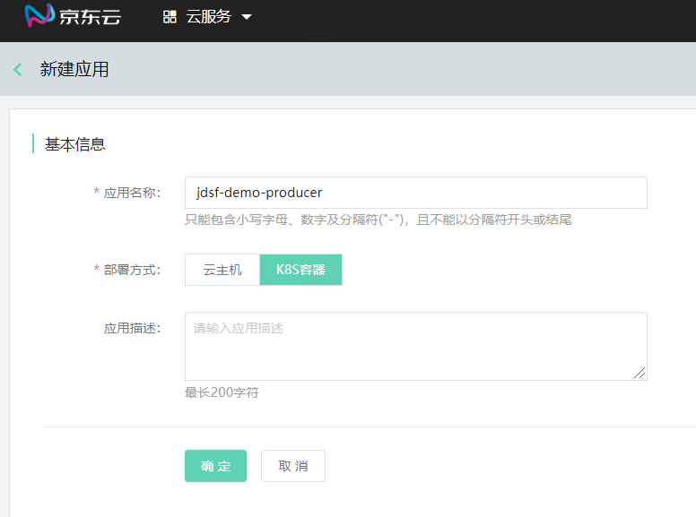

#### 第3步：对应用发起部署

在应用管理列表中，选择要部署的K8S应用，点击操作中的“发起部署”，进入配置部署信息页。其中基本信息、容器及镜像信息，为必填部分内容；高级设置部分可以选填。

1、基本信息、容器及镜像信息项说明。

| 字段 | 说明 |
| :- | :- |
|  资源池 |  用户在Kubernetes集群中创建的集群，并且当前将往该集群中部署应用。 |
|  JDSF命名空间 |  当前部署操作的目标 JDSF 的命名空间。若选择部署到JDSF的命名空间中，则既可使用JDSF的注册中心，也可使用 Kubernetes 进行服务注册发现，方便用户在控制台上进行操作和管理；若不选择JDSF命名空间，则只能通过K8S进行服务注册发现。   |
|  Kubernetes 命名空间 |  当前部署操作的目标 Kubernetes 的命名空间。 |
|  镜像 |  镜像仓库和镜像标签信息等。 |

2、新建Kubernetes命名空间。

在微服务平台，点击操作“创建Kubernetes命名空间”，可以直接在Kubernetes下创建命名空间。

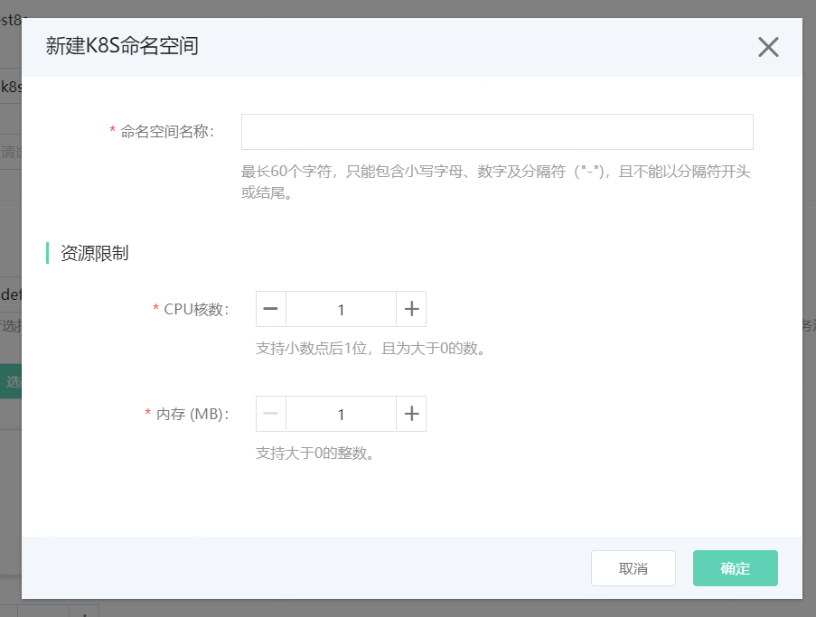

#### 第4步：执行部署

部署后，还可进行回滚、重新部署操作。

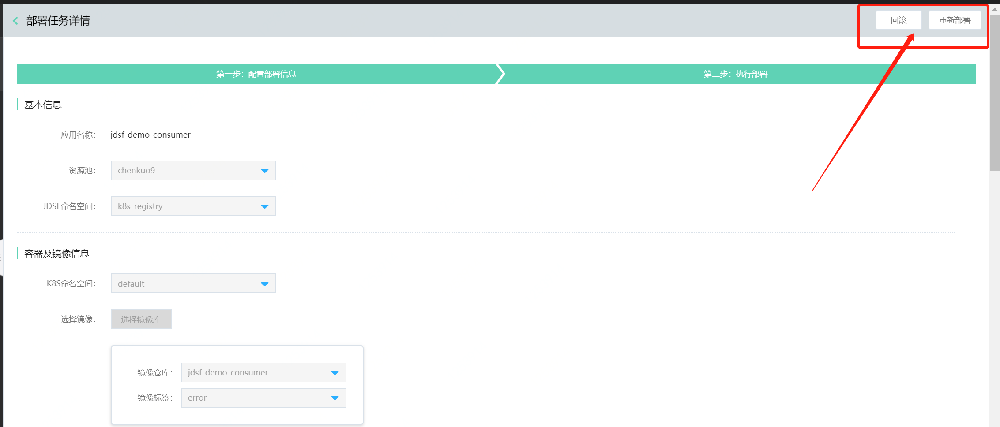

### 删除应用

1、登录微服务平台控制台。 在左侧导航栏点击应用管理，进入应用列表页。

2、对于需要删除的应用，点击操作列的删除。

3、用户需在删除数据前，自行做好数据备份工作。

### 扩缩容

针对Kubernetes资源池的扩容，可以在微服务平台中进行配置。

1、登录微服务平台控制台。 在左侧导航栏点击应用管理，进入应用列表页。

2、选择需要配置扩缩容的应用，点击应用名称，进入应用详情页。

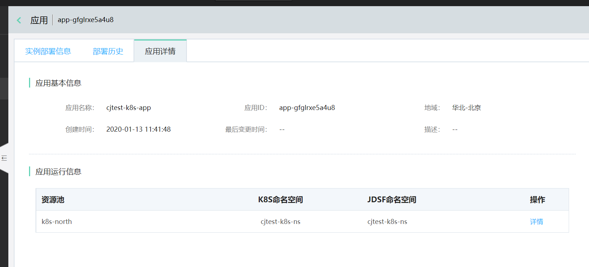

点击操作栏中的详情，可在应用设置中对运行Pod总数、规格进行调整。
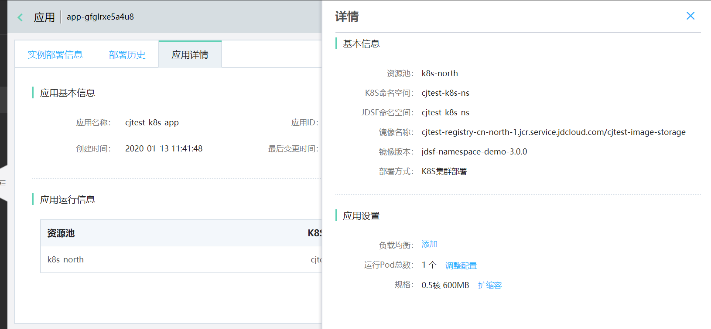

3、配置扩缩条件。目前支持自动扩缩和手动扩缩两种方式。

1）自动扩缩

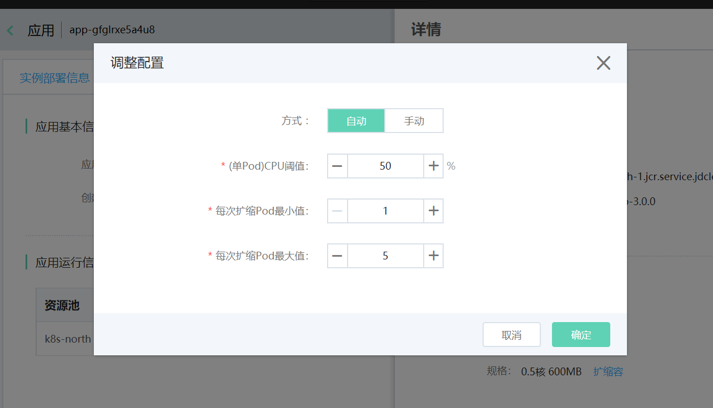

例如：当配置自动扩缩如上图所示的时候，表示如果当前如果 cpu 负载超过应用部署配置的资源上限的50% 的时候 Kubernetes 会自动创建一个 Pod 扩充应用实例，如果扩容完成后所有的 Pod 资源都超过了每个 Pod资源上限的50%，Kubernetes 还会继续的扩缩，直到达到 5 个 Pod 的为止，当 应用 负载回落后，Kubernetes 将自动的进行缩容，移除部分 Pod 回收资源。需要注意的是只有在使用京东云Kubernetes 1.12.3-jcs.4 以上的版本才支持自动扩缩容（HPA）。

2）手动扩缩

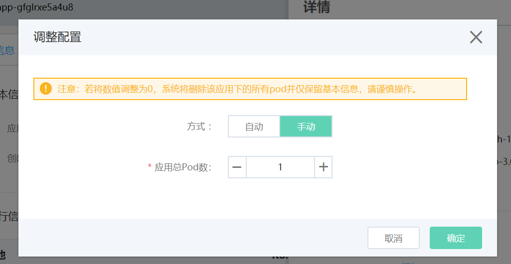

例如：当配置如上图所示的时候，会修改应用的实例数量到设置的数量，如果当前设置值小于当前部署的实例数量 会进行缩容操作；如果当前设置值大于当前部署的实例数量 会进行扩容操作。

4、配置扩缩规格。

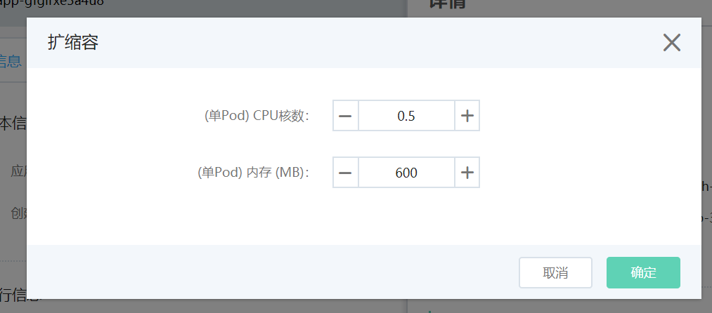

### 配置负载均衡

1、登录微服务平台控制台。 在左侧导航栏点击应用管理，进入应用列表页。

2、选择需要配置的应用，点击应用名称，进入应用详情页。

3、点击操作栏中的详情，可在应用设置中进行负载均衡配置。

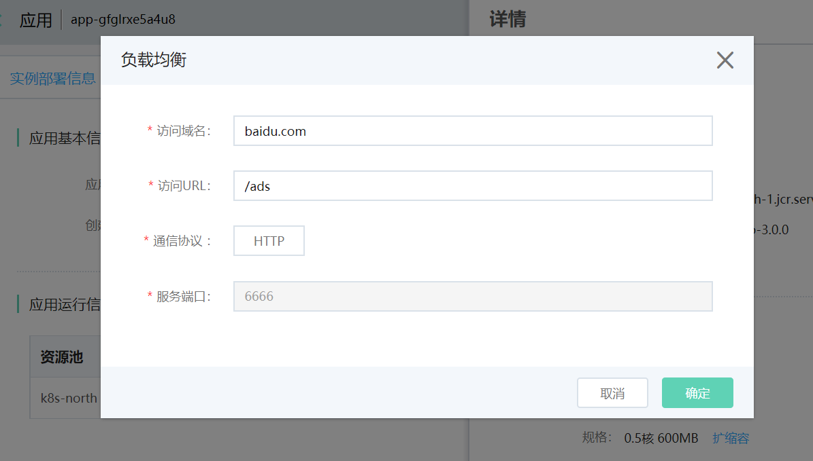

可参考： [Nginx-ingress controller部署](../../../../Elastic-Compute/JCS-for-Kubernetes/Best-Practices/Ingress/Deploy-Ingress-NGINX-Controller.md)

###  配置应用日志 

配置应用日志的过程，需要在“配置部署”页面进行配置。

1、登录微服务平台控制台。 在左侧导航栏点击应用管理，进入应用列表页。点击操作“发起部署”。

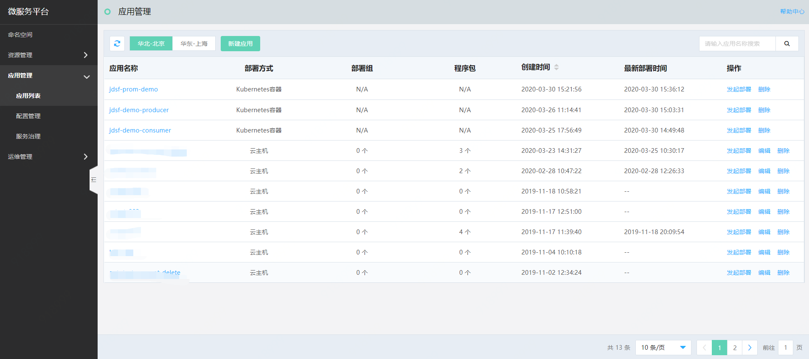

2、在高级配置中，找到“应用日志”的配置。打开配置开关，填写日志信息。

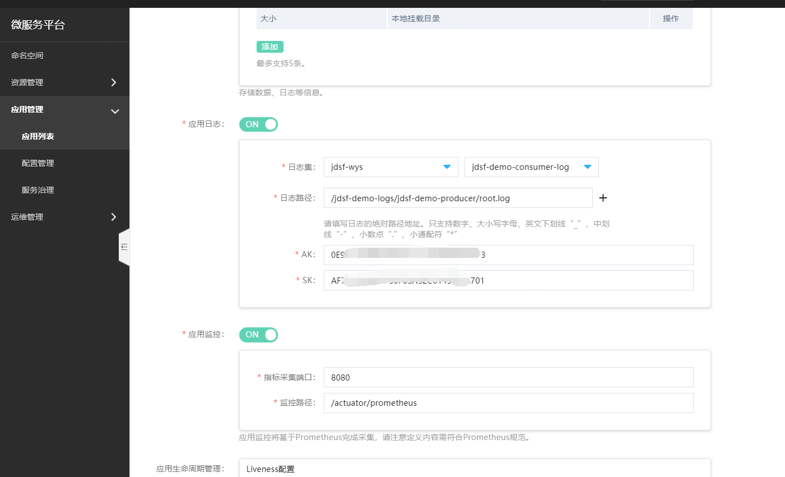

| 信息项	| 说明	| 
| :- | :- | 
|  日志集	|  应用日志通过云日志进行采集，请提前准备日志集。创建日志集请参考： [日志集管理](../../../../Management/Log-Service/Operation-Guide/LogSet/LogSetManagement.md)	| 
|日志路径 | 该路径为日志采集路径，请填写绝对路径。| 
| AK/SK | 需要填写当前用户名下可用的 Access Key/Access Key Secret，该信息请参考： [Accesskey管理](../../../../User-Service/Account-Management/AccessKey-Management.md)|  

 
3、部署成功后，在应用详情中的应用运行信息中，可查看不同资源池中的应用运行信息。
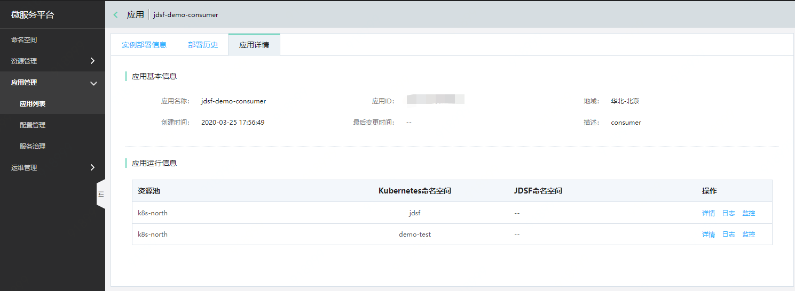

4、点击操作中的“日志”，即可跳转至日志信息页。通过检索，可查看采集的日志信息。
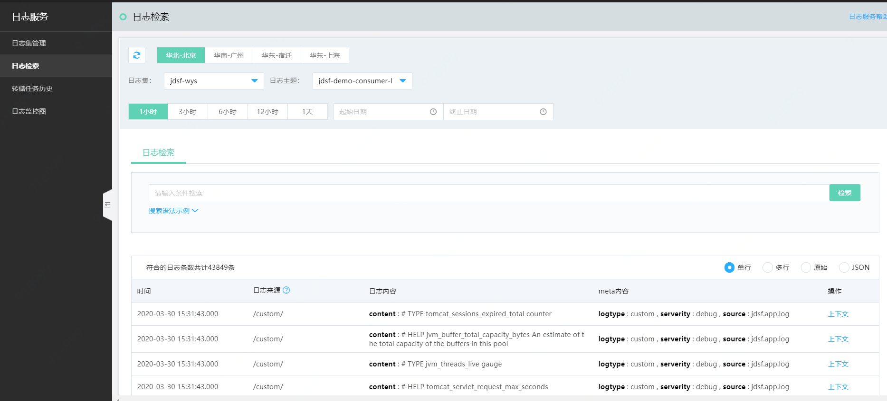

###  配置应用监控 

配置应用监控的过程，需要在“配置部署”页面进行配置。

1、在 Kubernetes 中打开 集群监控

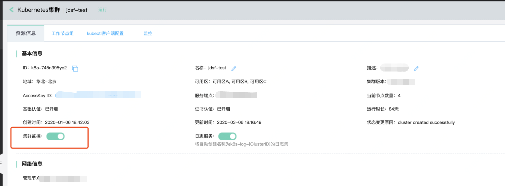

2、登录微服务平台控制台。 在左侧导航栏点击应用管理，进入应用列表页。点击操作“发起部署”。

3、在高级配置中，找到“应用监控”的配置。打开配置开关，填写配置信息。

| 信息项	| 说明	| 
| :- | :- | 
| 采集端口 | 采集端口 | 
| 采集路径 | Prometheus 将使用该路径进行采集，并将采集结果上报至云监控。 | 

4、部署成功后，在应用详情中的应用运行信息中，可查看不同资源池中的应用运行信息。

5、点击操作中的“监控”，即可跳转至应用监控信息页。通过自定义指标方式，即可查看监控图表。
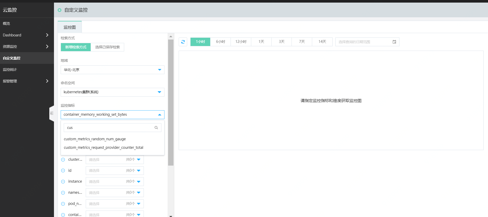

自定义监控使用方式，可参考： [自定义监控使用说明](../../../../Management/Monitoring/Operation-Guide/custom-monitoring/custom-monitoring-overview.md) 

【举例】在自定义监控中查看应用监控

假设自定义了监控指标随机数统计custom_metrics_random_num_gauge，并且应用已经部署成功。那么在“自定义监控”中查看该指标方式为：

STEP1:在“命名空间”项中选择“kubernetes集群(系统)”，

STEP2:选择监控指标“custom_metrics_random_num_gauge”

STEP3:选择聚合方式和维度。之后即可看到监控图表。

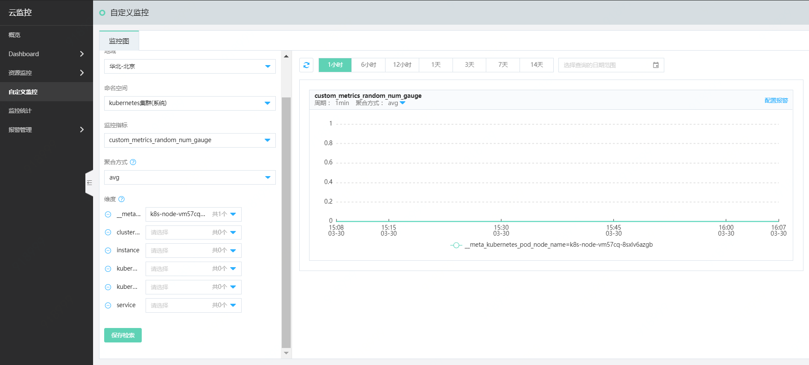

