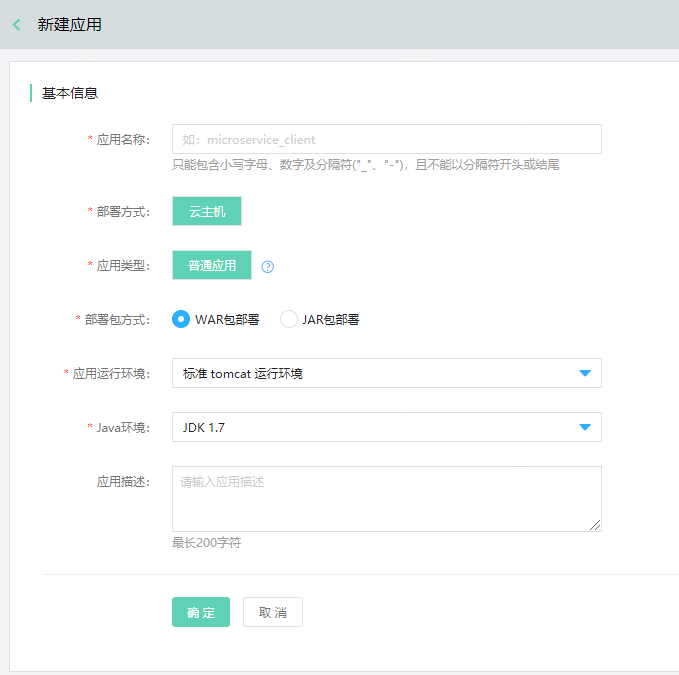
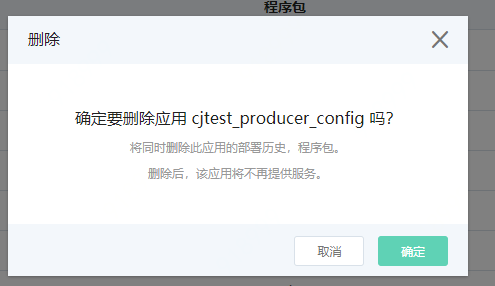

#  应用管理
应用，是一组具有特定功能组成的集合。当前平台提供虚拟机应用的部署，用户可通过虚拟机部署方式，部署应用程序包到云主机上。

- 1台云主机上只能部署1个应用；
- 支持WAR包、JAR包部署。

## 操作场景

例如，用户在命名空间（如预发环境、线上环境）中，部署程序包、创建应用、删除应用等。

## 操作步骤

应用的操作流程如下：

### 创建应用

1、	登录微服务平台控制台。在左侧导航栏点击应用管理，进入应用列表页。

2、	在列表上方，点击新建应用，进入创建页。

3、	设置基本信息，单击确定，完成创建。

**说明：**

-  Java运行环境目前支持JDK1.7、OpenJDK1.8。

### 删除应用

1、登录微服务平台控制台。	在左侧导航栏点击应用管理，进入应用列表页。

2、对于需要删除的应用，点击操作列的删除。

**说明：**

- 需先删除部署组，才能删除应用；否则无法删除。

- 删除应用时，将同时删除程序包和部署历史。

- 用户需在删除数据前，自行做好数据备份工作。

### 应用部署

该内容，请参考 ： [应用部署](APPDeloy.md)  。

### 实例部署信息

1、 用户可查看当前应用，通过哪些部署组，被部署至哪些实例上；并可对每个实例上的应用，进行启动应用、停止应用等操作。

2、 当需要从部署组中移除实例时，可至部署组详情页中选择并删除。删除实时生效。 

### 程序包管理

1、程序包管理中上传的是当前应用在部署中所使用的程序包。

2、在删除应用的同时，将删除应用下的所有程序包；删除前用户需自行备份。

3、目前，程序包支持JAR, WAR两种类型，最大支持256兆。

### 部署历史

该节内容，可查看部署组章节。在删除部署组的同时，用户可选择是否同步删除部署历史；删除前用户需自行备份。

### 部署组

该节内容，可查看 [部署组](Deploy-Group.md)  章节。

