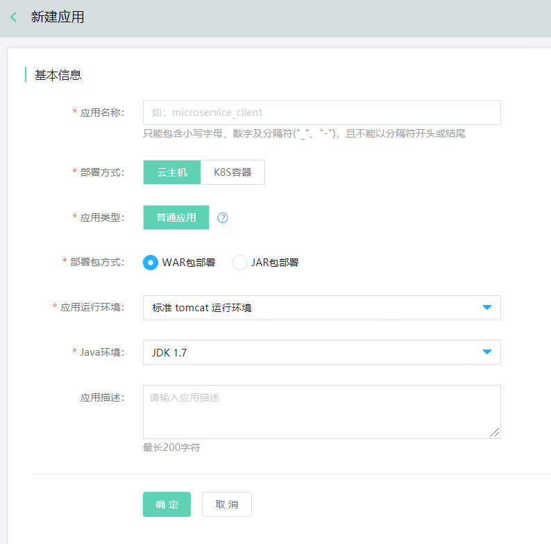
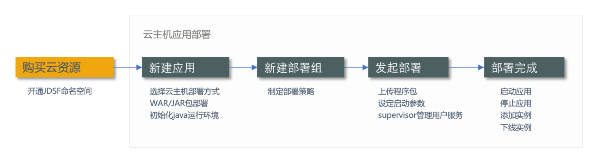

#  应用管理概述
应用，是一组具有特定功能组成的集合。当应用完成开发后可通过控制台进行应用部署，目前已支持虚拟机应用部署,集成K8S容器应用部署。

|   | 云主机部署 | K8S容器应用部署 |
| :- | :- | :- |
| 操作场景 | 为传统部署方式。用户在命名空间（如预发环境、线上环境）中，部署程序包、创建应用、删除应用等。 | 在京东云上使用K8S集群后，可通过JDSF部署K8S应用。 |
| 部署方式 | 部署应用程序包到云主机上。1台云主机上只能部署1个应用。 | 部署K8S应用到京东云上的K8S集群。  |
| 资源池 | 云主机 | K8S集群 |
| 部署介质 | WAR包、JAR包 | 镜像 |

## 应用的基本操作

### 创建应用

1、	登录微服务平台控制台。在左侧导航栏点击应用管理，进入应用列表页。

2、	在列表上方，点击新建应用，进入创建页。

3、	设置基本信息，单击确定，完成创建。

### 删除应用

1、登录微服务平台控制台。	在左侧导航栏点击应用管理，进入应用列表页。

2、对于需要删除的应用，点击操作列的删除。

**说明：**

- 如果有部署组，需要先删除部署组，才能删除应用；否则无法删除。

- 删除应用时，将同时删除程序包和部署历史。

- 用户需在删除数据前，自行做好数据备份工作。

### 应用部署

1、云主机应用部署流程如下：

详情请参考 ：[云主机中部署应用](APPDeloy.md)  
 
 
2、K8S容器应用部署流程如下：

详情请参考 ：[在K8S容器中部署应用](APPDeloyK8S.md)  
 

**说明：**

1. 在资源池中重新导入云主机，可以把安全组的50001端口打开。

2. 重做新操作系统，不会改动安全组。部署成功就可以正常停止/启动应用。

3.如果用户手动改动安全组或者云主机里面的防火墙设置，可能会影响停止/启动应用的功能。

### 实例部署信息

1、 用户可查看当前应用，通过哪些部署组，被部署至哪些实例上；并可对每个实例上的应用，进行启动应用、停止应用等操作。

2、 当需要从部署组中移除实例时，可至部署组详情页中选择并删除。删除实时生效。 

### 程序包管理

1、程序包管理中上传的是当前应用在部署中所使用的程序包。

2、在删除应用的同时，将删除应用下的所有程序包；删除前用户需自行备份。

3、目前，程序包支持JAR, WAR两种类型。

### 部署历史

在删除部署组的同时，将同步删除部署历史；删除前用户需自行备份。

### 部署组

云主机方式部署应用时，需要通过部署组来实施部署，相关内容请参考： [部署组](Deploy-Group.md)  章节。

