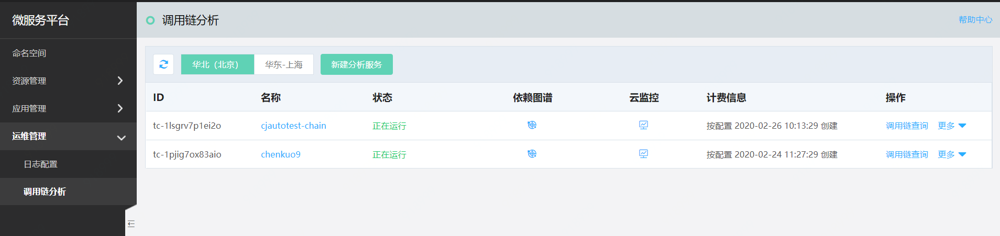
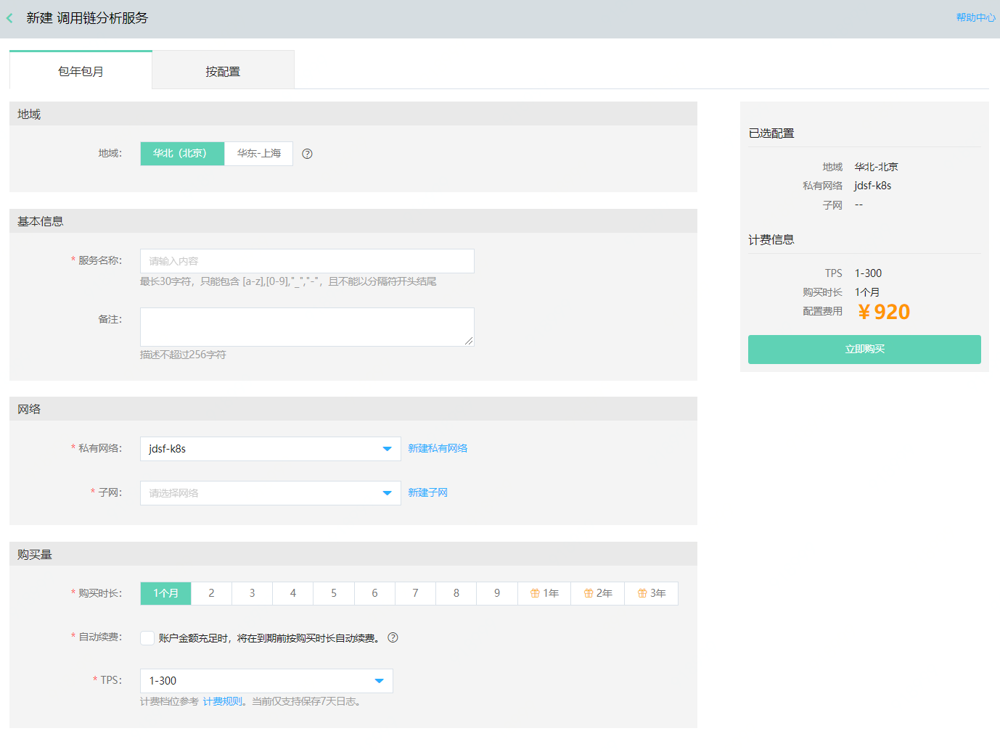
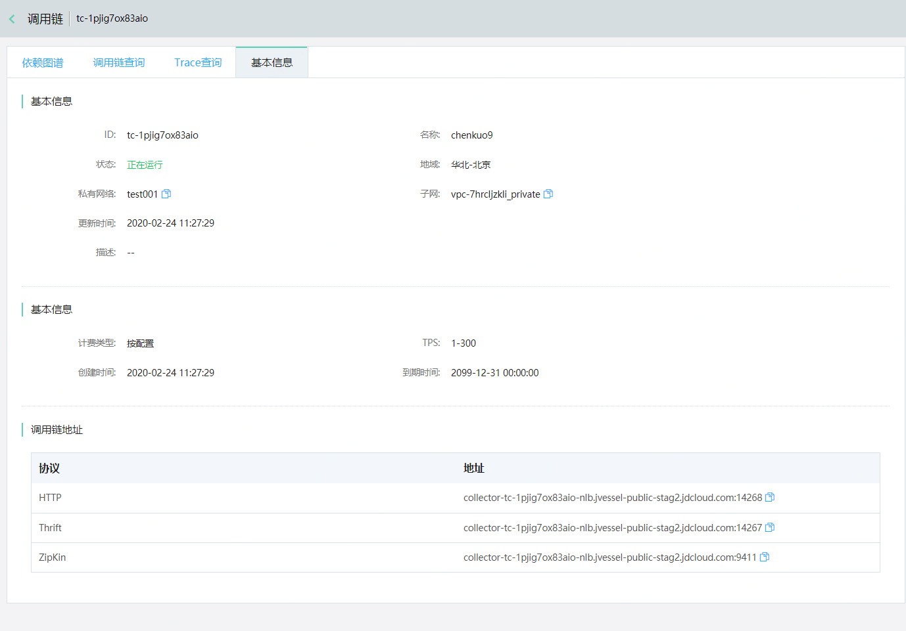
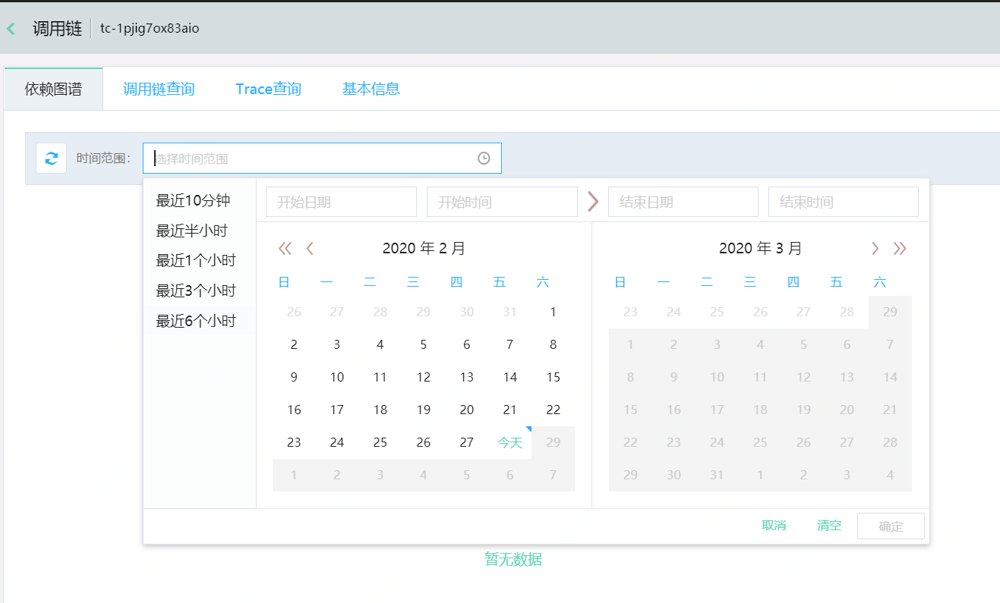
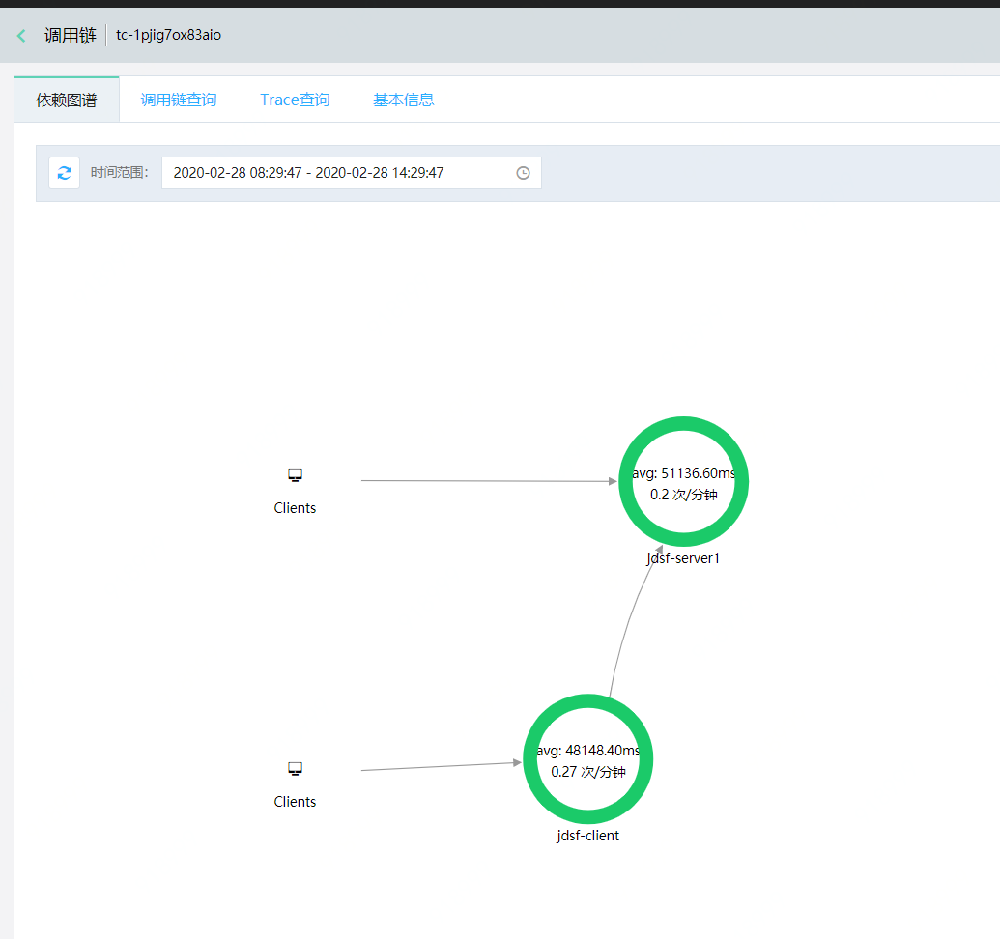
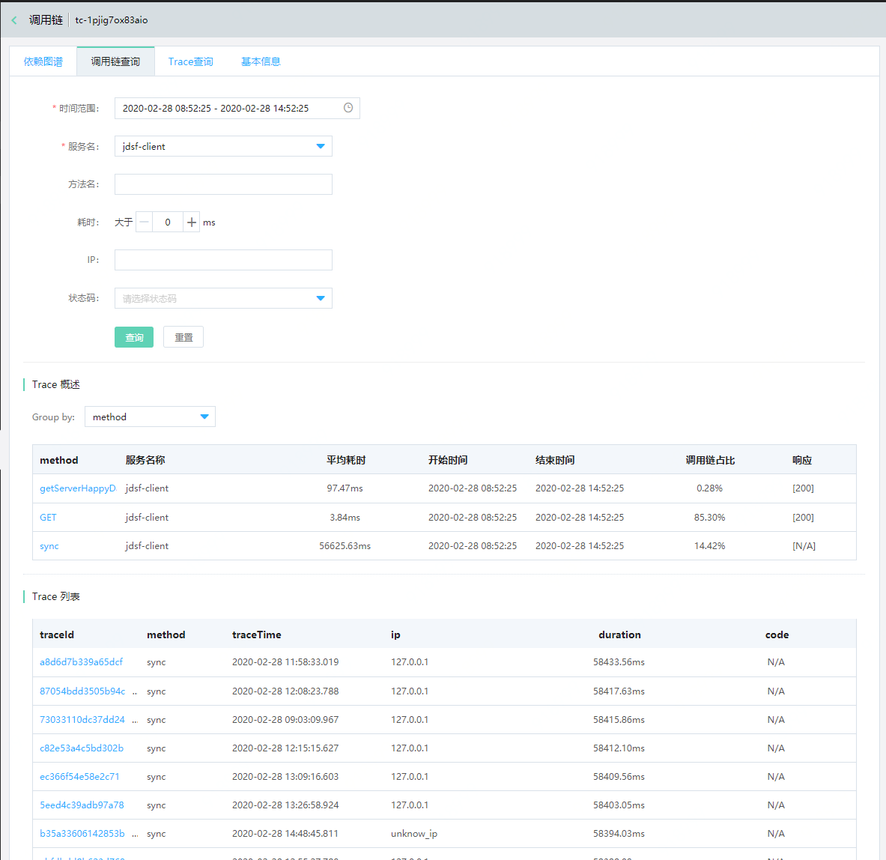
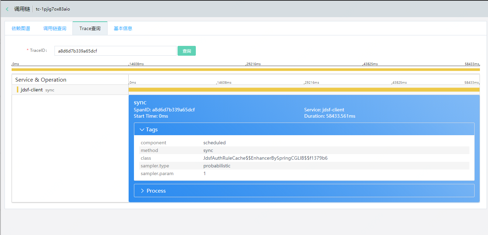
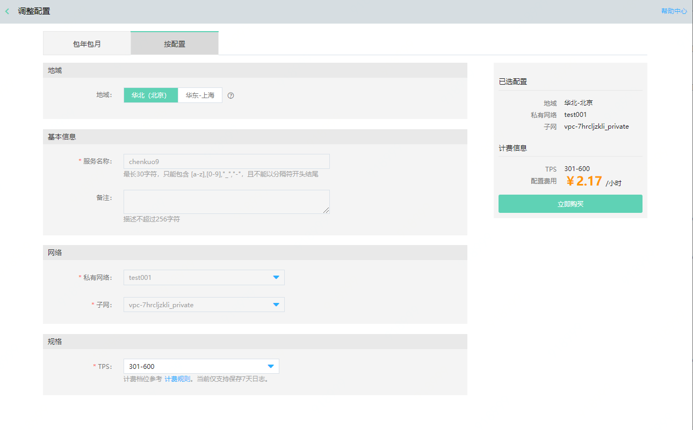
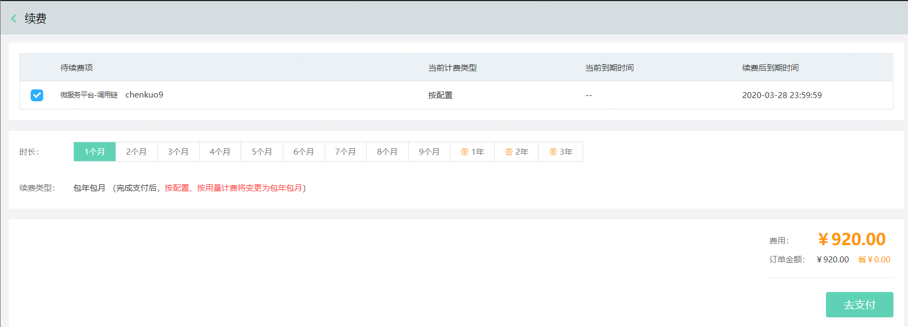

#  调用链分析服务
调用链分析服务即提供了对某个服务、某个逻辑操作的执行情况进行的监控的功能。在微服务架构下，一个请求从发出到响应，中间可能经过了很多个服务的调用，调用链分析服务对分析服务调用关系、耗时操作、性能瓶颈上价值很大。
	
调用链分析服务包括新建分析服务、删除、修改、调用链查询、依赖图谱。

## 操作步骤：

### 新建分析服务

第1步：选择地域。

先选择分区，然后再在此分区中点击新建分析服务。如图所示，先选择“华北-北京”分区，再点击“新建分析服务”。
   
   
   
第2步：新建分析服务

目前调用链支持两种收费方式：按配置、包年包月。您可根据需要，选择不同计费方式。收费方式可参考： [计费说明](../../Pricing/Billing-Overview.md)

您需依次录入服务名称、备注、选择集群网络及子网ID、TPS、购买信息等信息。然后点击保存，完成创建过程。

   
   
这里的调用日志并发写入数量需要您根据集群的TPS进行估计，其含义可以理解为整个业务集群总TPS乘以采样率。如果不太确定，建议选较低的档，然后根据系统运行起来后的实际TPS进行扩容。

目前调用链分析服务只支持扩容，暂时不支持缩容，请避免选择的规格过大。

调用链分析服务直接部署在用户VPC中，会根据用户选择的不同规格占用VPC中的不同数量的内网IP，请确保所选子网动态IP充足。
 
第3步：保存并创建成功后，可在调用链分析服务列表中，看见新增的调用链分析服务。

### 查看调用链服务详情

第1步：选择调用链，然后点击您需要查看的服务名称。

  
   

第2步：查看详情。
 
   

您可根据连接调用链服务使用的不同网络协议，选择合适的调用链地址进行使用。

###  依赖图谱

第1步：先选择您需要查看的调用链服务，然后点击依赖图谱操作。

   
    
第2步：选择时间单位，查看依赖图谱。

   
 
 选择时间范围后，将加载该时段内的图普信息。
 
   
   
 ###  调用链查询
 
 调用链服务提供了高级检索功能，您可根据时间范围、当前调用链服务中的服务名、方法名、好实、IP、状态码等方式，查询调用链信息。

 
   
第3步：点击某一个Trace id，可查询该trace id 的信息。
  
   

 ###  根据Trace id查询
 
 您也可根据Trace id直接检索信息。
 

###   调整配置

目前仅支持进行升配调整，暂不支持降配。

 
如您在调整配置过程中有任何问题，可咨询客服。

###   转包年包月

对于“按配置”计费类型的资源，支持转为“包年包月”收费类型。

暂不支持由“包年包月”计费类型转为“按配置”计费类型。如您在操作过程中有任何问题，可咨询客服。

###   删除服务

###  第1步：选择需要删除的服务
   
 
###  第2步：点击确定进行删除。
   

说明：

- 删除后调用链数据会丢弃，请谨慎操作。

- 如果您的资源处于无法删除状态，请先查看账户是否欠费，如若欠费需先补足欠款再进行资源删除；如若还有问题无法解决，您可联系客服或提交工单联系我们。

