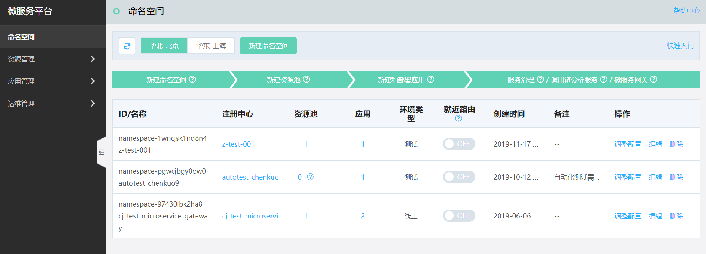
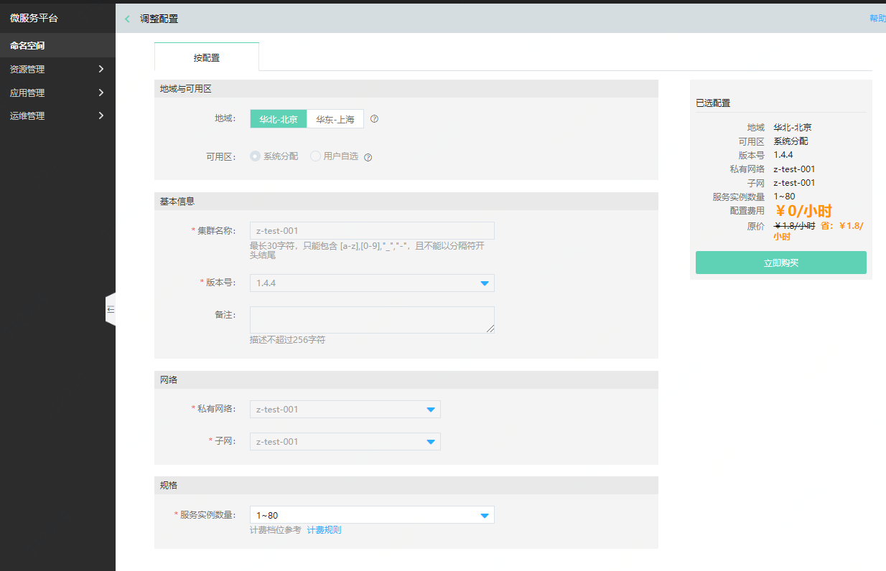
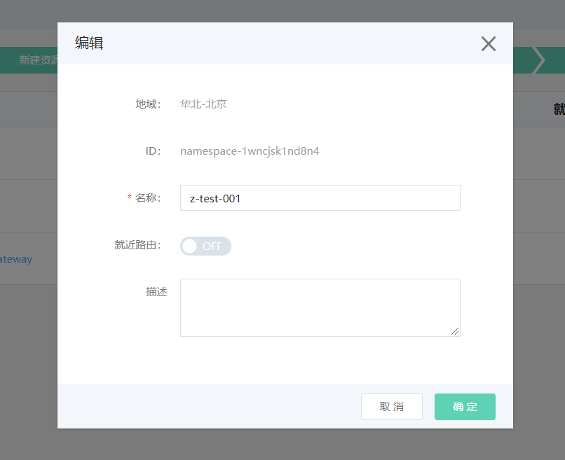

# 命名空间
命名空间，是对一组资源和对象的抽象集合，用于实现资源的隔离。用户在同一个VPC下，可创建多个命名空间。

例如：用户在同一VPC中，可根据项目对区分开发环境、测试环境、生产环境的需要，分别创建3个命名空间；并且每个环境中，资源、应用都是相互隔离的。
 

## 操作步骤

### 创建

1、	登录微服务平台控制台。在左侧导航栏点击命名空间，进入命名空间列表页。

2、	在列表上方，点击创建命名空间，进入创建页。

3、	设置服务信息，单击立即购买按钮，完成创建。

**说明：**

-  注册中心也将同步生成，管理该命名空间下的所有服务的注册发现。

-  命名空间显示的应用数量，指当前该命名空间下挂载的应用总数，包含部署成功、部署不成功、尚未部署的；而注册中心中显示的应用数，是部署成功，且注册中心可进行发现的应用数。

-  目前“系统分配”提供支持多可用区，“用户自选”只支持选择1个可用区。

### 调整配置

通过调整配置，可扩容命名空间的实例规格。

1、登录微服务平台控制台，进入命名空间列表页。

2、进入调整配置页。

3、选择所需规格，单击立即购买按钮，完成创建。

**说明：**

-  当前注册中心调整配置，只支持扩容，不支持缩容。

 
### 编辑

当前支持对命名空间的名称和描述进行修改。

  

 
 
### 删除

1、	登录微服务平台控制台。	在左侧导航栏点击命名空间，进入命名空间列表页。

2、对于需要删除的命名空间，点击操作列的删除。

**说明：**

1、在删除命名空间前，需要先清理其下所有的应用，否则无法删除。

2、在JDSF平台要求**注册中心名称唯一**，因此在删除命名空间后若再创建新命名空间时，需要保证**注册中心名称唯一**，且不能与历史创建过的注册中心名称重名。

3、用户需在删除数据前，自行做好数据备份工作。

