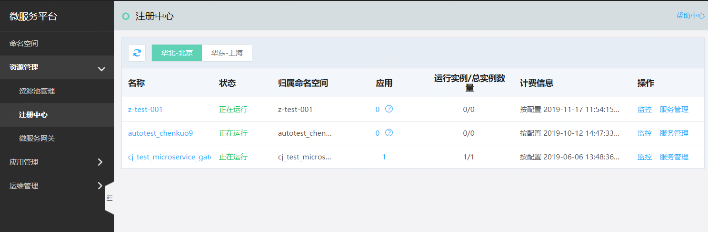
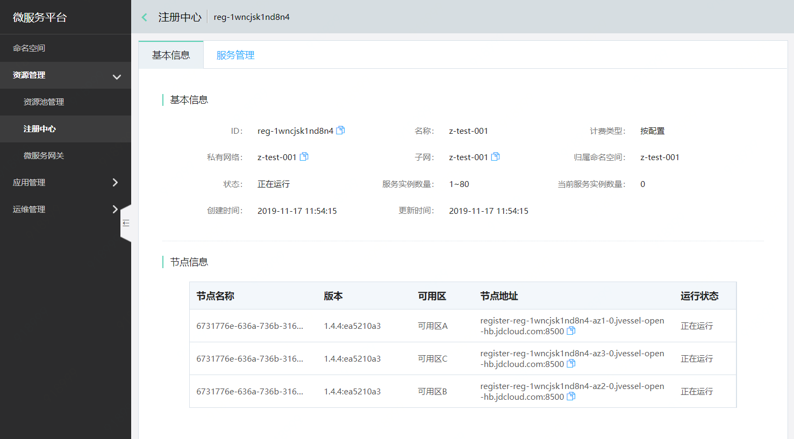

# 注册中心

注册中心，实现服务的注册与发现，是微服务的管理中心。用户在创建命名空间同时创建了注册中心；当删除命名空间时，也将同步删除注册中心信息。

注册中心提供的服务包括查看注册中心中的基本信息、服务信息、监控信息等。

 
## 操作步骤

### 注册中心
登录微服务平台控制台。在左侧导航栏的资源管理下，点击注册中心并进入列表页。

 
 点击注册中心的名字，可查看到当前注册的基本信息。用户可在基本信息中查询到节点名称、节点版本、节点所在可用区、节点地址、运行状态等信息。
 

### 服务管理

**说明：**

### 监控
可对当前注册中心的状态、服务实例情况、发布情况等信息进行监控，并配置报警规则。
