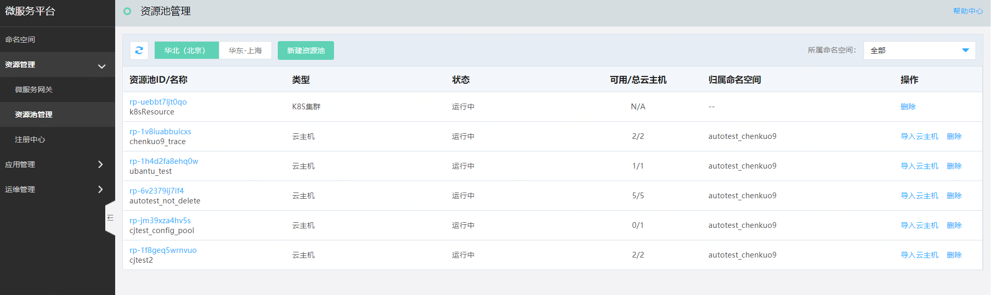
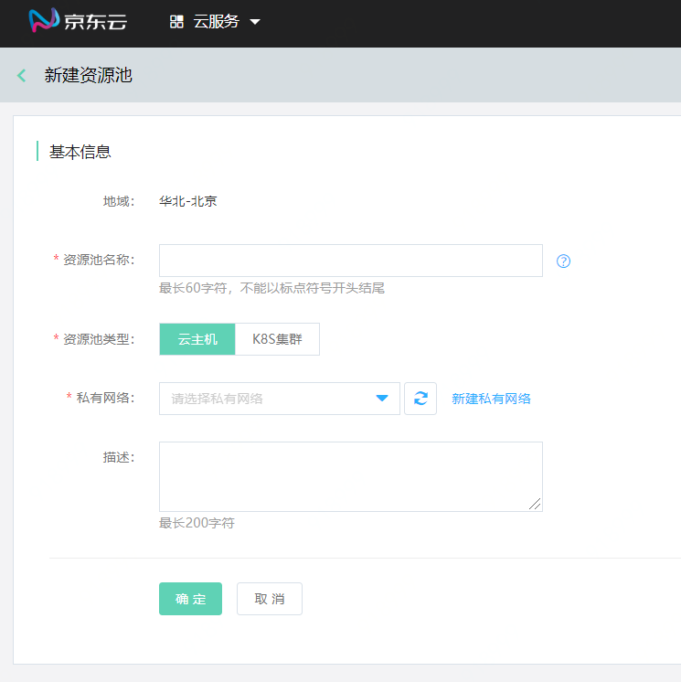
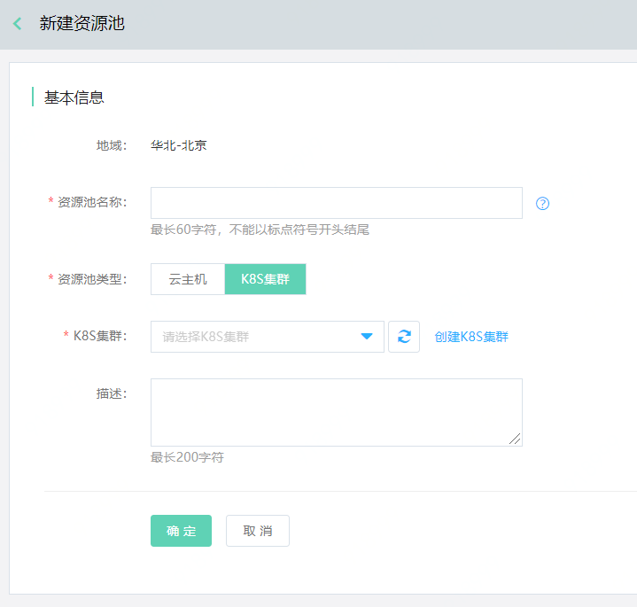
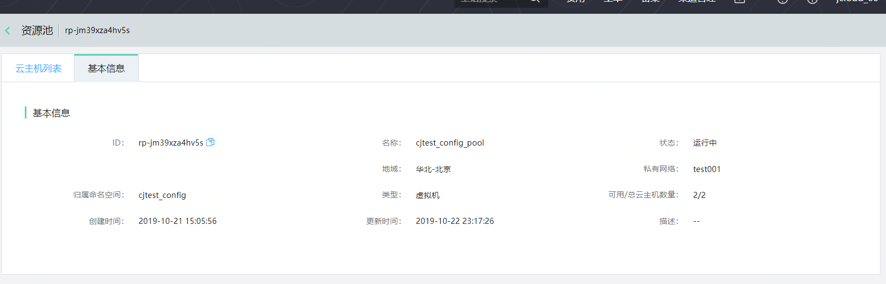
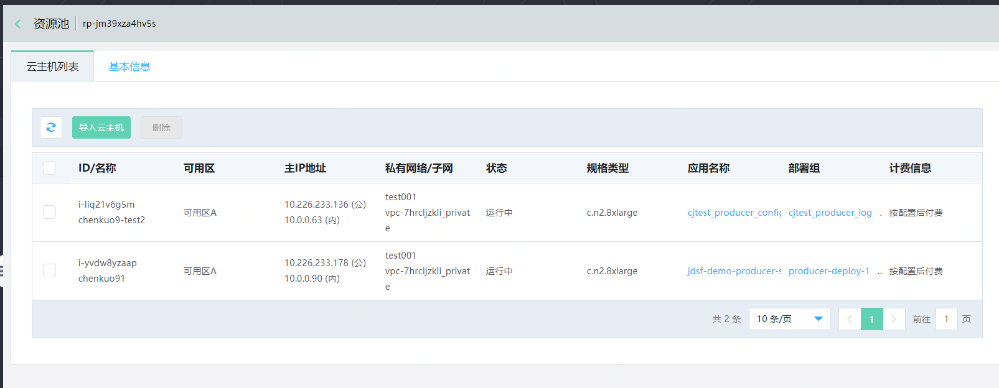

# 资源池管理

资源池，是一组资源集合的概念，通过资源池，可管理命名空间下的云主机、容器等资源。

**说明：**

-   1个资源池只能服务于1个命名空间；而1个命名空间下，可以同时存在多个资源池。
-   用户在资源池中，可进行新建/删除资源池、导入云主机、导出云主机等操作。

## 准备工作

如果用户计划创建云主机资源类型，则在创建资源池前，默认用户已经购买/开通完云主机、私有网络等资源；

如果用户计划创建K8S资源类型，则需要在创建资源池前，默认用户已经购买/开通完云K8S相关资源；

## 操作步骤

### 创建资源池

1、	登录微服务平台控制台。在左侧导航栏点击资源管理，进入资源池管理列表页。

2、	在列表上方，点击新建资源池，进入创建页。设置资源池信息，单击确定完成创建。

若用户创建的是云主机资源，则需关联相应的私有网络。

若用户创建的是K8S资源，则需关联相应的K8S集群。

3、资源池信息。

对于云主机类型资源池，可查看云主机资源池相关信息；对于K8S资源池，则可查看K8S集群信息。

| 字段 | 说明 |
| :- | :- |
|  可用云主机数量 |  指运行中的云主机数量。 |
|  资源池云主机  |  指当前这个资源池中的云主机总数量。  |
|  归属命名空间  |  指当前这个资源池，在JDSF中所归属的命名空间。  |

4、资源池中的云主机信息。

**注意：**

-   资源池需要与其将所服务的命名空间，属于同一VPC内。
-   在资源池中，用户可进行新建/删除资源池、导入云主机、移除云主机等操作。
 

### 删除资源池

1、	登录微服务平台控制台。在左侧导航栏点击资源管理，进入资源池列表页。

2、	对于需要删除的资源，点击操作列的删除。

1）对于云主机类型资源：

- 在删除资源池前，需要先将该资源池中的所有云主机都删除掉。

- 在删除资源池前，需要对绑定在云主机上部署组解除绑定。

- 在删除数据前，还需自行做好数据备份工作。

2）对于K8S类型资源：

- 在删除前，需要先删除通过该资源池部署的应用。

- 删除即为解除K8S与JDSF平台的绑定关系。

### 导入云主机

1、	登录微服务平台控制台。在左侧导航栏点击资源管理，进入资源池列表页。

2、	对于需要进行操作的资源池，点击操作列的导入云主机操作。

**说明：**

1、当前仅支持绑定同VPC下的且未被绑定过的云主机，才可导入。

2、一个云主机只能绑定1个资源池。

### 移除云主机

1、登录微服务平台控制台。	在左侧导航栏点击资源管理，进入资源池列表页。

2、点击ID进入云主机列表页，选择需要移除的云主机，进行删除。用户需在删除数据前，需要先把云主机从部署组中解除绑定再进行删除。

3、删除前需自行做好数据备份工作。

