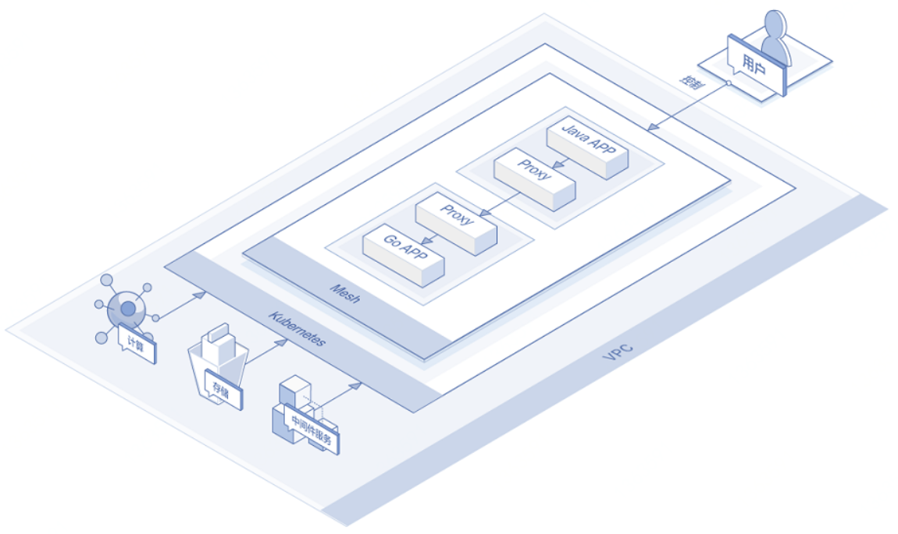
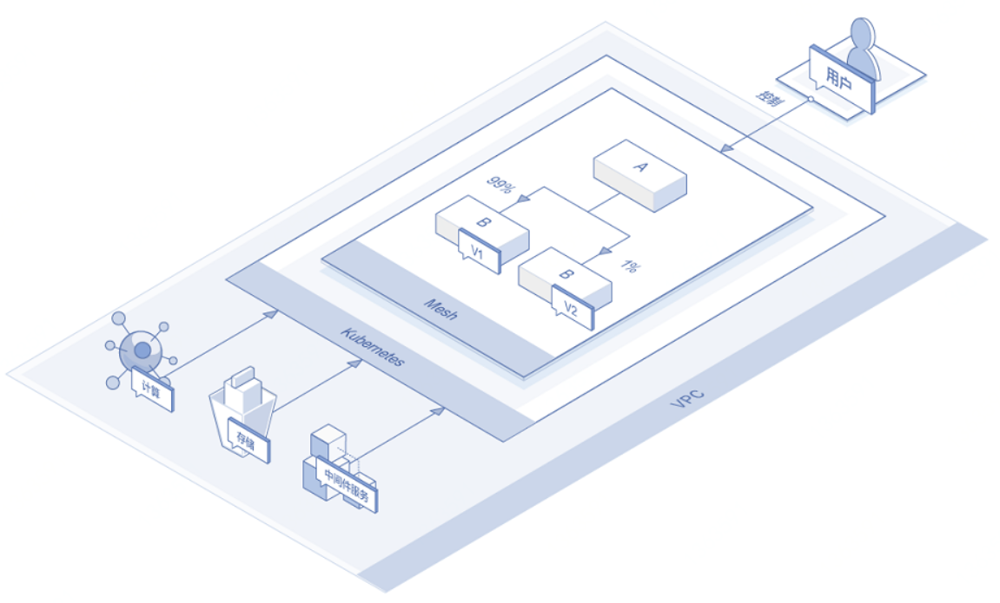
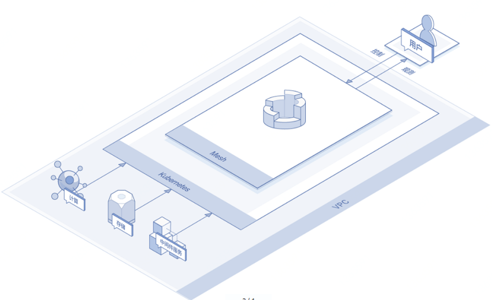

# 应用场景

###	跨语言服务治理

京东云服务网格具有与语言无关的特点，可以支持多种语言应用的统一治理。

由Java应用访问Golang应用时，Proxy可以在转发请求流量的同时实现服务治理功能。

###	分流

服务网格支持按HTTP Header、URI、权重三种维度进行调度流量，用户可以使用该特性实现灰度分布、蓝绿部署等功能。

###	可观测

服务网格通过代理采集度量数据发往Mixer及后端支撑观测平台，以实现对业务应用的实时监控。

