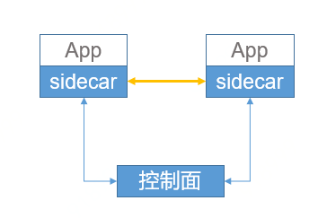

# 产品概述

服务网格是具有无侵入、语言和框架无关等特点的第二代服务治理框架，致力于将服务治理的功能平台化，让用户聚焦业务流程开发。

京东云网格（Mesh），是京东云上的服务治理的工具，是Service Mesh在京东云平台上的具体实现。它依托于京东云Kubernetes集群，为应用提供了基础设施层，以Sidecar模式（如下图所示）与微服务应用一起运行，适用云原生应用进行服务治理，主要功能包括服务注册发现、服务调用、流量管理、服务观测等。目前尚不支持自建K8S集群上的应用治理。

服务网格具有以下优势：

-  与开发语言和框架无关

-  业务开发者不用深入研究服务治理的实现

-  业务模块与服务治理解耦

-  服务治理功能升级、独立于业务模块升级

-  运行时动态调整各种规则和策略
