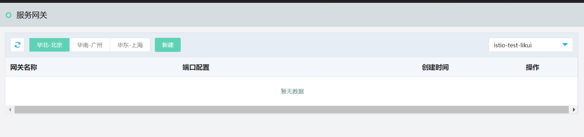
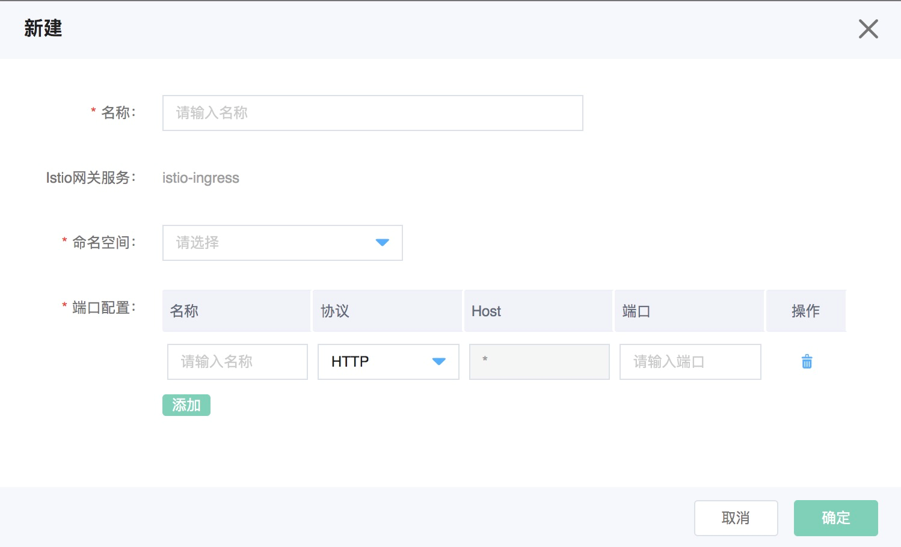

#  服务网关（Ingress Gateway）

通过服务网关，提供服务的外网访问入口。

##  操作说明

###  新建服务网关

1、	登录控制台，互联网中间件>云服务网格>服务网关。

 

2、	点击新建。

 

| 信息项 | 说明 |
| :- | :- |
| 名称 | 新创建的服务网关的名称。 | 
| Istio网关服务 | 默认为istio-ingress服务。 | 
| 端口配置 | 单击添加，可以增加多个端口的配置。 | 
| 端口名称 | 端口的名称 | 
| 端口协议 | 支持HTTP/TCP | 
| 端口 | 1-65535 | 
| Host | 默认为通配符“*”，不可修改。 | 

	
	
 
###  删除网关

- 如果已有绑定的虚拟服务，则不能编辑、删除;解绑后才可以编辑删除。

- 删除后，将不能恢复。

