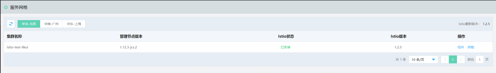
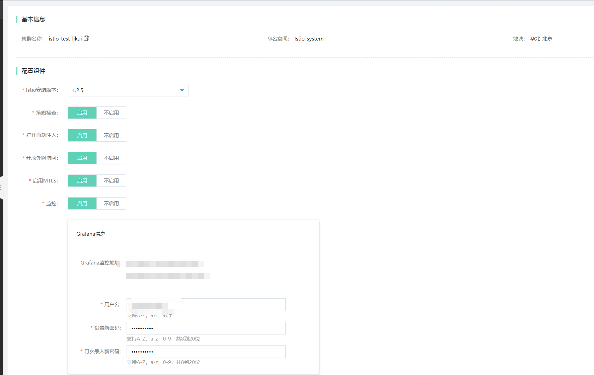

#  Istio管理

服务治理（Service Management），即对服务的生命周期进行管理，包含服务的注册和发现、处理服务调用之间的关系、服务监控和分析等。

部署网格的过程，即为在K8S中安装部署网格的过程。

## 环境准备

- 已经开通所需资源如：云主机、云网格、K8S集群等。网格依赖于K8S存在。

- 开放外网访问，系统会自动创建京东云负载均衡组件并申请公网IP，带宽为1Mbps，收费标准请参考 [弹性公网IP](../../../Hyper-Converged-IDC/Cloud-Physical-Server/Operation-Guide/Networking/Elastic-IP-For-Physical-Cloud.md) 的收费  。
	

## 操作说明

###  部署网格

1、	登录控制台。菜单位置：互联网中间件>云服务网格>Istio管理
 
 

2、	当用户创建完K8S集群后, 在Istio管理中，会自动检索到用户创建的K8S列表。用户可选择需要部署网格的K8S集群，点击操作中的“部署”，往该集群中部署K8S。
 

配置组件信息说明：

| 信息项 | 说明 |
| :- | :- |
| 集群名称| 部署Istio的目标集群。 |
| 命名空间 | 部署Istio的命名空间。 |
| 地域 | 当前网格所在地域。 |
| 策略检查 | 将组织策略应用于服务之间的互动，确保访问策略得以执行，资源在消费者之间良好分配。 |
| 打开自动注入 | 是否启用 Sidecar 进行容器的自动注入。默认情况下启用。 |
| 开放外网访问 | 开启外网访问权限 |
| 启用MTLS | 用户可选择是否开启MTLS |
| 监控 | 是否启用Grafana 展示指标的度量数据。如开启，则需要提前设置用户名和密码。  |
| Kiali 观测 | 是否启用 Kiali 可视化服务网格。如果开启，则需要提前设置用户名和密码。 |
| 调用链 | 是否启用Jaeger调用链。用户可设置调用链采样率百分比 。 |
| 示例组件 | K8S官方示例组件 |

3、	在用户配置完基础信息后，点击部署，系统将为当前K8S集群部署Istio。

4、	可通过以下方法查看部署是否成功。

1)	当提交部署后，即可通过执行进度，查看部署过程。若有报错信息，可查看日志，并进行重新部署。

2)	在Istio管理页，查看当前集群的Istio部署状态。

5、	当部署成功后将会有如下变化：

1)	默认会创建一个服务网关（Ingress Gateway）

2)	在“虚拟服务”中，将自动检索到并展示当前K8S集群中所有的服务列表。

###  组件管理

当网格初次部署完成后，可根据实际需要，对网格组件进行再次配置。

入口：互联网中间件>云服务网格>Istio管理，在操作栏中有组件管理操作。

###  卸载

1、	登录云服务网格控制台。在左侧导航栏点击并进入云网格管理列表页。

2、 在列表中，点击操作中的“删除”。

-  删除后，当前为Istio所配置的内容将全部删除。

-  删除后，若再重新为当前集群创建Istio，则视为重新安装。

