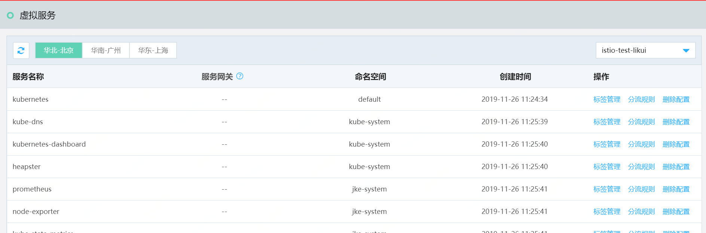
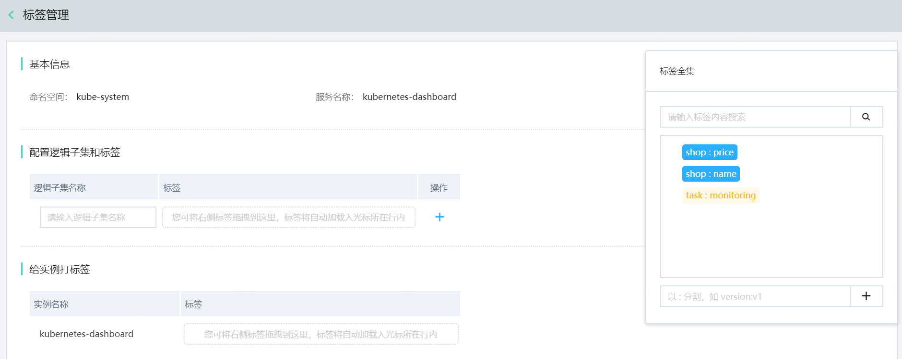
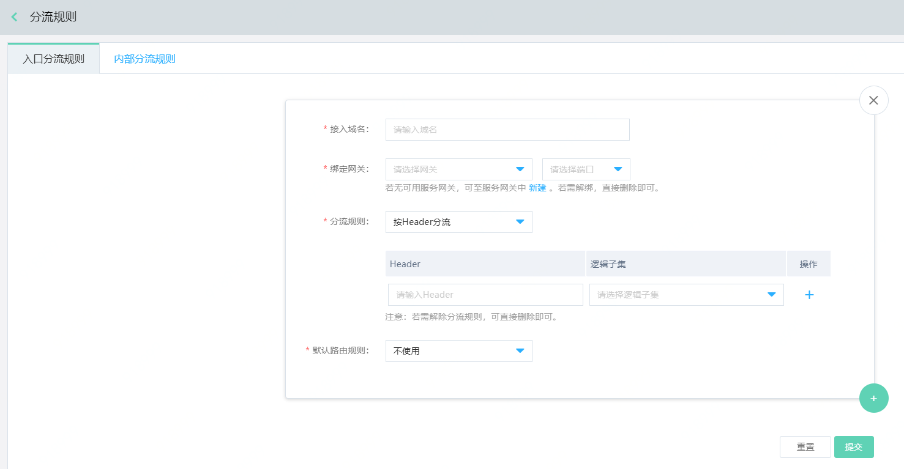
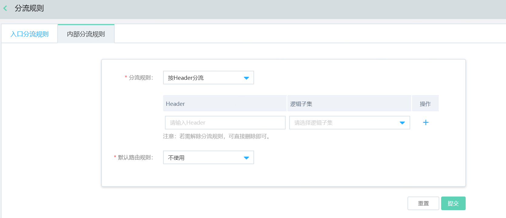

#  虚拟服务（Virtual Service）

在虚拟服务管理页中，平台将自动检索并展示当前K8S集群中所有的服务列表。若内容为空，用户需先至K8S中创建服务。

##  环境准备

1、	用户需要先创建K8S集群，并部署了网格。

2、	K8S中已经运行有服务。

3、	如果需要对外提供服务，则需要提前准备好服务网关。

##  操作说明

### 逻辑子集（Destination Rule）

通过配置逻辑子集，完成给实例打标签，下一步即可为服务配置分流规则。

1.	登录控制台。菜单位置：互联网中间件>云服务网格>虚拟服务。

2.	点击操作中的“标签管理”，进入配置逻辑子集页面。

在此步骤，您需配置逻辑子集和标签，并且给实例打标签。

说明：

1)	逻辑子集中的标签，仅能从右侧“标签全集”中选择。

2)	标签全集中的标签，分为两类：来源于K8S中初始化的标签，用户自行创建的自定义标签。

3)	可通过拖拽，将标签拖动至逻辑子集中。实时生效。

4)	可通过拖拽，给实例打标签。实时生效。

### 分流规则（Traffic Rule）

分流规则包含入口分流规则和内部分流规则。用户可自定义配置，也可以不进行配置。

####  配置入口分流规则

当需要为外部请求配置分流规则时，可在入口分流规则中进行配置。

1、	登录控制台。菜单位置：互联网中间件>云服务网格>虚拟服务，点击操作中的分流规则，选择入口分流规则。

2、	绑定服务网关和端口。

3、	选择分流规则的生效方式 ，目前支持Header、URL、按权重3重方式分流。更新时会自动覆盖原来的分流规则。

####  配置内部分流规则

当需要为网格内部服务间的访问调用配置分流规则时，可在内部分流规则中进行配置。

1、	登录控制台。菜单位置：互联网中间件>云服务网格>虚拟服务，点击操作中的分流规则，选择内部分流规则。

2、	选择分流规则的生效方式 ，目前支持Header、URL、按权重3重方式分流。

 

