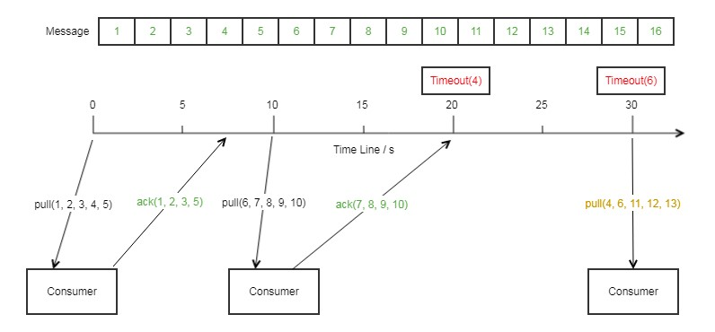

# 跳跃ACK
通常，一个分布式消息系统（如：kafka），客户端消费一个消息后需要立刻给消息系统发送一个消费确认，然后才能消费下一条消息。因此，如果某个消息在客户端处理的时间非常长或者由于别的原因导致消费确认不能及时到达，那么这段时间内后面的消息就不能被客户端处理。只能等到那条消息被处理完确认后才能继续消费。

 消息JCQ为提升消费性能，采用跳跃消费设计。当一条消息不能及时确认时，后到的消费请求仍然会把这条消息后面的消息返回给客户端。客户端可以同时消费这条消息后面的消息，从而大大提升了在特定情况下（正在消费的消息由于某种原因不能及时确认）的消费处理能力。

消息的ACK过程，以pull模式来说明（push模式相同逻辑），假定超时时间为20s：

       
最开始的时候consumer拉取了5条消息，并且在第7s的时候ACK了1,2,3,5四条消息。
       
第10s，consumer重新拉去了5条消息，并在随后ACK了第7,8,9,10条消息。
       
第20s，消息4超时，在30s的时候，消息6超时。
       
30s，consumer重新拉取了5条消息，此时，4,6超时，重新发送给客户端。

为了避免消息在这种情况下无限重试，在每次消息超时之后，下一次重新发给客户端的时间间隔会增加。如果在重发超过了一定次数之后，该消息会进入DLQ(Dead-Letter-Queue), 需要用户手动处理。

