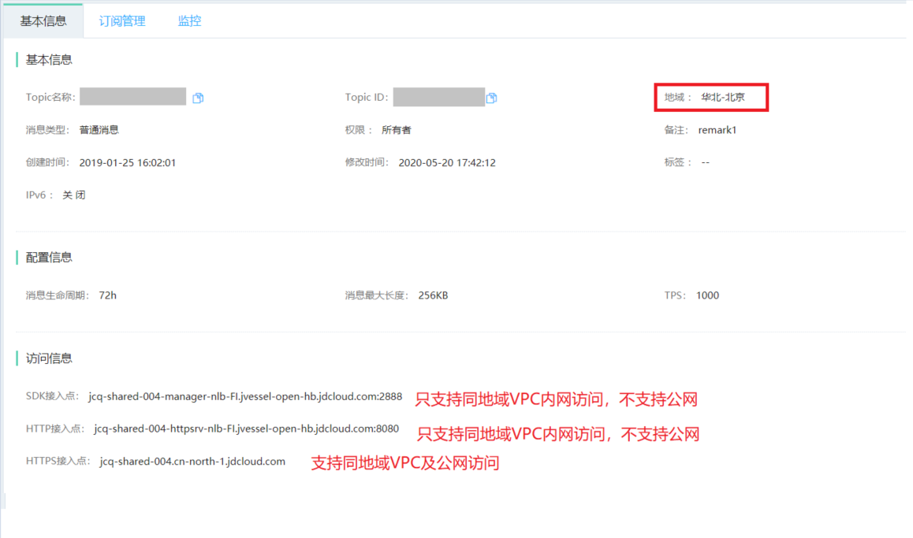
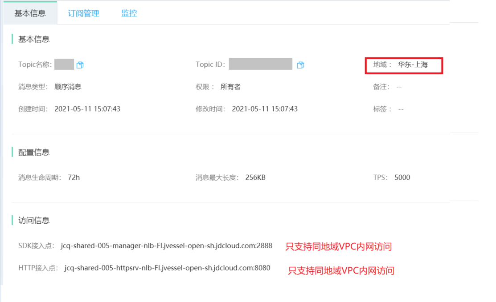
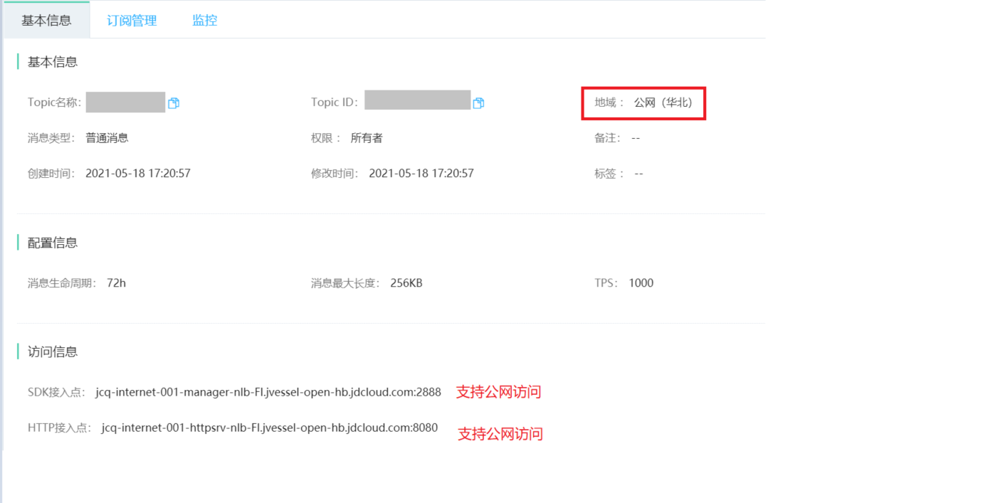

# 网络
消息队列JCQ 支持VPC、公网的访问方式，在不同地域及消费协议支持方式有所不同。

## VPC网络
消息队列JCQ在任意地域均支持用户VPC网络访问，支持TCP、Http/Https任意协议的消费方式。

## 公网
| 地域	| 是否支持公网	| 消费方式 |
| :- | :- | :- |
|华北-北京 |是| Https协议|
|华东-上海|否|--|
|公网（华北）|是| TCP、Http议|

### 访问信息获取
登陆消息队列JCQ控制台--Topic管理--基本信息，可在访问信息一栏中获取接入点信息。

Topic所在地域为华北--北京，示例如下：

Topic所在地域为华东--上海，示例如下：

Topic所在地域为公网（华北），示例如下：

