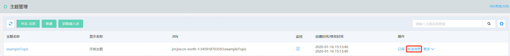
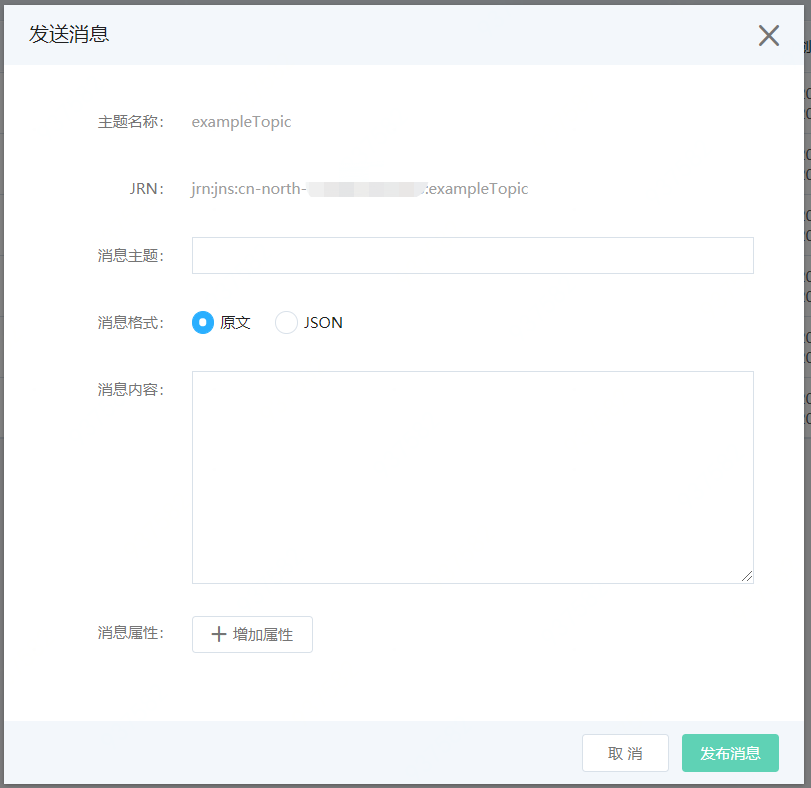

# 消息发布
1. 在主题列表找到想要发布消息的主题，点击操作列的“发布消息”。

   

2. 填写消息主题（可选），选择消息格式

   

   - 原文：所有终端节点发送相同的消息内容。

     【因为发送短信需要签名ID和模板ID，所以不建议有短信终端节点的主题用原文发送消息，因为其他类型的终端节点也会收到签名ID和模板ID，而不是短信模板里的内容】

   - Json：可自定义选择不同终端节点的消息内容。

     ```json
     {
       "default": "示例消息",
       "http": "HTTP 终端节点的示例消息",
       "https": "HTTPS 终端节点的示例消息",
       "email": "电子邮件终端节点的示例消息",
       "jqs": "队列服务 JQS终端节点的示例消息",
       "function": "函数服务 Function终端节点的示例消息",
       "sms": {
         "templateId": "模板Id",
         "signId": "签名Id",
         "params": ["男","大二"]
       }
     }
     ```
     - parans：为短信模板变量对应的数据值,Array格式，例如：["男","大二"]
     
3. 填写消息属性，可以为消息设置一些消息属性方便订阅者通过筛选策略筛选消息，或者只是为不同消息分类。

   - 消息属性数量限制为10个，消息属性的所有组件都包括在消息大小限制中，最大为256KB。
   - 消息属性名称可以包含以下字符：A-Z、a-z、0-9、下划线 (_)、连字符 (-) 和句点 (.)。
   - 说明：
     - 1.最长可为 256 个字符
     - 2.必须在消息的所有属性名中唯一
     - 3.不能以句点开头或结尾
     - 4.序列中不能有连续句点
   - 消息属性数据类型：支持的类型包括 String、String.Array、Number 和 Binary。
   - 消息属性的值：按照提示填写相应的内容，如果属性类型是 "String.Array"请将该数组放入方括号 “[]” 内。在该数组内，将字符串值加入双引号内。

4. 选择”发布消息“，消息将发布到主题。

5. 接收消息：订阅终端之后就会收到刚才发布到主题的消息，订阅者可以登陆订阅终端查看。

   短信和选择原文消息传输的终端节点，只能看到消息内容，没有其他消息元数据。

   如果没有选择原文消息传输的终端节点，可以看到类似如下消息json格式的消息：

```json
{ 
    "Type": "Callback", 
    "MessageId": "2c9f3f9ef9d348c58fb96a01ded6f886", 
    "TopicJrn": "jrn:jns:cn-north-1:userid:exampleTopic", 
    "Subject": "exampleMessage", 
    "Message": "hello world，hello JDcloud Callback Service。", 
    "TimeStamp": "2020-01-16 15:50:48", 
    "UnsubscribeURL": "http://jns.cn-north-1.jdcloud.com/unsubscribe.html?SubscriptionJrn=xxxxxxxx", 
    "MessageAttributes": { 
        "example": { 
            "StringValue": "2020", 
            "DataType": "Number" 
        } 
    } 
}
```

如果想停止订阅该主题，可以发送HTTP GET请求到UnsubscribeURL，即可取消订阅该主题。


## 短信发布

因为法律安全规范，发送短信需要发送者申请短信签名和短信模板，通过审核后才能正常发送短信。所以在通知服务需要发送的短信内容要在[文本短信](https://sms-console.jdcloud.com/overview)服务中申请。

参考文档：  
[签名申请](https://docs.jdcloud.com/cn/text-message/signature)  
[模板申请](https://docs.jdcloud.com/cn/text-message/content)  
[模板变量规则](https://docs.jdcloud.com/cn/text-message/para)

将申请的签名Id和模板Id以及变量数组填入到发布消息的Json消息体内，短信订阅终端才可以收到消息。
