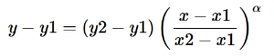

# 消息传输重试策略

传输重试策略定义了当通知服务向订阅终端节点推送失败时候，如何进行消息重试。当传输重试策略完成规定的重试次数时候，除非为订阅配置死信队列，否则通知服务会停止重试并丢弃该消息。

## 通知服务的传输重试策略

| 终端节点类型         | 立即重试          | 最小延迟重试/间隔时间 | 退避重试/退避策略                        | 最大延迟重试/间隔时间 | 总尝试次数        |
| -------------------- | ----------------- | --------------------- | ---------------------------------------- | --------------------- | ----------------- |
| HTTP/S               | 自定义（默认0次） | 自定义（默认0次）     | 自定义（默认3次，线性退避（20秒-20秒）） | 自定义（默认0次）     | 自定义（默认3次） |
| 短信（SMS）          | 0次               | 2次，1秒              | 10次，指数退避（1秒-10分钟）             | 38次，10分钟          | 50 次             |
| 邮件（Email）        | 1次               | 1次，10秒             | 10次，线性退避（10秒-5分钟）             | 90次，5分钟           | 102次             |
| 队列服务（JQS）      | 10次              | 100000次，20秒        | 0次                                      | 0次                   | 100010次          |
| 函数服务（Funciton） | 0次               | 2次，1秒              | 10次，指数退避（1秒-20分钟）             | 38次， 20分钟         | 50 次             |


### 每个传输重试策略包含四个阶段。

1. 立即重试阶段– 此阶段在首次推送失败后立即发生。在该阶段中重试之间没有时间间隔。
2. 最小时间间隔重试阶段 – 此阶段在立即重试阶段之后发生。在该阶段中重试之间时间间隔为最小延迟时间值。
3. 退避重试阶段 – 此阶段在最小时间间隔重试阶段之后发生。此阶段通过规定退避策略控制各个重试之间的延迟。此阶段设置了最短延迟时间、最大延迟时间和退避策略，该退避策略定义了延迟时间从最小值增加到最大值的速率。重试退避策略可以是算术、指数、几何或线性的。
4. 最大时间间隔重试阶段 – 此阶段在退避重试阶段之后发生。在该阶段中重试之间时间间隔为最大延迟时间值。


## 自定义HTTP/S传输重试策略

用户可以根据业务的不同特性自定义HTTPS的传输重试策略。在主题或者订阅都可以定义 HTTP/S 传输策略。当HTTP/S订阅设置了订阅级别的传输重试策略将覆盖主题级别传输重试策略。（除非主题级别的传输策略勾选了忽略订阅覆盖，则主题级别的传输重试策略将覆盖订阅级别的。）

#### 如果用户想要在传输重试的4个阶段设置如下策略：

总尝试次数：20次

1. 立即重试阶段： 3 次
2. 最小时间间隔重试阶段：4 次，相隔 20 秒
3. 退避重试阶段：10次，线性退避，20 秒到 60 秒
4. 最大时间间隔重试阶段：4 次，相隔 60 秒

##### 控制台设置


##### SDK设置-JSON 预览

```
{
  "healthyRetryPolicy": {
    "numRetries": 20,
    "numNoDelayRetries": 3,
    "minDelayTarget": 20,
    "maxDelayTarget": 60,
    "numMinDelayRetries": 4,
    "numMaxDelayRetries": 4,
    "backoffFunction": "linear"
  },
  "disableSubscriptionOverrides": false
}
```
###### JSON含义
传输策略包含一个重试策略和两个个限制策略。传输策略共有 8 个属性。

| 策略                           | 描述                                                         | 范围                                                 |
| :----------------------------- | :----------------------------------------------------------- | :--------------------------------------------------- |
| `numRetries`                   | 重试总数，包括立即重试、最小延迟重试、退避重试和最大延迟重试。 | 0 至 100 **默认值：** 3                                |
| `numNoDelayRetries`            | 要立即完成的重试次数                                         | 0 或更多 **默认值：** 0                                |
| `minDelayTarget`               | 重试的最小延迟时间。 **单位：** 秒                             | 0 至最大延迟时间 **默认值：** 20                       |
| `maxDelayTarget`               | 重试的最大延迟时间。 **单位：** 秒                             | 最小延迟时间至 3600 **默认值：** 20                    |
| `numMinDelayRetries`           | 最小时间间隔重试阶段重试次数，各个重试之间有指定的最小延迟时间。 | 0 或更多， **默认值：** 0                              |
| `numMaxDelayRetries`           | 最大时间间隔重试阶段的重试次数，各个重试之间有最大延迟时间。 | 0 或更多， **默认值：** 0                              |
| `backoffFunction`              | 各个重试之间退避策略函数。                                       | 四个选项之一：算术，指数，几何，线性， **默认：** 线性 |
| `maxReceivesPerSecond`         | 每个订阅每秒的最大传输次数。                                 | 1 或更多， **默认：** 无限制                           |
| `disableSubscriptionOverrides` | 是否覆盖订阅的传输重试策略                                   | true或false， **默认：** false                         |

退避策略阶段的重试次数 =

```
numRetries - numNoDelayRetries - numMinDelayRetries - numMaxDelayRetries
```


退避策略函数：



其中y为延迟时间，x为重试次数，y2为最大延迟时间，y1为最小延迟时间，x2为退避策略阶段重试次数，x1为1， α 值控制横轴伸缩曲线

线性(α=1)

指数(α=10) 

几何(α=4)

算数(α=2)
