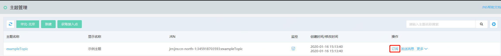
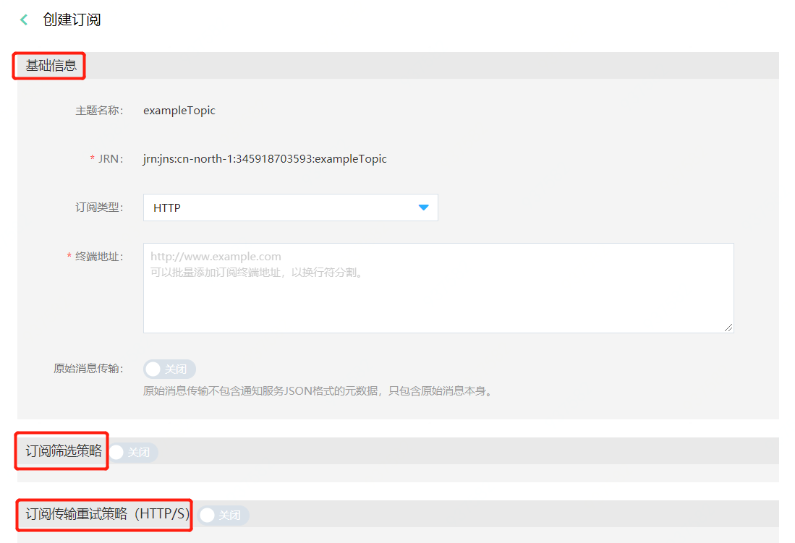

# 订阅创建
主题创建完成后，需要创建主题下的订阅，订阅中的终端节点才会收到发布到主题的消息。

## 创建订阅
1. 在通知服务控制台，在列表中找到想要创建订阅的主题，点击操作列中的“订阅”，进入到创建订阅页面。

2. 进入到创建主题页面

创建订阅总共有三部分内容：
- 基础信息
- 订阅筛选策略
- 订阅传输策略

填写完信息，点击“创建订阅”，如果成功则右上角提示创建成功跳转到该主题的订阅列表页，如果失败则右上角提示错误信息，请根据提示修改后再次提交。

#### 订阅创建-基础信息

1. 主题名称：为所要订阅的主题名称。

2. JRN：必填，为主题的JRN（唯一资源识别ID）。

3. 订阅类型：必选，为所需要订阅的终端节点的类型，包括：HTTP, HTTPS, JQS, SMS。

4. 终端地址：必填，填写所需要接收通知服务推送消息的终端节点地址。

| 订阅类型 | 示例                                                  |
| -------- | ---------------------------------------------------- |
| HTTP     | "http://www.example.com"                             |
| HTTPS    | "https://www.example.com"                            |
| Email    | "example@example.com"                                |
| JQS      | "jrn:jqs:cn-north-1:userPin:testQueue（标准队列）"   |
| Fucntion | "请选择触发函数"，” 请选择函数版本/别名”             |
| SMS      | "13xxxxxxxxx（国内）                                |

5. 原始消息传输：必选，在订阅类型为HTTP, HTTPS,JQS 时候有此参数，当开启原始消息传输时，推送的消息不包含通知服务JSON格式的元数据，只包含原始消息本身。
#### 订阅创建-订阅筛选策略
订阅筛选策略：非必填，订阅筛选策略方便订阅对发布到主题的信息进行筛选，使得订阅者可以获得其感兴趣的消息通知，而不是接收发布到该主题的每条消息。详情[可参考](Filtering-Policies.md)。

#### 订阅创建-订阅传输重试策略（HTTP/S）
订阅传输重试策略(HTTP/S)：非必填，只有订阅类型为HTTP或者HTTPS时候有此参数，传输重试策略定义了当通知服务向订阅终端节点推送失败时候，如何进行消息重试。当传输重试策略完成规定的重试次数时候，除非为订阅配置死信队列，否则通知服务会停止重试并丢弃该消息。详情[请参考](../Message-Management/Reties-Policies.md)
