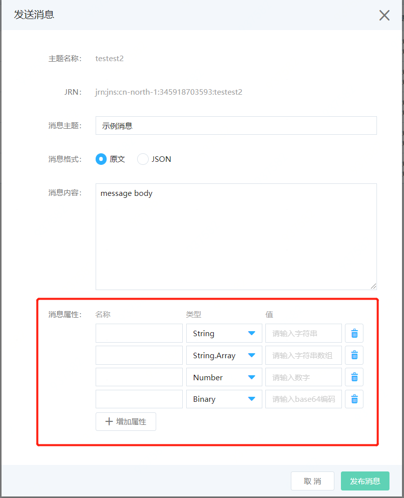

# 订阅筛选策略

订阅筛选策略方便订阅对发布到主题的信息进行筛选，使得订阅者可以获得其感兴趣的消息通知，而不是接收发布到该主题的每条消息。

订阅筛选策略是基于消息属性进行筛选的，首先需要先定义消息属性，字段：MessageAttributes 

### 带消息属性的消息
1. 通过控制可以发布带有消息属性的消息

2. SDK发布消息时候的消息JSON格式
由于此消息包含 MessageAttributes 字段，因此，任何包含筛选策略的主题订阅均可选择接受或拒绝此消息。

```
{
   "Type": "Notification",
   "MessageId": "0279074ae73a4b1097ab86b39c161f44",
   "TopicArn": "jrn:jns:cn-north-1:012345678910:Topic",
   "Message": "message body",
   "Timestamp": "2019-12-26 12:31:22",
   "SignatureVersion": "1",
   "Signature": "xxxxx",
   "UnsubscribeURL": "unsubscribe-url",
   "MessageAttributes": {
      "price": {
         "Type": "Number",
         "Value": "123"
      }
   }
}
```

### 筛选策略
筛选策略为基于消息的属性名称和值接受或拒绝消息。

#### 接受消息的策略
以下订阅筛选策略中的属性与分配给示例消息的属性匹配。

如果此策略中的任一属性与分配给该消息的属性不匹配，则此策略将拒绝该消息。

```
{
   "price": [{"numeric": [">=", 100]}]
}
```

#### 拒绝消息的策略
以下订阅筛选策略在其属性与分配给示例消息的属性之间存在不匹配项，因此该策略属性会导致消息被拒绝。
```
{
   "event": ["order_cancelled"],
}
```
