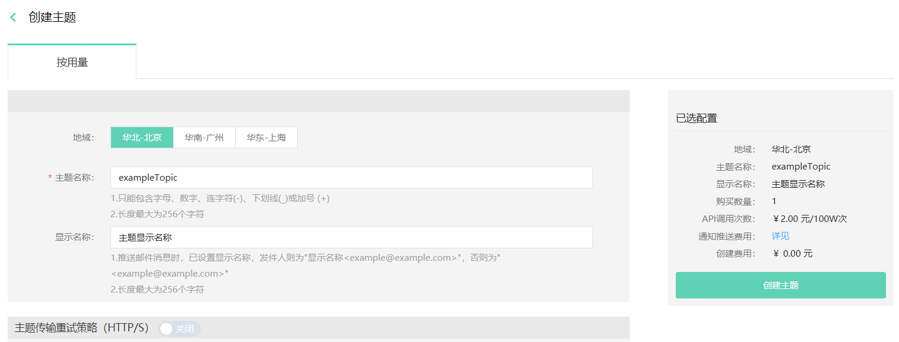

# 创建主题

在通知服务控制台，点击创建主题按钮，进入到创建主题页面。

1. region选择：可以选择“华北-北京、华东-上海、华南-广州”三个region。

2. 主题名称创建后不能修改。

   - 主题名称区分大小写，只能包含字母、数字、连字符(-)、下划线(_)或加号 (+)，长度最大为256个字符。

3. 显示名称：最大长度为256字符，在推送邮件消息时，已设置显示名称，发件人则为"显示名称<example@example.com>"，否则为"<example@example.com>"。

4. 主题传输重试策略（HTTP/S）是主题设置其所有HTTP/S订阅的传输重试策略，有默认设置，如果无特殊需求可以不作修改，详情可查看[消息传输重试策略](../Message-Management/Reties-Policies.md)。

   说明：

   1. 最多重试次数为100次 。
   2. 最小延迟重试、最大延迟重试和立即重试的和应该小于等于重试次数。
   3. 最小延迟时间要小于等于最大延迟时间。
