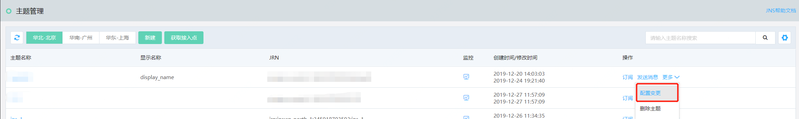
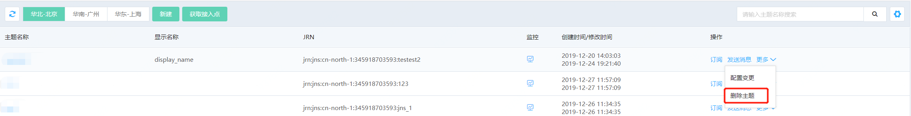
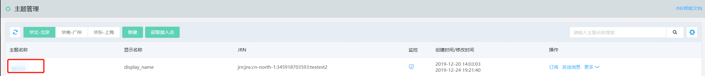

# 管理主题

1. 修改主题

在通知服务控制台，找到需要修改的主题，在“操作”列点击更多后点击配置变更，进入到修改主题页面。

2. 删除主题

在通知服务控制台，找到需要删除的主题，在“操作”列点击更多后点击删除主题，确认后删除。

3. 查看主题详情

在通知服务控制台，找到需要查看的主题，在“主题名称”列点击主题名称，进入到主题详情页面，可以查看主题配置详情，订阅信息和监控。

