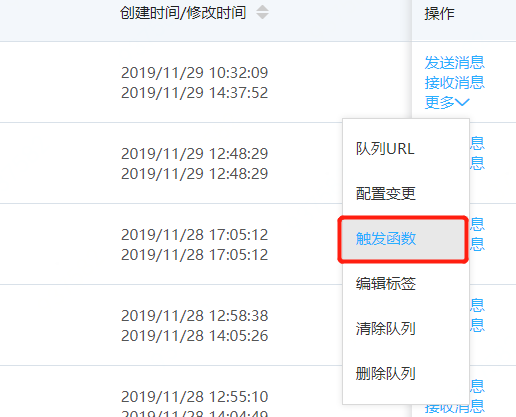
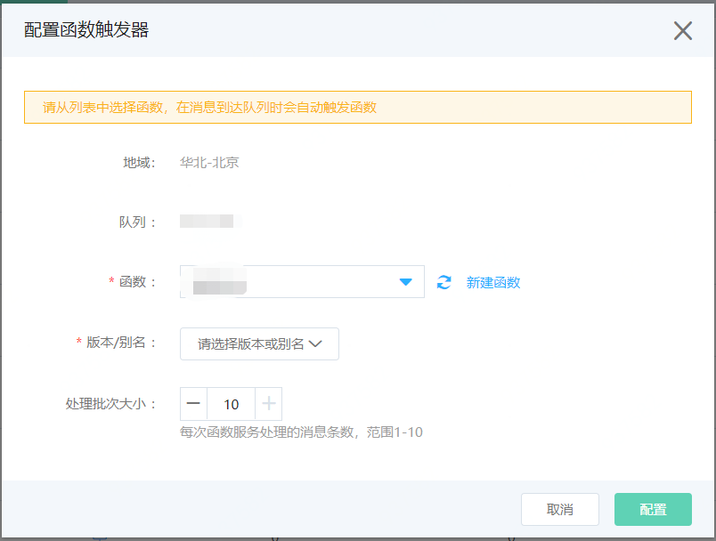
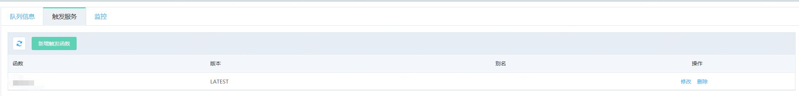

# 触发函数
  发送到队列服务队列中的消息，如果想要触发函数服务来对消息进行处理，可以使用此功能。
  
## 前提条件

- 仅在华北-北京地域提供触发函数功能
- 已经在队列服务创建好标准队列，FIFO队列暂不支持此功能
- 在函数服务想要触发的函数已经配置服务角色，并且添加了系统策略：JDCloudQueueServiceTriggerFunction至函数服务角色权限（操作步骤[请参考](../../../../Elastic-Compute/Function-Service/Operation-Guide/invokefunction/triggermanagement/eventsourceservice/JQS-trigger.md)）

## 注意事项

- 触发函数的消息被函数服务拉取消费之后就会被删除，其他消费者无法再消费到
- 一个队列可以触发一个或者多个函数,但是队列与函数需要在同一地域

## 操作步骤
1. 选择想要触发函数的队列，然后在操作列选择更多中，触发函数功能。

   

2. 选择想要触发的函数，版本/别名和处理批次大小，进行触发配置。如果没有创建可以点击“新建函数”，创建函数（需要添加了系统策略：JDCloudQueueServiceTriggerFunction至函数服务角色权限），刷新列表再选取刚才创建的函数。

   

3. 可以在队列详情，tab页面触发服务中查看刚才配置的触发函数，点击修改可以修改处理批次大小或者删除触发函数。

   
   

