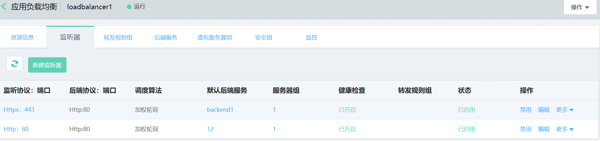
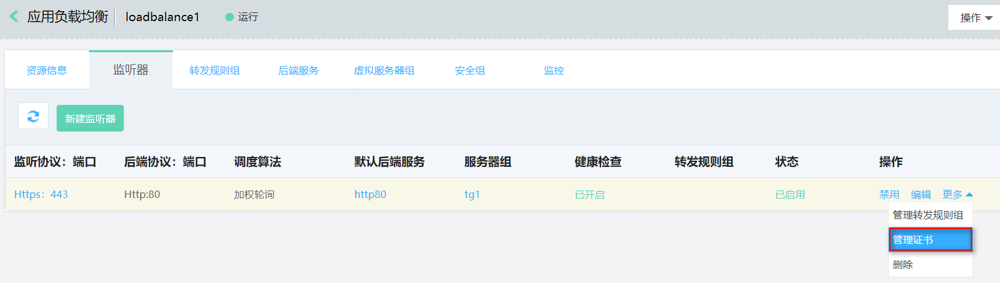
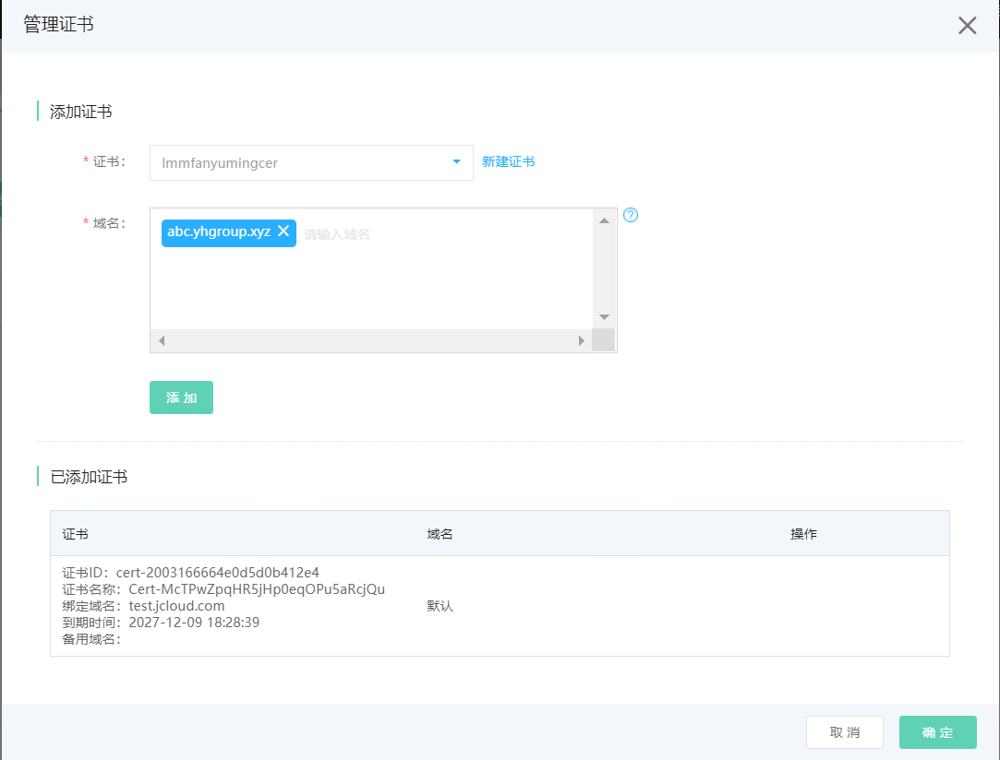

# 部署负载均衡基于域名转发流量，不同域名使用不同证书

## 准备与规划

- 网络准备

	根据业务部署需要，提前规划应用负载均衡和作为后端服务器的地域、可用区、私有网络等。

- 服务器准备

	需提前创建承载业务流量的云主机、容器等资源，并确保打开监听所需的端口，合理配置安全组、ACL策略。

- 应用负载均衡实例

	创建一个应用负载均衡实例，并设置地域、可用区、网络、安全组等配置。
	

## 配置步骤

请按如下步骤配置应用负载均衡基于访问请求的域名和URL路径将流量转发给不同的后端服务：

[创建一个七层监听器](forward-traffic-based-on-urlmap#user-content-1)

[添加一个转发规则组](forward-traffic-based-on-urlmap#user-content-2)

[监听器关联转发规则组实现基于域名转发流量](forward-traffic-based-on-urlmap#user-content-3)

[监听器挂载多证书实现不同域名返回不同证书](forward-traffic-based-on-urlmap#user-content-4)

### 创建一个七层监听器

仅七层监听器（HTTP或HTTPS）支持关联转发规则组，此处以HTTPS监听器为例。

- 前端监听配置：

  点击 **添加** 创建一个监听器：选择HTTPS协议，配置监听端口、空闲连接超时。

  

- 后端转发配置：可以新建或者选择已有的后端服务。新建一个后端服务：配置后端服务名称、协议（HTTP）、端口为80、调度算法选择加权轮询、打开关闭会话保持开关、会话保持超时时间设置。

  

- 配置健康检查：设置健康检查相关参数，这里使用HTTP方式。

  

- 添加服务器组：根据业务需要选择虚拟服务器组、高可用组，也可根据需求新建一个虚拟服务器组。

  

- 至此，已创建完成基于HTTPS协议的监听器，可在监听器列表查看。

  

### 添加一个转发规则组

1. 通过应用负载均衡-详情-转发规则组进入转发规则组列表页。

	

2. 点击 **新建转发规则组**，打开转发规则组创建页，填写转发规则组名称和描述。
3. 点击**添加规则**，为转发规则组配置转发规则。
    - 域名：用于匹配客户端请求的域名。支持输入IPv4地址和域名，域名支持精确匹配和通配符匹配，输入限制如下：
      - 仅支持输入大小写字母、数字、英文中划线“-”和点“.”，不区分大小写，且不能超过110字符。
      - 最少包括一个点"."，不能以点"."和中划线"-"开头或结尾，中划线"-"前后不能为点"."。
      - 通配符匹配支持包括一个星"*"，输入格式为\*.XXX或XXX.\*。
    - URL路径：用于匹配客户端请求的URL路径，支持精确匹配和前缀匹配。
      - 必须以/开头。
      - 仅支持输入大小写字母、数字和特殊字符：$-_.+!'()%:@&=/，区分大小写，且不能超过128字符。
      - 前缀匹配支持包括一个星"*"，输入格式为/XXX\*或/\*。
    - 动作：选择转发，选择应用负载均衡将匹配规则的报文转发到的后端服务。下拉列表中仅显示后端协议为HTTP的后端服务。

### 监听器关联转发规则组实现基于域名转发流量

1. 通过监听器列表页-操作栏，点击**更多-管理转发规则组**弹出管理转发规则组对话框。

2. 在管理转发规则组对话框中，可为监听器关联一个转发规则组。

### 监听器挂载多证书实现不同域名返回不同证书

1. 通过监听器列表页-操作栏，点击**更多-管理证书**弹出管理证书对话框。

2. 在管理证书对话框中，选择扩展证书，输入或选择扩展证书服务的域名。
    - 扩展证书：选择的扩展证书必须为在云安全-SSL数字证书已上传/申购的证书
    - 域名：扩展证书服务的域名。域名支持选择和输入，当选择域名时，仅支持选择扩展证书中的绑定域名和备用域名；当输入域名时，支持输入精确域名和泛域名，输入限制如下：
      - 仅支持输入大小写字母、数字、英文中划线“-”和点“.”，不区分大小写，且不能超过110字符。
      - 最少包括一个点"."，不能以点"."和中划线"-"开头或结尾，中划线"-"前后不能为点"."。
      - 通配符匹配支持包括一个星"*"，输入格式为\*.XXX。
3. 当一个证书需为多个域名提供服务时(例如：泛域名证书或多域名证书)，添加证书时支持选择或输入多个域名，单击**添加**，可批量添加域名与扩展证书的多条对应关系到已添加证书表格。

4. 单击**确定**，完成添加多证书操作。
