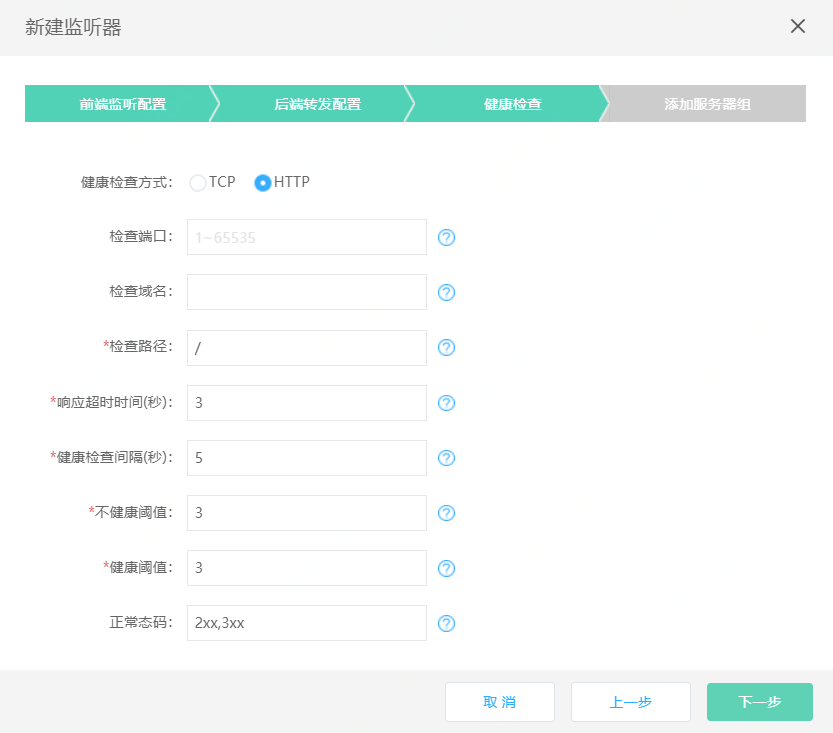
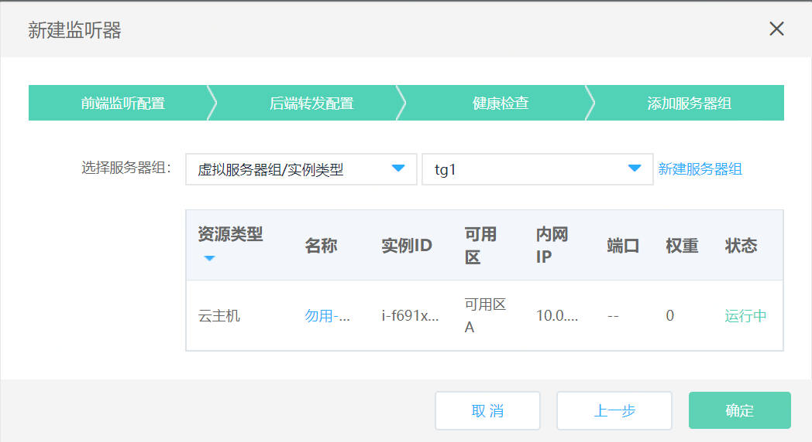
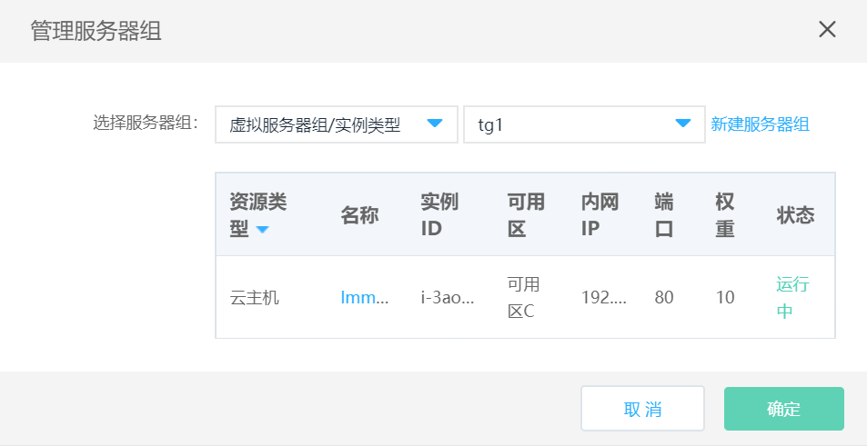

# 后端服务管理

## 添加后端服务

1. 通过应用负载均衡-详情-后端服务进入后端服务管理页；

3. 点击 **新建后端服务**，打开后端服务创建页；

5. 后端服务设置：
	
	**基本信息：**
	
	- 名称：定义后端服务名称；
	
	- 后端协议：可选http、tcp；

		  注意：监听器只能与对应协议类型的后端服务绑定，后端协议为http时，只能绑定监听协议为http、https类型的监听器，后端协议为tcp时，只能绑定监听协议为tcp、tls类型的监听器；

	- 端口：输入范围1-65535，不同后端服务的端口可以重复；

	- 调度算法：应用负载均衡将服务请求分发到后端服务器的算法  **加权源IP**：基于源IP地址进行的哈希算法。在后端服务器列表不变的情况下，相同源IP地址的服务请求将分发到同一台后端服务器。如增加或减少后端服务器，将可能导致源IP地址的服务请求转发到不同的后端服务器。同时可配置后端服务器的权重，按权重比例分发服务请求  ● **加权五元组**：基于报文五元组（协议、源IP、源端口、目的IP和目的端口）进行的哈希算法，报文五元组相同的服务请求将分发到同一台后端服务器。同时可配置后端服务器的权重，按权重比例分发服务请求。当客户端源IP数量较少并且业务类型为无状态业务时，推荐使用加权五元组算法，这样可使业务请求更均匀的分布到不同的后端服务器  ● **加权最小连接数**：基于负载均衡与后端服务器建立的连接数进行的哈希算法，新建连接请求将被分发到连接数最小的后端服务器。同时可配置后端服务器的权重，按权重比例分发服务请求

	- 会话保持：仅后端协议为http时支持配置，支持基于cookie植入方式的会话保持。开启本功能后，相同客户端的服务请求都将转发到同一台后端服务器。增加后端服务器，已有客户端的服务请求仍转发到同一后端服务器；移除后端服务器，仅影响移除的后端服务器上的服务请求转发到其他后端服务器；

	- 超时时间：会话保持cookie的超时时间，输入范围0-86400；

	- 获取真实IP：后端协议为http时，默认开启不可关闭，此时可通过X-Forwarded-For头字段获取客户端真实IP；后端协议为tcp时，支持proxy protocol协议方式透传客户端IP；
	
		  注：当后端协议为tcp时，如开启获取真实IP，需在后端服务端完成proxy protocol的相关配置。

	- 获取HTTP头字段：用于透传客户端http请求的相关信息。支持通过X-Forwarded-Proto字段获取负载均衡监听协议、通过X-Forwarded-Port字段获取负载均衡监听端口、 通过X-Forwarded-LBIP字段获取负载均衡VIP地址 、通过X-Forwarded-Host字段获取负载均衡监听目的IP（域名）和端口；

		

	**健康检查设置：**

	- 选择健康检查方式：HTTP、TCP；

	- 设置检查端口：输入范围1-65535，如不填写默认为后端实例接收负载均衡流量的端口；

	- 检查域名：健康检查的域名。支持输入域名和IP地址。如果输入域名，仅支持大小写字母、数字、英文中划线"-"和点"."，不区分大小写，且不超过255个字符。默认为空，表示健康检查不携带域名。仅健康检查方式为HTTP时支持填写。
	
	- 检查路径：健康检查的URL路径。必须以“/”开头，最多支持5级目录，不得超过100字符。仅健康检查方式为HTTP时支持填写。

	- 响应超时时间(s)：输入范围2-60秒,此为健康检查响应的最大超时时间；

	- 健康检查间隔(s):输入范围为5-300秒,此为健康检查的时间间隔；

	- 不健康阈值：输入范围1-5，此为后端实例从成功到失败的连续健康检查失败次数；

	- 健康阈值：输入范围1-5，此为后端实例从失败到成功的连续健康检查成功次数；

	- 正常态码：输入范围2xx（等价于200-299）、3xx（等价于300-399）、4xx（等价于400-499）。仅健康检查方式为HTTP时支持填写。

			

	**添加服务器组：**

	- 选择服务器组类型：虚拟服务器组/实例类型、虚拟服务器组/IP类型、高可用组，或者可以暂不添加；
	
	 
		
	
	- 虚拟服务器组/实例类型 或 虚拟服务器组/IP类型：系统会自动筛选出当前可以绑定的虚拟服务器组列表，如没有可用的虚拟服务器组，可点击“新建虚拟服务器组”进行创建；	
	
		  注：
		    * 虚拟服务器组/实例类型的后端服务器必须与应用负载均衡处于相同地域下的相同私有网络下。
		    * 当后端服务器位于VPC外（例如：后端服务器通过专线、VPC peering、VPN与应用负载均衡互通）时，请创建IP类型的虚拟服务器组。

	- 高可用组：系统会自动筛选出当前可以绑定的高可用组，如没有可用的高可用组，请前往高可用组页面进行创建；
	
	       注：可选高可用组中的后端服务器必须与应用负载均衡处于相同地域下的相同私有网络下。         

## 管理后端服务

1. 查看后端服务详情：点击后端服务名称进入后端服务详情页，可查看后端服务配置信息、更换绑定的后端服务器组（见下文）；

1. 查看绑定的服务器组：列表页点击后端服务名称，查看后端服务关联的服务器组信息和健康状态；

1. 编辑后端服务：编辑后端服务相关配置信息；

        注意：
        * 健康检查开关状态仅支持在编辑后端服务对话框中修改。负载均衡通过健康检查功能检测后端服务器的运行状况，当检测到后端服务故障时，将不再向其分发流量，从而保证业务的整体可用性。不建议将健康检查开关关闭。
        * 关闭健康检查开关后，后端服务器的健康状态将显示为“N/A”，此时负载均衡将流量按照调度算法分发到所有“运行中”的后端服务器。

1. 删除后端服务：删除成功后后端服务将与绑定的服务器组自动解除关联，已关联监听器的后端服务不可删除；

	
## 更换后端服务绑定的服务器组

1. 通过应用负载均衡-详情-后端服务-详情打开后端服务详情，点击 **更改**，更换绑定的服务器组；

1. 通过应用负载均衡-详情-后端服务-编辑打开后端服务编辑页，更换绑定的服务器组；

