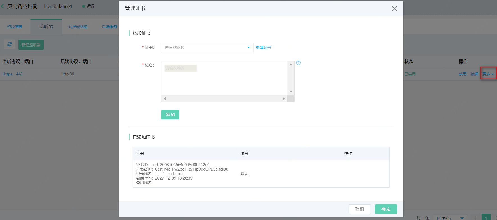

# 证书管理

[原理介绍](certificates-management#user-content-1)

[添加证书](certificates-management#user-content-2)

[替换证书](certificates-management#user-content-3)

[删除证书](certificates-management#user-content-4)

## 原理介绍

SNI（Server Name Indication，服务名称指示）是对TLS协议的扩展，允许一个服务器使用多个域名和证书。应用负载均衡支持SNI，允许单个HTTPS/TLS监听器绑定一个默认证书和多个扩展证书，实现不同访问域名的请求返回不同的证书。

- 创建监听器时挂载的证书称为默认证书，默认证书的挂载/替换在创建/修改监听器对话框中进行操作；
- 在**证书管理**对话框中挂载的证书称为扩展证书，扩展证书的挂载/替换/删除在**证书管理**对话框中进行操作，将扩展证书挂载到HTTPS/TLS监听器时，需您指定证书服务的域名，仅指定域名的访问请求才能使用对应的扩展证书提供服务。

当一个HTTPS/TLS监听器配置了多个证书时，证书匹配的优先级为：精确域名扩展证书>以\*开头的最长后缀泛域名扩展证书>默认证书。

## 添加扩展证书

1. 通过监听器列表页-操作栏，点击**更多**弹出管理证书对话框。
2. 选择扩展证书，输入或选择扩展证书服务的域名。
    - 扩展证书：选择的扩展证书必须为在云安全-SSL数字证书已上传/申购的证书
    - 域名：扩展证书服务的域名。域名支持选择和输入，当选择域名时，仅支持选择扩展证书中的绑定域名和备用域名；当输入域名时，支持输入精确域名和泛域名，输入限制如下：
      - 仅支持输入大小写字母、数字、英文中划线“-”和点“.”，不区分大小写，且不能超过110字符。
      - 最少包括一个点"."，不能以点"."和中划线"-"开头或结尾，中划线"-"前后不能为点"."。
      - 通配符匹配支持包括一个星"*"，输入格式为\*.XXX。
3. 当一个证书(例如：泛域名证书或多域名证书)需为多个域名提供服务时，添加证书时支持选择或输入多个域名，单击**添加**，可批量添加域名与扩展证书的多条对应记录。

4. 单击**确定**，完成添加证书操作。

## 替换扩展证书

当由于证书即将过期等原因，您需要替换监听器挂载的证书时，可通过在**证书管理**对话框中的编辑功能进行操作。
1. 通过监听器列表页-操作栏，点击**更多**弹出管理证书对话框。
2. 点击需要替换证书的域名右侧操作列的**编辑**，在弹出的对话框中可替换该域名对应的扩展证书。

## 删除扩展证书

当需要删除域名与扩展证书的对应项时，可通过在**证书管理**对话框中的删除功能进行操作。
1. 通过监听器列表页-操作栏，点击**更多**弹出管理证书对话框。
2. 点击需要替换证书的域名右侧操作列的**删除**，可删除该域名与扩展证书的对应项。
