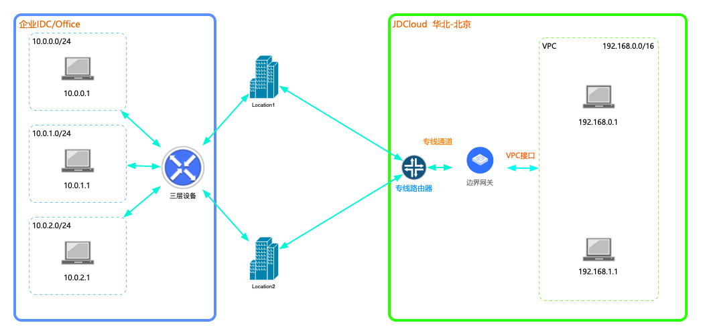

## 专线高可用方案
本教程将为您介绍如何通过京东云专线连接，建立企业IDC到公有云VPC之间高可用的私有连接。

### 业务场景
客户将核心/非适宜上云的业务部署在自建IDC内，非核心业务/扩展业务部署在京东云VPC内，需要打通IDC和公有云VPC的网络环境，实现内网通信，同时保证业务的高可用。 

### 前置条件
* 企业IDC内的网段与公有云VPC内的网段不能重叠；
* 专线连接运行BGP路由协议；
* 运营商已为您施工了两条不同的物理线路，接入了两个不同的京东云专线接入点；

对客户端设备的要求，详见[使用限制](../Introduction/Restrictions.md)。

### 详细步骤
###### 步骤1.创建边界网关

a)登录[京东云边界网关控制台](https://cns-console.jdcloud.com/host/borderGateway/list)；   
b)选择使用专线的地域，点击创建边界网关； 
c)边界网关支持运行BGP路由协议，当前京东云边界网关的BGP ASN固定为65000，后续会开放修改； 

更多内容，详见[边界网关管理](../Operation-Guide/Border-Gateway-Management/Border-Gateway-Configuration.md)。

###### 步骤2.创建VPC接口
a)登录[京东云VPC接口控制台](https://cns-console.jdcloud.com/host/vpcAttachment/list)；   
b)选择使用专线的地域，点击创建VPC接口； 
c)选择步骤1中创建的边界网关，选择要通过该边界网关路由流量的VPC，选择要传播到该边界网关中的VPC网段，创建VPC接口后，被选择的网段将自动添加到该边界网关的传播路由表中，下一跳指向此步骤创建的VPC接口； 

更多内容，详见[VPC接口管理](../Operation-Guide/Border-Gateway-Management/VPC-Attachment-Configuration.md)。

###### 步骤3.创建物理连接
请确认已通过运营商的两条物理专线接入了京东云。
a)登录[京东云物理连接控制台](https://cns-console.jdcloud.com/host/physicalConnection/list)；   
b)选择地域，点击“创建”； 
c)输入连接的名称、描述、接入方式、客户IDC地址、合作伙伴/运营商(合作伙伴接入)、接入点(自助接入)，可选输入客户联系人、联系方式，创建物理连接，两种接入方式的区别，详见：[专线连接特性](../Introduction/Features/Direct-Connect-Features.md)，创建基于第一条物理线路的物理连接； 
d)重复以上步骤，创建基于第二条物理线路的物理连接； 

更多内容，详见[物理连接管理](../Operation-Guide/Direct-Connection-Management/Physical-Connection-Configuration.md)。

###### 步骤4.创建专线通道
a)登录[京东云专线通道控制台](https://cns-console.jdcloud.com/host/dedicatedVif/list)；   
b)选择使用专线的地域，点击创建专线通道； 
c)选择之前创建且状态为“可用”的物理连接、选择边界网关、指定云端与客户端三层设备之间互联的参数，包括Vlan Tag、客户端BGP ASN、BGP密钥、两对互联地址，创建基于第一条物理线路的物理连接的专线通道； 
d)重复以上步骤，创建基于第二条物理线路的物理连接的专线通道； 

更多内容，详见[专线通道管理](../Operation-Guide/Direct-Connection-Management/Private-Virtual-Interface-Configuration.md)。

###### 步骤6.配置专线客户端
a)当前[京东云专线通道控制台](https://cns-console.jdcloud.com/host/dedicatedVif/list)尚不提供专线通道客户端配置下载功能，配置客户端设备时请参考客户端配置示例，如[思科客户端配置](../Operation-Guide/Client-Site-Configuration/Cisco-Configuration.md)； 
b)``完成客户端专线设备配置后，BGP会自动协商建立``，此时可在客户端设备中查看BGP Peer的建立状态及路由，若BGP Peer未能正常建立，请参考[FAQ](../FAQ/FAQ.md)进行故障处理； 

###### 步骤7.配置路由
a)京东云专线连接支持在云端和客户端之间使用静态路由/BGP动态路由，建议使用BGP动态路由实现路由自动更新； 
b)不同路由的配置方式： 
  * 配置静态路由，在边界网关的静态路由表中配置去往客户端的静态路由，目的端为客户端网段，下一跳为两个专线通道。在客户端三层设备上配置去往云端的静态路由，目的端为云端网段，下一跳为两个专线通道的接口，当前配置静态ECMP路由需要京东云人员在后台进行配置(即将开放控制台自行配置)，若使用不同掩码则可自行创建；
  * 配置BGP动态路由，边界网关和客户端三层设备之间建立BGP会话后，边界网关会自动将有效路由全部发布到Peer客户端，客户端需发布客户端网段路由到Peer云端，此时，若配置了VPC路由表的路由传播，则整条链路已通且路由已生效；

更多内容，详见[配置边界网关路由](../Operation-Guide/Route-Management/Border-Gateway-Route-Configuration.md)和[配置VPC路由](../Operation-Guide/Route-Management/VPC-Route-Configuration.md)。

###### 步骤8.测试连通性并验证路由切换
a)登录[京东云云主机控制台](https://cns-console.jdcloud.com/host/compute/list)，在创建了服务的地域下，要和企业IDC内网网段互通的VPC中创建一台云主机，确认该云主机所在子网的路由表中存在正确去往企业IDC内网网段的路由；   
b)使用a中创建的云主机ping企业IDC内网中的一台实例的内网地址，验证内网通信是否正常； 
c)在客户端路由器上将其中一条专线通道的BGP会话断开，或将其路由摘除,或将其路由的端口置DOWN，查看流量是否切换到另一条专线通道上，验证有效后，再将第一条专线通道及路由建立起来； 
