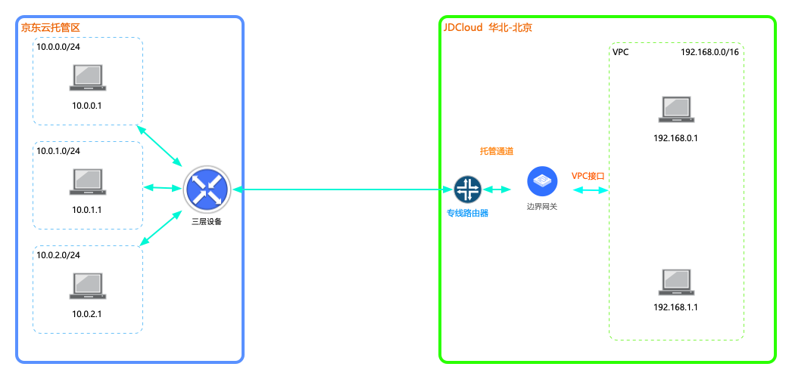
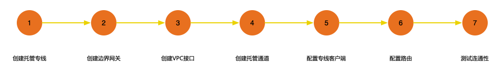

## 京东云托管区连接公有云
本教程将为您介绍如何通过托管连接，建立京东云托管区到公有云VPC的私有连接。

### 业务场景
客户将核心/非适宜上云的业务部署在托管区内，非核心业务/扩展业务部署在京东云VPC内，需要打通托管区和公有云VPC的网络环境，实现内网通信。<br />



### 前置条件
使用托管连接前，请先阅读相关[使用限制](../Introduction/Restrictions.md)。

### 配置步骤


### 详细步骤
###### 步骤1.创建托管专线
a)登录[京东云托管专线控制台](https://cns-console.jdcloud.com/host/hConnection/list)；  <br />
b)选择地域，点击“创建”；<br />
c)输入连接的名称、描述，可选输入客户联系人、联系方式，创建托管专线，两种接入方式的区别，详见：[托管连接特性](../Introduction/Features/Hosted-Connect-Features.md)；<br />

```
  京东云托管专线支持独享端口接入，即托管区设备直接与京东云设备对接。
```

d)托管专线创建后进入“待审核”状态，京东云收到您提交的托管专线申请后，会在1~2个工作日以内完成审核操作，您也可主动联系京东云进行确认；     <br />
e)审核通过后，托管专线进入“初装费待支付”状态；<br />
f)支付初装费成功后，托管专线进入“施工中”状态，京东云将为您完成物理线路铺设，并进行网络调试；<br />
g)当线路调试通过后，托管专线将进入“等待确认”状态，请您在验证网络连通性之后，对托管专线进行“确认施工完成”，支付相应的预付费端口租用费后，托管专线进入“可用”状态；<br />

###### 步骤2.创建边界网关
a)登录[京东云边界网关控制台](https://cns-console.jdcloud.com/host/borderGateway/list)；  <br />
b)选择使用专线的地域，点击创建边界网关；<br />
c)边界网关支持运行BGP路由协议，当前京东云边界网关的BGP ASN固定为65000，后续会开放修改。边界网关与专线路由器之间运行BGP路由，专线路由器与客户端三层设备之间运行BGP路由，专线路由器使用的BGP ASN固定为64512；<br />

更多内容，详见[边界网关管理](../Operation-Guide/Border-Gateway-Management/Border-Gateway-Configuration.md)。

###### 步骤3.创建VPC接口
a)登录[京东云VPC接口控制台](https://cns-console.jdcloud.com/host/vpcAttachment/list)；  <br />
b)选择使用专线的地域，点击创建VPC接口；<br />
c)选择步骤2中创建的边界网关，选择要通过该边界网关路由流量的VPC，选择要传播到该边界网关路由表中的VPC网段，创建VPC接口后，被选择的网段将自动添加到该边界网关的传播路由表中，下一跳指向此步骤创建的VPC接口；<br />

更多内容，详见[VPC接口管理](../Operation-Guide/Border-Gateway-Management/VPC-Attachment-Configuration.md)。

###### 步骤4.创建托管通道
a)登录[京东云托管通道控制台](https://cns-console.jdcloud.com/host/hVif/list)；  <br />
b)选择使用专线的地域，点击创建托管通道；<br />
c)选择之前创建且状态为“可用”的托管专线；<br />
d)选择边界网关；<br />
e)指定云端与客户端三层设备之间互联的参数，包括Vlan Tag、客户端BGP ASN、BGP密钥、两对互联地址；<br />

```
  vlan，用于区分不同的业务，若您使用相同的托管专线创建多条托管通道，请为每条托管通道指定使用不同的vlan，实现业务间隔离。
  互联地址，云端共两台专线路由器设备为客户提供服务，基于业务高可用的角度，需要在此处指定两对互联地址，实现客户端分别和其中一台专线路由器建立BGP Peer。
```

更多内容，详见[托管专线配置](../Operation-Guide/Hosted-Connection-Management/Hosted-Connection-Configuration.md)和[托管通道配置](../Operation-Guide/Hosted-Connection-Management/Hosted-Private-Virtual-Interface-Configuration.md)。

###### 步骤5.配置专线客户端
a)当前[京东云托管通道控制台](https://cns-console.jdcloud.com/host/dedicatedVif/list)尚不提供托管通道客户端配置下载功能，配置客户端设备时请参考客户端配置示例，如[思科客户端配置](../Operation-Guide/Client-Site-Configuration/Cisco-Configuration.md)；<br />
b)``完成客户端专线设备配置后，BGP会自动建立``，此时可在客户端设备中查看BGP Peer的建立状态及路由，若BGP Peer未能正常建立，请参考[FAQ](../FAQ/FAQ.md)进行故障处理；<br />

###### 步骤6.配置路由
a)京东云托管连接支持在云端和客户端之间使用静态路由/BGP动态路由，建议使用BGP动态路由实现路由自动更新；<br />
b)不同路由的配置方式：<br />
  * 配置静态路由，在边界网关的静态路由表中配置去往客户端的静态路由，目的端为客户端网段，下一跳为托管通道。在客户端三层设备上配置去往云端的静态路由，目的端为云端网段，下一跳为托管通道的接口，当前配置静态路由需要京东云人员介入来验证互通生效；
  * 配置BGP动态路由，边界网关和客户端三层设备之间建立BGP会话后，边界网关会自动将有效路由全部发布到Peer客户端，客户端需发布客户端网段路由到Peer云端，此时，若配置了VPC路由表的路由传播，则整条链路已通且路由已生效；

更多内容，详见[配置边界网关路由](../Operation-Guide/Route-Management/Border-Gateway-Route-Configuration.md)和[配置VPC路由](../Operation-Guide/Route-Management/VPC-Route-Configuration.md)。

###### 步骤7.测试连通性
a)登录[京东云云主机控制台](https://cns-console.jdcloud.com/host/compute/list)，在创建了托管连接的地域下，在要和企业IDC内网互通的VPC中创建一台云主机，确认该云主机所在子网的路由表中存在正确去往企业IDC内网网段的路由；  <br />
b)使用a中创建的云主机ping企业IDC内网中的一台实例的内网地址，验证内网通信是否正常；<br />

有关托管连接的计费方式，详见[托管连接计费](../Pricing/Billing-Overview.md)。
