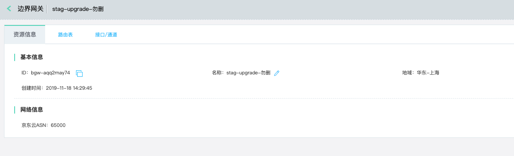

## 边界网关
边界网关(BGW，Border Gateway)，是京东云用来承载VPC南北向流量的一种网关，主要作用是与VPC或其它环境(如企业IDC)进行内网互通。

边界网关目前能实现的业务场景包括：
  * 同地域多VPC互联；
  * 同地域VPC和企业IDC/京东云托管区通过专线互联；
  * VPC和企业IDC/Office/Branch通过VPN互联；

### 操作步骤
##### 1.创建边界网关
a)登录[京东云边界网关控制台](https://cns-console.jdcloud.com/host/borderGateway/list)；  <br />
b)选择要访问的云上资源所在的地域，点击“创建”；<br />
c)输入边界网关的名称，创建边界网关；<br />
d)边界网关支持与其他网关设备之间运行BGP路由协议，当前京东云边界网关的BGP ASN固定为65000，后续会开放修改；<br />

```
  边界网关支持运行BGP路由协议的功能目前仅在广州和上海地域上线。
```


##### 2.修改边界网关
您可对边界网关的名称、路由条目、VPC接口及传播进行修改。<br />
a)登录[京东云边界网关控制台](https://cns-console.jdcloud.com/host/borderGateway/list)；  <br />
b)点击相应的边界网关，进入边界网关详情页；<br />
c)详情页支持修改边界网关名称、配置路由表、新建/编辑VPC接口，后续会开放修改边界网关的BGP ASN；<br />
d)配置边界网关路由表，边界网关路由表支持两种路由：静态路由、BGP动态/传播路由，其中静态路由是在路由表中静态配置的路由，BGP动态/传播路由是通过BGP路由协议从其他BGP Peer设备处学习到的路由，或者通过VPC接口传播的VPC路由。其中静态路由支持编辑，BGP动态路由需要在BGP Peer设备处修改其发布的路由，VPC传播路由通过修改VPC接口的传播网段进行更新。有关边界网关路由表配置路由传播的更多内容，详见[VPC接口操作手册](VPC-Attachment-Configuration.md)；<br />

```
边界网关支持运行BGP路由协议的功能目前仅在广州和上海地域上线。
```



##### 3.删除边界网关
若您不再需要边界网关，可将其删除。<br />
a)登录[京东云边界网关控制台](https://cns-console.jdcloud.com/host/borderGateway/list)；  <br />
b)选择要删除的边界网关，点击操作列中的“删除”，当该边界网关未创建专线通道、托管通道、VPN连接、VPC接口时可以删除；<br />


更多内容，详见[边界网关产品功能](https://docs.jdcloud.com/cn/direct-connection/border-gateway-features)。
