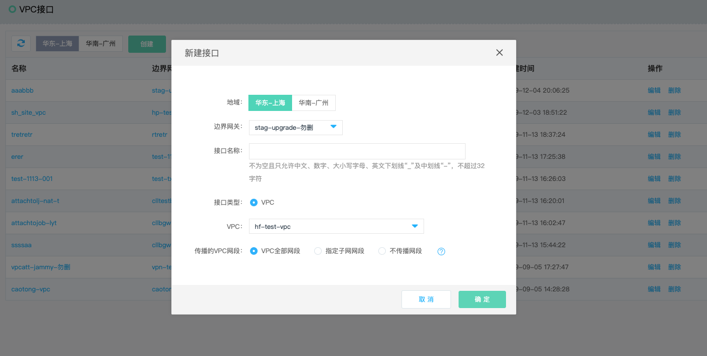

## VPC接口
VPC接口(VPC Attachment)，用于在边界网关和VPC之间建立1对1连接，创建VPC接口后，可通过配置路由传播将VPC的网段传播到边界网关的路由表中，相反地，也可以将边界网关有效路由表的路由传播到VPC的路由表中。

```
  VPC接口功能目前仅在广州和上海地域上线。
```

### 操作步骤
##### 1.创建VPC接口
a)登录[京东云VPC接口控制台](https://cns-console.jdcloud.com/host/vpcAttachment/list)，或进入边界网关的详情页的“接口/通道”Tab中创建VPC接口；  <br />
b)选择地域，点击“创建”；<br />
c)输入VPC接口的名称、选择边界网关、选择VPC、指定要传播到边界网关路由表的VPC网段，创建VPC接口。传播VPC网段支持三种模式：VPC全部网段、指定子网网段、不传播网段；<br />
* VPC全部网段表示将所选择VPC的全部子网网段(包括该VPC中当前已存在的子网网段，以及未来增加的子网网段，创建子网时自动传播该子网的网段)传播到边界网关的路由表中。
* 指定子网网段表示只传播所选择的子网网段，VPC中未选中的子网网段不进行传播，未来新增加的子网网段也不自动传播；
* 不传播网段表示不将所选择VPC的任何网段传播到边界网关；

```
  和同一个边界网关均创建了VPC接口的多个VPC间若存在网段冲突，路由传播到边界网关路由表的原则是先传播的计为有效路由，后传播的计为无效路由。
  例如VPC A中存在网段为10.0.0.0/16的子网，VPC B中存在网段为10.0.1.0/24的子网，VPC A先和边界网关BGW A创建了VPC接口，同时指定传播10.0.0.0/16子网，VPC B后和边界网关BGW A创建了VPC接口，同时指定传播10.0.1.0/24子网，则边界网关BGW A的有效路由表中将仅存在10.0.0.0/16，下一跳为VPC A的路由，而10.0.1.0/24，下一跳为VPC B的路由将进入边界网关BGW A的传播路由表，但计为无效路由。
  当删除了10.0.0.0/16，下一跳为VPC A的路由后，10.0.1.0/24，下一跳为VPC B的路由将进入边界网关BGW A的有效路由表。
```

有关VPC路由表配置路由传播的更多内容，详见[VPC路由表路由传播](https://docs.jdcloud.com/cn/virtual-private-cloud/route-table-configuration)。



##### 2.修改VPC接口
您可对VPC接口的名称、指定的VPC及传播的子网网段进行修改。<br />
a)登录[京东云VPC接口控制台](https://cns-console.jdcloud.com/host/vpcAttachment/list)；  <br />
b)选择相应的VPC接口，点击操作列中的“编辑”，进入编辑VPC接口页面；<br />
c)支持修改VPC接口名称、指定的VPC及传播的子网网段，各配置项的限制同创建VPC接口，不支持修改VPC接口的边界网关；<br />


##### 3.删除VPC接口
若您不再需要VPC接口，可将其删除。<br />
a)登录[京东云VPC接口控制台](https://cns-console.jdcloud.com/host/vpcattachment/list)；  <br />
b)选择相应的VPC接口，点击操作列中的“删除”。删除VPC接口后，VPC路由表的传播关系、VPC以及边界网关相应的传播路由会被自动删除；<br />


