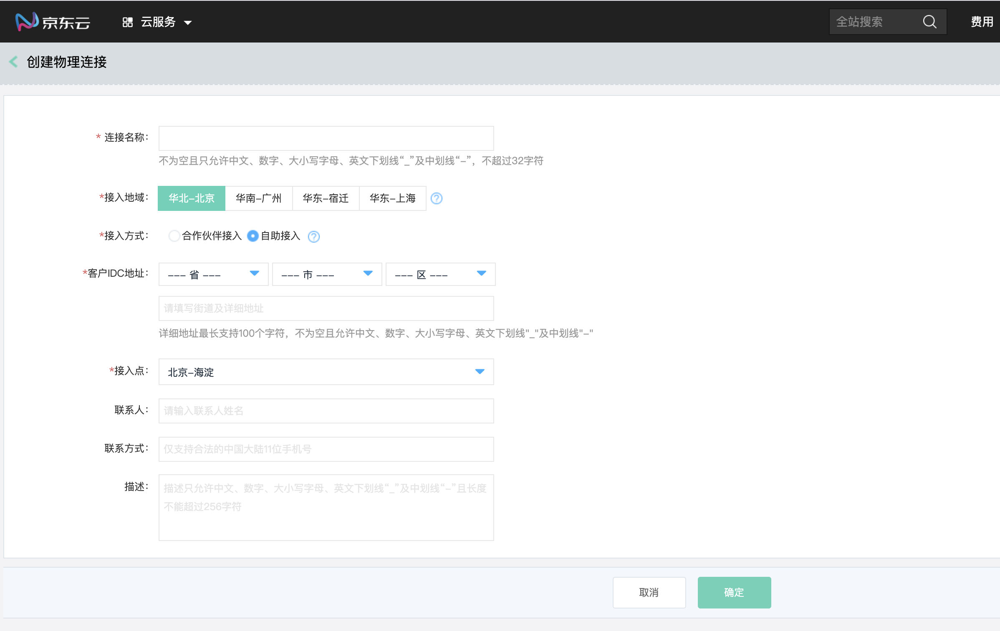
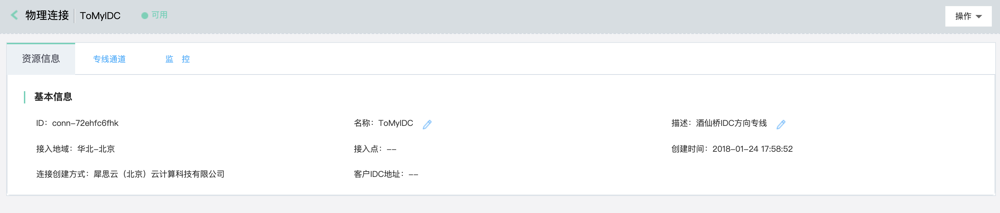
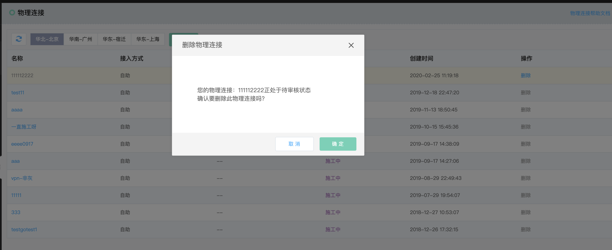

## 物理连接
物理连接(Physical Connection)，物理连接是通过物理链路专线的方式接入公有云，实现客户的企业IDC访问VPC资源，物理连接在逻辑上表示一条物理链路。

### 操作步骤
##### 1.创建物理连接
已完成企业实名认证的客户可以使用物理连接。<br />
a)登录[京东云物理连接控制台](https://cns-console.jdcloud.com/host/physicalConnection/list)；  <br />
b)选择地域，点击“创建”；<br />
c)输入物理连接的名称、接入地域、接入方式、客户IDC地址、合作伙伴/接入点、联系人、联系方式、描述，创建物理连接；<br />
d)接入方式支持自助接入和合作伙伴接入两种方式，当选择自助接入时，需选择接入点，当选择合作伙伴接入时，需选择使用的合作伙伴及服务开通时长，或联系合作伙伴获取更多信息(合作伙伴已入驻京东云市场，可在京东云市场查看合作伙伴的详细信息)；<br />
e)新建的物理连接进入待审核状态，审核过程一般需要1~2个工作日；<br />

```
  接入方式支持自助接入及合作伙伴接入两种方式，自助接入是指客户以独享端口的方式接入公有云，合作伙伴接入是指京东云已经与一些专线业务服务商完成了预连接，客户可选择与这些专线业务服务商的设备进行对接，通过与其他客户共享该合作伙伴与京东云预连接的设备端口的方式接入公有云。

  自助接入由京东云提供接入点，您可选择距离您的IDC最近的接入点完成接入。基于业务高可用性的角度，建议至少同时选择两个不同的接入点进行接入，同时建议不同的线路使用不同的运营商。当一个接入点的线路或设备出现故障时，可快速切换到其它接入点的线路，业务整体不受影响。

  合作伙伴接入，您可联系合作伙伴，选择其距离您的IDC最近的接入点完成接入。基于业务高可用性的角度，建议至少同时选择合作伙伴的两个不同的接入点，或选择不同的合作伙伴进行接入。

  合作伙伴可为您提供更多接入点的选择以及更灵活的接入方式，建议低于1Gbps带宽的客户选择通过合作伙伴方式接入京东云。
```

```
  物理连接各状态说明：
  待审核：客户申请物理连接后，物理连接进入“待审核”状态，由京东云后台人员对物理连接进行审核，审核项包括：客户是否完成企业实名认证、所选择的接入点或合作伙伴是否满足接入要求等。若审核通过，物理连接进入“待支付”状态，同时生成对应的订单，“合作伙伴接入”方式生成云市场的专线订单，“自助接入”方式生成京东云普通交易订单。若审核不通过，物理连接进入“审核未通过”状态；
  待支付：此状态下，客户可对相应的订单进行支付，客户对订单进行支付后，“自助接入”方式的物理连接自动进入“施工中”状态。“合作伙伴接入”方式的物理连接，当合作伙伴确认开始施工时，物理连接进入“施工中”状态；
  施工中：“自助接入”方式，当物理链路对接到京东云的专线设备端口且链路层调试成功(端口UP，收发光正常)后即认为施工完成，物理连接进入“等待确认”状态。“合作伙伴接入”方式，当物理链路对接到合作伙伴的专线设备端口且链路层调试成功后即认为施工完成，物理连接进入“等待确认”状态；
  等待确认：当物理连接处于“等待确认”状态时，客户可和京东云&运营商/合作伙伴一起对物理链路进行网络联调测试，当网络联调测试通过后，客户在京东云控制台对物理连接确认施工完成，确认后，物理连接进入“可用”状态；
  可用：表示物理连接当前能够正常进行使用，当某些原因导致物理链路不能正常使用时，物理连接进入“不可用”状态；
  不可用：表示物理连接当前不能够正常使用，待故障排除后，物理连接进入“可用”状态；
  删除中：当客户不再需要使用物理连接时，可对物理连接进行删除，由于物理链路需要拆除，故需要客户提前至少1个月提出拆线申请，当客户删除物理连接时，物理连接进入“删除中”状态。待物理链路确认拆除后，“自助接入”方式申请的物理连接，由京东云后台人员确认线路拆除，同步删除物理连接并清空专线物理设备中与此物理连接相关的配置信息。“合作伙伴接入”方式申请的物理连接，由合作伙伴同步删除物理连接并清空专线物理设备中与此物理连接相关的配置信息；
  审核未通过：物理连接因为某些原因导致审核未通过时的状态；
```



##### 2.修改物理连接
您可对物理连接的名称、描述进行修改。<br />
a)登录[京东云物理连接控制台](https://cns-console.jdcloud.com/host/physicalConnection/list)；  <br />
b)选择相应的物理连接，进入物理连接详情页面；<br />
c)支持修改物理连接名称、描述，各配置项的限制同创建物理连接；<br />



##### 3.物理连接调整配置
若您因业务变化需要调整物理端口规格，请线下与京东云协商具体的变更时间，并自行准备新规格所需的单模光模块，待该物理连接断开流量后由机房人员进行端口变更。待端口变更完成且确认流量已恢复后(此时物理端口限速仍为原规格)，请在控制台中操作调整端口配置，以按新的端口规格进行计费，待支付成功后将自动调整端口限速为新的速率。<br />
a)登录[京东云物理连接控制台](https://cns-console.jdcloud.com/host/physicalConnection/list)；  <br />
b)选择相应的物理连接，点击操作列中的“调整配置”，请按您的实际需求进行升降配操作；<br />

##### 4.删除物理连接
若您不再需要物理连接，可将其删除。<br />
a)登录[京东云物理连接控制台](https://cns-console.jdcloud.com/host/physicalConnection/list)；  <br />
b)选择相应的物理连接，点击操作列中的“删除”，当该物理连接未创建专线通道时可以删除；<br />


