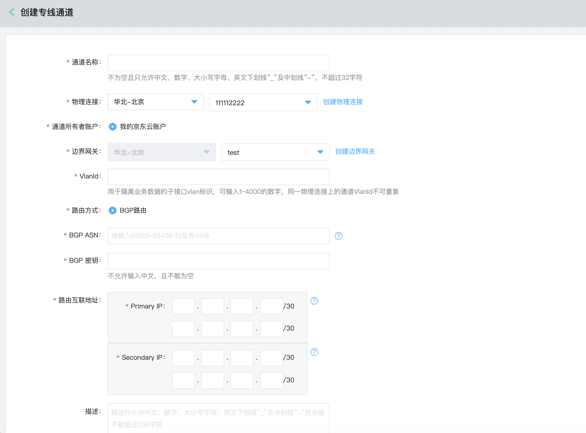
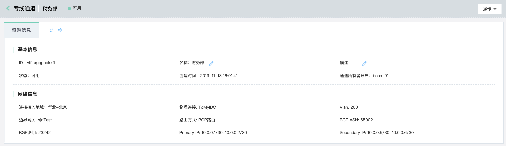
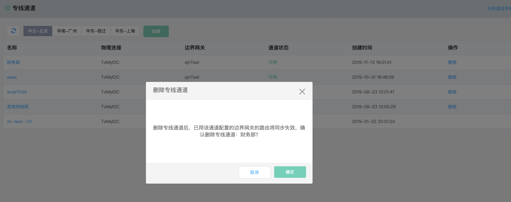

## 专线通道
专线通道(Private Virtual Interface)，专线通道是在物理连接上区分业务流的逻辑通道，不同的专线通道处理不同的业务，专线通道之间相互隔离、互不影响。

```
  请提前规划好IDC和VPC内的网段，需保证IDC内的网段和VPC内的网段不会重叠。
```

### 操作步骤
##### 1.创建专线通道
已存在“可用”状态的物理连接的客户可以使用专线通道。<br />
a)登录[京东云专线通道控制台](https://cns-console.jdcloud.com/host/dedicatedVif/list)；  <br />
b)选择地域，点击“创建”；<br />
c)输入专线通道的名称，选择物理连接、边界网关，指定vlanId、路由方式、客户端设备的BGP ASN、BGP密钥、BGP互联地址，描述，创建专线通道；<br />
d)创建专线通道后，经过一段时间的配置下发后，专线通道进入“可用”状态，配置下发过程涉及云端配置下发，以及和客户端的vlan打通、BGP Session建立、BGP路由学习等，请提前在客户端设备中完成相关配置；<br />

```
  仅可用状态的物理连接支持创建专线通道。
  当前仅支持访问同账号的VPC资源。

  专线通道参数说明：
  vlanId：同一条物理连接上可以创建多条专线通道，不同的专线通道使用不同的vlanId进行区分及隔离，vlanId即vlan号。
  BGP ASN：京东云的专线设备和客户端设备之间运行BGP路由协议，京东云使用的BGP ASN为64512，客户端支持使用的BGP ASN范围为：65001~65499。
  BGP密钥：当前BGP密钥配置不生效，此处可任意指定，但配置客户端时请不要配置BGP密钥。
  路由互联地址：用于在京东云和客户端之间建立BGP Session的互联地址，基于高可用性的角度，请分别指定两对/30的地址，/30的地址中，客户端使用第一个地址，京东云使用第二个地址。互联地址支持10/8、172.16/12、192.168/16三个内网网段的地址。
```

```
  专线通道各状态说明：
  配置中：专线通道配置下发过程中的状态，请同步进行客户端配置；
  可用：专线通道配置下发完成，并与客户端建立BGP Session后的状态，此时可正常进行通信；
  不可用：表示专线通道当前不能够正常通信，待故障排除后，专线通道进入“可用”状态；
  删除中：当客户不再需要使用专线通道时，可对专线通道进行删除，删除过程需要清除相关配置，会持续一段时间，待配置清除后，专线通道删除完成；
```



##### 2.修改专线通道
您可对专线通道的名称、描述进行修改。<br />
a)登录[京东云专线通道控制台](https://cns-console.jdcloud.com/host/dedicatedVif/list)；  <br />
b)选择相应的专线通道，进入专线通道详情页面；<br />
c)支持修改专线通道名称、描述，各配置项的限制同创建专线通道；<br />



##### 3.删除专线通道
若您不再需要专线通道，可将其删除。<br />
a)登录[京东云专线通道控制台](https://cns-console.jdcloud.com/host/dedicatedVif/list)；  <br />
b)选择相应的专线通道，点击操作列中的“删除”；<br />


