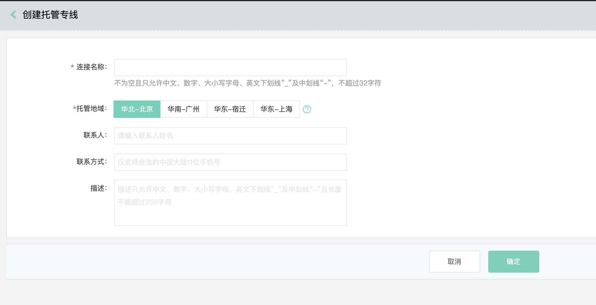
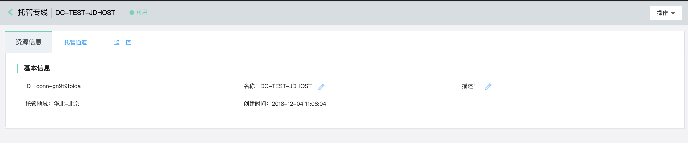
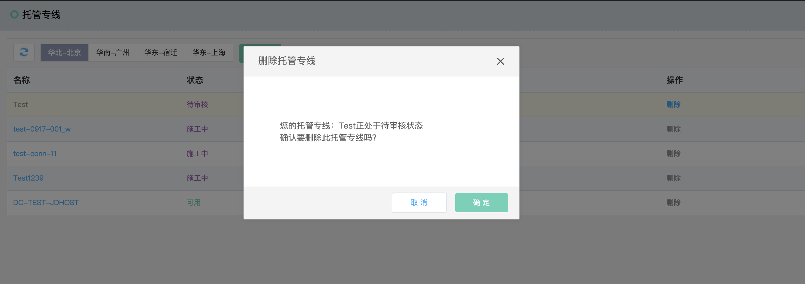

## 托管专线
托管专线(Hosted Connection)，托管专线是通过物理链路专线的方式接入公有云，实现客户的京东云托管区访问VPC资源，托管专线在逻辑上表示一条物理链路。

### 操作步骤
##### 1.创建托管专线
已完成企业实名认证的客户可以使用托管专线。<br />
a)登录[京东云托管专线控制台](https://cns-console.jdcloud.com/host/hConnection/list)；  <br />
b)选择地域，点击“创建”；<br />
c)输入托管专线的名称、托管地域、联系人、联系方式、描述，创建托管专线；<br />
d)新建的托管专线进入待审核状态，审核过程一般需要1~2个工作日；<br />

```
  托管专线各状态说明：
  待审核：客户申请托管专线后，托管专线进入“待审核”状态，由京东云后台人员对托管专线进行审核，审核项包括：客户是否完成企业实名认证等。若审核通过，托管专线进入“待支付”状态，同时生成对应的订单。若审核不通过，托管专线进入“审核未通过”状态；
  待支付：此状态下，客户可对相应的订单进行支付，客户对订单进行支付后，托管专线自动进入“施工中”状态；
  施工中：当物理链路对接到京东云的专线设备端口且链路层调试成功(端口UP，收发光正常)后即认为施工完成，托管专线进入“等待确认”状态；
  等待确认：当托管专线处于“等待确认”状态时，客户可和京东云一起对物理链路进行网络联调测试，当网络联调测试通过后，客户在京东云控制台对托管专线确认施工完成，确认后，托管专线进入“可用”状态；
  可用：表示托管专线当前能够正常进行使用，当某些原因导致物理链路不能正常使用时，托管专线进入“不可用”状态；
  不可用：表示托管专线当前不能够正常使用，待故障排除后，托管专线进入“可用”状态；
  删除中：当客户不再需要使用托管专线时，可对托管专线进行删除，由于物理链路需要拆除，故需要客户提前至少1个月提出拆线申请，当客户删除托管专线时，托管专线进入“删除中”状态。待物理链路确认拆除后，由京东云后台人员确认线路拆除，同步删除托管专线并清空专线物理设备中与此托管专线相关的配置信息；
  审核未通过：托管专线因为某些原因导致审核未通过时的状态；
```



##### 2.修改托管专线
您可对托管专线的名称、描述进行修改。<br />
a)登录[京东云托管专线控制台](https://cns-console.jdcloud.com/host/hConnection/list)；  <br />
b)选择相应的托管专线，进入托管专线详情页面；<br />
c)支持修改托管专线名称、描述，各配置项的限制同创建托管专线；<br />



##### 3.托管专线调整配置
若您因业务变化需要调整物理端口规格，请线下与京东云协商具体的变更时间，并自行准备新规格所需的单模光模块，待该托管专线断开流量后由机房人员进行端口变更。待端口变更完成且确认流量已恢复后(此时物理端口限速仍为原规格)，请在控制台中操作调整端口配置，以按新的端口规格进行计费，待支付成功后将自动调整端口限速为新的速率。<br />
a)登录[京东云托管专线控制台](https://cns-console.jdcloud.com/host/hConnection/list)；  <br />
b)选择相应的托管专线，点击操作列中的“调整配置”，请按您的实际需求进行升降配操作；<br />

##### 4.删除托管专线
若您不再需要托管专线，可将其删除。<br />
a)登录[京东云托管专线控制台](https://cns-console.jdcloud.com/host/hConnection/list)；  <br />
b)选择相应的托管专线，点击操作列中的“删除”，当该托管专线未创建专线通道时可以删除；<br />


