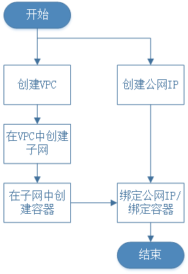

# 绑定容器实例
本文详细地介绍了如何将公网IP绑定到容器实例上，为容器提供公网访问和被公网访问的能力。

## 前提条件

- 确保您已经[注册京东云账号](https://user.jdcloud.com/register?returnUrl=https%3A%2F%2Fwww.jdcloud.com%2F)，并实现[实名认证](https://realname.jdcloud.com/account/verify)；

- 确保您已经创建一个弹性公网IP，且未绑定云资源；

- 确保您已经创建一个容器，且未绑定弹性公网IP。

## 操作流程

分别介绍从公网IP产品侧绑定容器和从容器实例侧绑定公网IP的操作步骤，操作流程如下图所示：



## 弹性公网IP绑定容器实例
从公网IP产品侧绑定容器实例，具体操作步骤如下：

### 操作步骤

步骤1：登录京东云控制台，进入控制台导航页面；

步骤2：在控制台左侧导航栏，选择网络-【私有网络】-【弹性公网IP】，进入弹性公网IP列表页；

步骤3：在弹性公网IP列表页，定位未绑定的弹性公网IP，在操作列点击【绑定资源】，进入弹性公网IP绑定资源弹窗；

	- 目前弹性公网IP支持绑定云主机、负载均衡、容器、弹性网卡等资源
	- 弹性公网IP详情页右上角快捷操作菜单同时提供绑定资源按键，功能与列表页按键保持一致

步骤4：在绑定资源弹窗，点击资源类型的下拉列表，选择【容器】；

步骤5：选择需绑定公网IP的容器实例，点击【确定】按钮，完成绑定弹性公网IP操作；

步骤6：返回弹性公网IP列表页，查看弹性公网IP绑定情况。


## 容器实例绑定弹性公网IP
从容器侧绑定弹性公网IP，具体操作如下：
### 操作步骤

步骤1：登录京东云控制台，进入控制台导航页面；

步骤2：在控制台左侧导航栏，选择弹性计算-原生容器-容器实例，进入容器实例列表页；

步骤3：在容器实例列表页，定位需要绑定的容器实例，在操作列点击【更多】选择【绑定公网IP】，进入绑定弹性公网IP弹窗；
```
若原生容器未绑定弹性公网IP，则显示【绑定公网IP】，如已绑定公网IP，则会显示【解绑公网IP】按钮
```
步骤4：在绑定公网IP弹窗，选择容器实例需要绑定的弹性公网IP；
```
可通过IP ID和IP地址进行搜索，选择需要绑定的弹性公网IP
```

步骤5：选中需要绑定的公网IP，点击【确定】按钮，完成绑定弹性公网IP操作；

步骤6：返回容器实例列表页，查看弹性公网IP绑定情况。

## 后续测试

容器实例与弹性公网IP绑定之后，您可以通过Ping弹性公网IP地址的方式来检测弹性公网IP的连通性。

## 相关参考

- [使用限制](../../Introduction/Restrictions.md)
- [创建VPC](https://docs.jdcloud.com/cn/virtual-private-cloud/vpc-configuration)
- [创建公网IP](https://docs.jdcloud.com/cn/elastic-ip/create-elastic-ip)
- [创建原生容器](https://docs.jdcloud.com/cn/native-container/create-to-instance)
- [解绑公网IP](https://docs.jdcloud.com/cn/elastic-ip/disassociate-elastic-ip)
