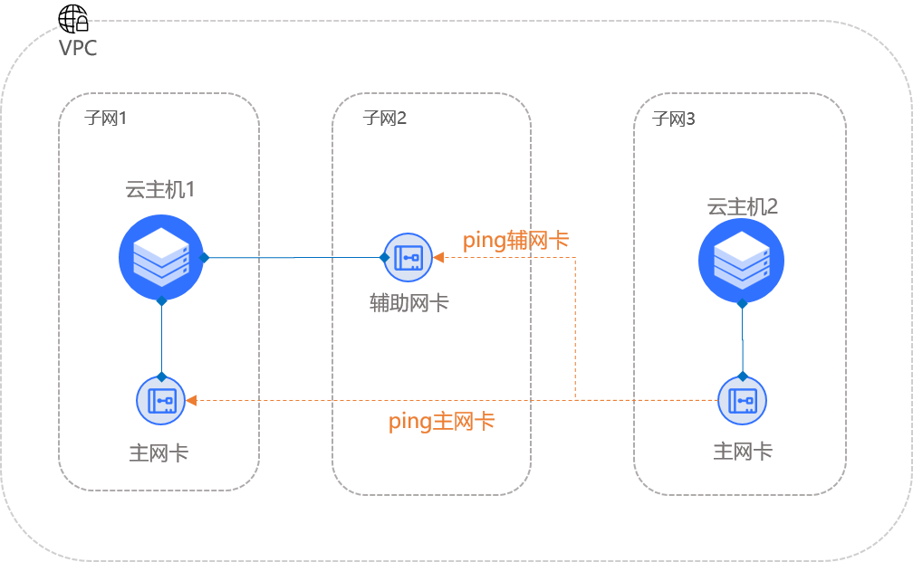

# Linux服务器弹性网卡配置

本文将介绍如何在Linux中配置弹性网卡，Linux包括多种镜像类型，且不同版本的镜像配置弹性网卡步骤稍有不同，本文以CentOS和Ubuntu两种镜像为例，对有差异的版本分别进行详细介绍。

- [配置CentOS 6.9、CentOS 7.6或CentOS 8.2](linux-permanent-configuration#user-content-1)
- [配置Ubuntu 14.04、Ubuntu 16.04](linux-permanent-configuration#user-content-2)
- [配置Ubuntu 18.04](linux-permanent-configuration#user-content-3)


### 场景概述

当单个网卡无法满足您的业务需求时，您需要使用弹性网卡，使用弹性网卡需配置策略路由，使流量从某个网卡进后能从该网卡返回，否则会出现非对称路由导致数据丢包。

本教程基于下图所示场景介绍如何配置弹性网卡，在VPC不同的子网中分别创建云主机1、云主机2及弹性网卡，其中云主机1已绑定弹性网卡，如未绑定请参考[绑定网卡](../Elastic-Network-Interface-Management/Associate-Elastic-Network-Interface.md)。对云主机1的弹性网卡进行配置，使云主机2能分别ping通云主机1的主/辅网卡IP地址（本文中所提“辅网卡”均指弹性网卡）。
```

注：windows镜像不支持策略路由，如使用多网卡，仅支持同网段资源访问，本例不适用于windows。
```



### 配置步骤

- 网络配置，使绑定在云主机上的弹性网卡的IP地址生效；
- 配置路由，包括配置策略路由和路由规则，经过弹性网卡的流量需要指定新的路由表，否则会出现非对称路由，无法使用弹性网卡。

```
注：中括号里的内容需您根据您实际配置自行填写
```


### 配置CentOS 6.9、CentOS 7.6或CentOS 8.2
<div id="user-content-1"></div>

步骤1：通过ssh登录云主机1

步骤2：通过以下命令查看云主机1的网卡：

```
ip a
```

步骤3：打开网卡配置文件：

```
vi /etc/sysconfig/network-scripts/[ifcfg-eth1]
```

步骤4：在网卡配置文件中加入配置信息：

```
#弹性网卡名称，本例中为eth1
DEVICE=[eth1]                  
NM_CONTROLLED=yes
ONBOOT=yes
#弹性网卡的主IP
IPADDR=[10.0.16.3]              
#弹性网卡IP的子网掩码
NETMASK=[255.255.240.0]         
NAME=[eth1]           
```

步骤5：配置路由，执行以下命令打开文件：

```
vi /etc/sysconfig/network-scripts/[route-eth1]
```

步骤6：在文件中增加命令行，添加路由规则，本例如下，具体需根据您网络配置实际情况填写：

```
#配置网关
default via [10.0.16.1] dev [eth1] table [1000] pref [100]
#配置路由
[10.0.16.0/20] dev [eth1] src [10.0.16.3] table [1000]              
```

步骤7：配置策略路由规则，执行以下命令打开文件：

```
vi /etc/sysconfig/network-scripts/[rule-eth1]
```

步骤8：在文件中添加以下命令行，配置策略路由规则：

```
from [10.0.16.3] table [1000]			
```

CentOS 7.6及CentOS 8.2需额外执行以下命令，使上述步骤中新增的配置文件能够被执行：

```
# 安装服务
yum install NetworkManager-config-routing-rules
# 使服务随云主机启动
systemctl enable NetworkManager-dispatcher.service
# 启动服务
systemctl start NetworkManager-dispatcher.service         
```

步骤9：执行以下命令重启网络服务：

CentOS 6.9
```
service network restart
```

CentOS 7.6
``` 
systemctl restart network
```
CentOS 8.2
```
nmcli c up eth0
nmcli c up eth1
```
步骤10：验证配置：登录云主机2，通过云主机2分别ping云主机1的主/辅网卡IP，若均能ping通则表示配置成功。

```
# ping主网卡IP
ping [10.0.32.5]
# ping弹性网卡IP
ping [10.0.16.3]          
```


### 配置Ubuntu 14.04、Ubuntu 16.04
<div id="user-content-2"></div>


步骤1：通过ssh登录云主机1

步骤2：通过以下命令查看云主机1的网卡：

```
ip a
```

步骤3：执行以下命令，创建并打开配置文件：

Ubuntu14

```
vi /etc/network/interfaces 
```

Ubuntu16

```
vi /etc/network/interfaces.d/[51-eth1].cfg
```

步骤4：将以下命令添加到上述文件中，本例中添加的弹性网卡是eth1，具体配置信息根据实际情况进行配置：

```
# 弹性网卡名称
auto [eth1]                     
iface [eth1] inet static
# 弹性网卡的主IP
address [172.16.64.3]
# 弹性网卡IP的子网掩码
netmask [255.255.240.0]         

# 配置默认网关
up ip route add default via [172.16.64.1] dev [eth1] table [100]

# 配置路由及策略路由
up ip route add [172.16.64.3] dev [eth1] table [100]
up ip rule add from [172.16.64.3] lookup [100]

```

步骤5：执行命令行重启网络服务，使配置文件生效：

Ubuntu14

```
(ifdown [eth1] && ifup [eth1])
```

Ubuntu16

```
systemctl restart networking
```

步骤6：验证配置：登录云主机2，通过云主机2分别ping云主机1的主/辅网卡IP，若均能ping通则表示配置成功。

```
# ping主网卡IP
ping [172.16.0.4] 
# ping弹性网卡IP
ping [172.16.64.3]      
```


### 配置Ubuntu18.04
<div id="user-content-3"></div>

步骤1：通过ssh登录云主机

步骤2：输入命令行查看云主机的网卡：

```
ip a
```
若已绑定弹性网卡，执行上述命令未显示弹性网卡信息，重启云主机后重复上面操作。

步骤3：创建并打开配置文件：

```
vi /etc/netplan/[51-eth1].yaml
```

步骤4：将以下命令添加到上一步的文件中，具体配置信息根据实际情况进行配置：

```
network:
  version: 2
  renderer: networkd
  ethernets:
    [eth1]:
      addresses:
       - [172.16.0.6/20]            # 弹性网卡IP地址，可配置多个
      dhcp4: no
      routes:                       # 配置路由表
        - to: 0.0.0.0/0
         via: [172.16.0.1]          # 默认网关
         table: [1000]
        - to: [172.16.0.6]
         via: 0.0.0.0
         scope: link
         table: [1000]
      routing-policy:               # 配置策略路由规则
        - from: [172.16.0.6]
          table: [1000]
```

注：上述配置信息采用了yaml语法格式编辑，yaml语法对缩进有严格要求，如缩进不一致执行下一步时将会报错。

步骤5：执行如下命令，使网络配置生效：

```
netplan --debug apply
```

步骤6：验证配置，使用云主机2分别ping 云主机1的主/辅网卡IP，若均能ping通则表示配置成功。

```
# ping主网卡IP
ping [172.16.0.4] 
# ping弹性网卡IP
ping [172.16.64.3]            
```

